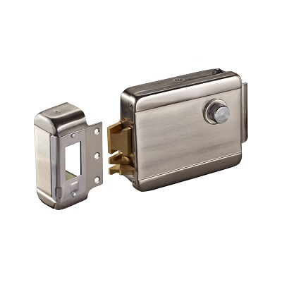
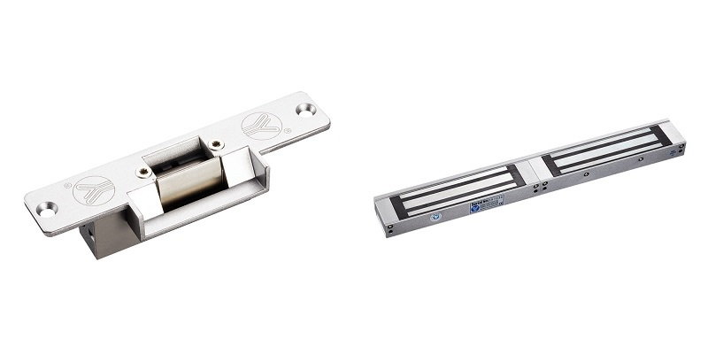
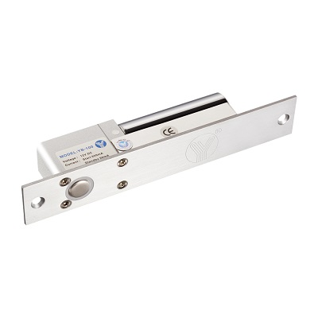
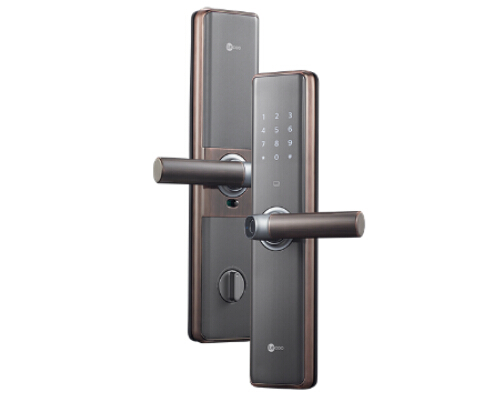

# 防盗锁安全性分析

本文对电子门锁的安全性做一个深度分析，认识到不同锁的安全性，以得到正确选择和使用

## 简介

常见的门锁，按照控制原理分为电子锁和机械锁。门锁的技术对于门禁安全起到决定性作用，本文列举常用的电子锁，并且对其安全性能进行全面分析，目的是让大家选择合适的门锁以达到真正的目的。

## 机械锁

防盗门自带的门锁就是典型的机械锁，虽然一直在更新换代，但都是可以被开启，只是时间的问题。防盗锁的国家标准分为分“普通防护级别”和“高级防护级别”，前者用字母“A”表示，后者用字母“B”表示。市面上的所谓超B级和C级锁是一些商家自己定义的，严格来说应该算作B级锁。

::: warning
A级锁芯，防止技术性开锁时间不少于1分钟，防止破坏性开启时间不少于15分钟。A级锁芯是老式的锁芯，钥匙是十字平板型或月牙型有凸形匙槽钥匙，单面或双面有一排凹形匙槽，这类钥匙小偷用锡纸可以在几秒钟之内就可以打开，如果你家还是用的这种钥匙赶紧换了。A级锁芯已经无法防住小偷了。  

B级锁芯，防止技术开锁时间不少于5分钟，防止冲击开启时间不少于30分钟。B级锁芯钥匙为平板型或月牙型，B级锁钥匙比A级钥匙要复杂，钥匙槽为单面或双面有两排凹形或圆柱型多点凹形匙洞。
超B级锁芯，技术开启时间超过270分钟。
:::

## 电子锁

什么是电子锁（也叫电锁），顾名思义，就是需要通电才能工作。常见的传统的电机锁，磁力锁，电插锁，还有当前流行的智能锁。

### 电机锁

电机锁，又称灵性锁。是根据楼宇电控门的工作原理，结合电控锁和磁力锁的优点，克服了它们的缺点而开发的新产品，灵性锁与电控锁和磁力锁相比较，它的性能更加的完善、优点更加明显。

### 磁力锁

电磁锁（或称磁力锁）的设计和电磁铁一样，是利用电生磁的原理，当电流通过硅钢片时，电磁锁会产生强大的吸力紧紧的吸住吸附铁板达到锁门的效果。只要小小的电流电磁锁就会产生莫大的磁力，控制电磁锁电源的门禁系统识别人员正确后即断电，电磁锁失去吸力即可开门。

### 电插锁

电插锁是一种电子控制锁具，通过电流的通断驱动“锁舌”的伸出或缩回以达到锁门或开门的功能。当然，关门开门功能的实现需要与“磁片”配合才能实现。

### 智能锁

智能锁是电子锁的一种，指区别于传统电子锁，在用户识别、便捷性、安全性、管理性方面更加智能化的锁具，智能锁是门禁系统中锁门的执行部件。

## 安全性分析

接下来分析一下各种锁的安全性：

| 锁类型 | 暴力开锁 | 技术开锁 | 正常开锁 | 安装难度 | 价格 |
| :-- | :-- | :-- | :-- | :-- | :-- |
| 机械锁 | 容易 | 很容易 | 钥匙 | 很容易，无需布线 | 廉价 |
| 磁力锁 | 比较容易 | 不能 | 刷卡/密码/指纹/手机APP | 需要布线 | 要结合整套门禁系统，价格适中 |
| 电插锁 | 难 | 不能 | 刷卡/密码/指纹/手机APP | 需要布线 | 要结合整套门禁系统，价格适中 |
| 智能锁 | 比较容易 | 难 | 刷卡/密码/指纹/手机APP | 很容易，无需布线 | 价格偏贵 |

磁力锁和电插锁的主要区别：

一、电插锁不受力的限制，没有被动打开的缺陷；磁力锁就受到磁力量的限制，在超过锁体本身负荷的情况下，锁就可以被开启，这就是磁力锁的缺点。  
二、电插锁在使用方面也比较磁力锁灵活，电插锁可以往双方向开，不受限制。而磁力锁，只能朝其中一个方向开，受安装位置的限制。  
三、磁力锁在价格上也比较电插锁要高点。

通过以上的对比，得出结论是：

从安全性角度来说，电插锁的安全性是最高的，几乎不能通过技术方式开锁，暴力开锁也是非常难，除非破坏整个门，但电插锁要结合专业的门禁系统，通过门禁控制器来控制锁的状态，另外还需要读卡器，门磁，后备电源等设备。

智能锁比起机械锁就更加安全一些，起码通过技术开锁很难。另外由于面积大、且多为塑料材质，容易被暴力破坏开锁。

机械锁基本上都可以通过简单的暴力方式和技术方式开锁，很不安全。
