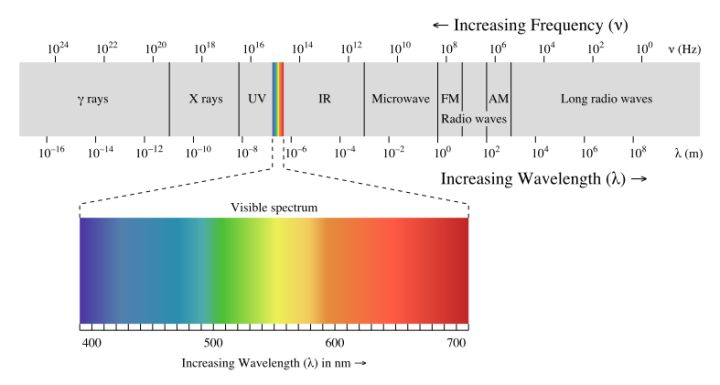

# 关于信号辐射

本文主要解释辐射的概念，以及常见的射频辐射和辐射的条件，以此来解除大家对枫叶无线系统辐射的担心

## 简介

辐射是什么?

辐射指的是能量以波或是次原子粒子移动的型态传送。辐射之能量从辐射源向外所有方向直线放射。一般可依其能量的高低及电离物质的能力分类为电离辐射或非电离辐射。一般普遍将这个名词用在电离辐射。

## 分类和概念

辐射有两类：

1. 电离辐射是一种可以把物质电离的辐射，电离辐射对生物是危险的。不是所有的辐射都是电离辐射。
2. 电磁辐射的另一个通俗名字叫电磁波，高能量（高频率）电磁辐射是电离辐射，只有这部分电磁辐射是危险的。

辐射是指的能量的传递，电磁波（电磁辐射）是一种以波的形式传递能量的辐射，辐射也可以是指一些粒子（中子电子阿耳法粒子等）移动传递能量。高能量的电磁波在穿过物质的时候有将物质电离的能力，具有这种能力的电磁波我们称它为电离辐射；高能量的中子电子阿耳法粒子束也具有这种能力，也可以被称为电离辐射。电离是指的物质的原子由中性不带电转变成带电的离子，而产生这种效应的原因是由于电荷被电离辐射从电子壳层中击出，使原子带电。

什么样的电磁波可以使物质电离呢？上面提到了高能量，那么什么样的电磁波具有高能量呢？首先要澄清一点这里说的高能量是指的辐射能，也就是电磁波的载体光子所具有的能量，也就是电磁波本身的特性，并不是指的电磁场的能量，尽管单位是一样的吧。秉承着大妈语言的原则，频率越高的电磁波，辐射能也就越高。

那么现在讨论的问题就来到了电磁波频率上了，我们来看看电磁波是怎样根据频率来分类的：

上面是频率，左到右越来越低单位是赫兹，下面是波长，左到右越来越长单位是米。我们从右到左来解释一下吧。

首先是长波（Long radio waves），波长超过 1 千米，频率低于 300kHz，如果按照频率分类长波要包含低频（30k - 300kHz），甚低频（3k - 30kHz），特低频（300 - 3kHz），超低频（30 - 300Hz）和极低频（小于 30Hz）。这些低频电磁波主要是在一些奇怪的领域，比如地质探测潜艇通讯之类。交流电产生的电磁波辐射（50Hz / 60Hz）也是在这个范围内的。长波中频率相对较高的被称为低频频段（30kHz - 300kHZ）的电磁波被用于一些卫星定位系统和无线校时。

鉴于无数朋友问高压电的辐射问题，在这里再补充几句好了。无论是多少千伏还是多少万伏的高压电线，变电站，高压电塔，变压器，还是家里用的电线，以及所有没有提到的和能源用电有关的设备，它们的工作频率在中国都是 50 赫兹（50Hz）。这种频率的电磁辐射的波长长达 6 千千米，按照电磁辐射发射天线的理论分析，想要发射这种波长的电磁辐射，那么其天线的尺寸也要达到上千千米才能做到。所以对于 50 Hz 的输电设施来说，只能在其很近距离的周围产生感应电磁场，很难做到向外辐射能量。

然后是无线电波（Radio waves），也称为射频波（RF - Radio frequency）。波长范围1毫米至1千米，频率范围 300kHz 至 300GHz。图中可见其相对较低频率段包括无线电通讯常用的调幅（AM）以及调频（FM）频率范围。无线电波中频率较高部分（频率 300MHz 至 300GHz 部分）也称为微波（Microwave），比如我们免费的433Mhz，无线路由器wifi，移动电信网（2G/3G/4G/5G）。无线电波主要用途是通讯。额外提一点就是微波有个很有名的用途就是微波炉，这个后面关于电磁辐射危害部分再细说。

再之后是红外线（IR - Infrared），其波长在 760 纳米至 1 毫米之间，频率则是 300GHz 至 430THz，另外鉴于越往后的频率越高，为了避免出现T往上的P/E/Z/Y造成困扰，之后会用科学计数法来表示频率：430THz 也就是 4.3E14（4.3乘以10的14次方，也就是乘以100,000,000,000,000，而4.3E14 就是430,000,000,000,000）。红外线更多的被用于监测热源。

再之后是可见光（Visible spectrum），波长范围 380 纳米至 780 纳米，频率在 1E14 Hz量级。可见光就是红橙黄绿蓝靛紫。

可见光之后是紫外线（UV Ultraviolet），波长范围 10 纳米至 400 纳米，频率在 1E14 至 1E16 Hz量级。自然界紫外线主要来自恒星辐射。

最后两种超高频率电磁波则分别是 X 射线（X Ray）以及频率最高的伽玛射线（γ Ray）。X 射线来自电子产生能量变化时以电磁波形式释放的能量，伽马射线来自原子核从高能激态到低能基态过程中以电磁波形式释放的能量。实际上 X 射线和伽玛射线是有一部分频率重合的，只是由于二者的成因不同因而命名也不同。同时由于这两种电磁波的波长极短，可通过原子间空隙，因而可以穿透物体。

从波长小于 150 纳米开始的电磁波，也就是频率超过 1.9E15 赫兹的电磁波，可以使物质电离，也就是说小波长，也就是高频率的一部分紫外线，X 射线以及伽玛射线属于之前提过的电离辐射。

电离辐射包括上面说过的这三种高能电磁波，同时还包含：α射线（α粒子）、β射线（β粒子）、中子等高能粒子流，而被称为宇宙射线的高能粒子射线则两者皆有。电磁波的电离能力，随着电磁波谱变化，电磁波谱中的γ射线、X射线几乎可以电离任何原子或分子。电磁波的频率愈高，能量愈强，电离能力愈强。

非电离辐射是指与X射线相比之下波长较长的电磁波，由于其能量低，不能引起物质的电离，故称为非电离辐射。如近紫外线与可见光、红外线、微波和无线电波等电离能力较弱的电磁波。

## 辐射危害

由于电离辐射会使物质电离，因而会破坏生物组织细胞的原子 / 分子结构。大剂量电离辐射对生物体的危害是肯定的，小剂量则可以忽略。毕竟自然界中是存在天然电离辐射源的，而生物在地球上进化了这么多年，早也已经适应了自然界的本底辐射，自身的修复能力可以平衡掉小剂量电离辐射造成的伤害。这里 中子弹和原子弹相比哪个人道一点？ 提到了大剂量电离辐射对生物体产生的危害。当然核武器造成的这种辐射毕竟属于特殊情况，日常生活中能够接触到的电离辐射的机会其实非常少，而且剂量也非常小。

接下来，日常生活中可能接触到电离辐射的场景包括：

1. 医学检查，包括 X 光片，X 光透视，CT 扫描，PET-CT 扫描，放射性同位素造影等；放射治疗，包括电子束，伽马束，质子束，重离子束等。这些都是利用电离辐射的穿透性，或者电离辐射可以杀死细胞的特性来加以利用。医学检查受到的剂量通常会比较高，但医生会权衡利弊，尽量少做，但也不用担心。
2. 长途飞机旅行。这主要来自宇宙辐射，尤其是当飞机穿越北极上空时由于可能会更多一些。
3. 吸烟。香烟含有的钋-210，镭-226及铅-210这些放射性同位素，吸烟时这些同位素会被吸入人体，在人体内部对组织进行内照射。
4. 夜光表，烟雾探测器。含有微量金属放射性同位素，但由于含量极小，对人体造成的伤害可忽略。
5. CRT 显示器。老式的 CRT 显示器是基于电子管的应用，电子能量的变化会产生 X 射线，所以其实是在运行时会产生很小的 X 射线的。但实际测试结果显示其剂量非常小，甚至还没有柏油马路沥青产生的放射性高。

除了以上提到的几点，还会有很多其他的可能性，比如自然界存在的各种矿物神马的例如上面说到的沥青矿。但基本除了第 1 条和第 3 条之外，辐射剂量都是很小很小的。至于网上传言各种关于电脑，路由器，手机，电视，机房等等各种电子设备工作时会产生电离辐射之类，从原理上讲这根本就是不可能的。毕竟这些电子设备的工作是产生的电磁波频率仅仅是射频范围，既不可能有原子核反应又不可能有电子束应用所以不可能产生 X 或者伽马射线，也就不可能产生电离辐射。

最后是非电离辐射的危害。非电离辐射日常生活中主要指之前提到的射频范围内的电磁波，也就是无线电波。到目前为止，没有任何科学实验或研究或事实数据能够明确证明射频电磁波会对生物体造成不良影响。经过证实的非电离辐射对生物组织能够产生的效果主要是其加热效果，但需要很强并且集中指向的电磁场。一个典型的例子就是微波炉。

::: tip
微波炉加热的原理是利用水分子的电偶极（Electric dipole moment）在电场中会转向电场的方向，当微波进来时，电场是来回变化，使得水分子为了要转向电场方向而随着电场转动，这样的转动即为热量的来源。
:::

除了微波炉里面，日常生活中能接触到的最强的射频电磁波大概也就是无线路由器了，但它的输出功率差了微波炉百倍，而且还是发射到空间中，功率完全分散掉了。至少我从没见过水放在无线路由器天线旁边能被加热，放太近被路由器烤热的不算。

至于高压电 / 交流电 / 变压器等等 50 或者 60 赫兹的电磁波，前面也提到了，由于其波长要几千千米长，基本不可能能做到辐射有效功率，所以从辐射传播的角度考虑，它们的贡献基本可以忽略不计了。只有在距离这些设备很近的范围内会有一定的感生电磁场，如果非要谈潜在危害的话，距离高压设备小于安全距离可能会导致放电，触电等等风险。但这是属于电压以及用电安全讨论的范畴，与电磁辐射是否安全这一命题基本无关了。

## 辐射标准

我国对电磁辐射（功率）有着严格的技术限值标准。为了防止电磁辐射污染，保障公众健康，国家环保、卫生等部门自上世纪90年代以来，先后制定颁发了《环境电磁波卫生标准》等7部法规和国家标准，对电磁辐射规定了分级标准：

- 一级标准（安全标准，对人体没有任何影响）
  - 高频辐射 小于 10 μW/cm²（微瓦/平方厘米）
  - 低频辐射：小于 10 V/m（伏/米）

- 二级标准（中间区，对人体可带来有害影响）
  - 高频辐射 小于 40 μW/cm²
  - 低频辐射 小于 25 V/m

## 结论

无线设备(比如WIFI，无线安防系统等等)传输距离越远越好吗？当然不是，无线信号传输距离取决于发射功率，发射功率越大距离越远，但会增加电磁辐射（上面有提到），中国没有成熟的检测认证和监管机构，所以某些厂家为了加长无线距离使劲的增加发射功率，完全不顾辐射危害。所以如果无线信号距离超远的设备，都有不小的发射功率，势必会增加电磁波的辐射危害。距离和辐射本来就是矛盾的，要实现好的效果，两者都要折中，找到平衡点，不要盲目跟风。

电离辐射的确是对人有危害的，但家用电器，无线路由器，无线安防系统，2G/3G/4G等产生的电磁波，只要发射功率控制在合理的范围内，肯定不会对人造成任何影响。

频率和功率是辐射的重要指标，根据实际情况我们一个辐射指数，供大家参考：

| 设备 | 射频频率 | 辐射指数 |
| --- | --- | --- |
| 枫叶设备 | 433/868Mhz | 完全可以忽略 |
| Wifi | 2.4Ghz和5Ghz | 可以忽略 |
| 2G网络 | 850-900Mhz 1800-1900Mhz | 基站的功率一般比较大，与基站距离有关，一般可以忽略。 |
| 3G网络-联通(WCDMA)  | 2100Mhz 1900Mhz 850MHz | 基站的功率一般比较大，与基站距离有关，一般可以忽略。 |
| 3G网络-移动(WCDMA) | 1880-1920MHz 2010-2025MHz | 基站的功率一般比较大，与基站距离有关，一般可以忽略。 |
| 3G网络-电信(WCDMA) | 1920-1935MHz 2110-2125MHz | 基站的功率一般比较大，与基站距离有关，一般可以忽略。 |
| 4G网络-移动TDD-LTE | 1900MHz 2300MHz 2600MHz | 基站的功率一般比较大，与基站距离有关，一般可以忽略。 |
| 4G网络-电信和联通FDD-LTE | 1800MHz 2600MHz | 基站的功率一般比较大，与基站距离有关，一般可以忽略。 |

