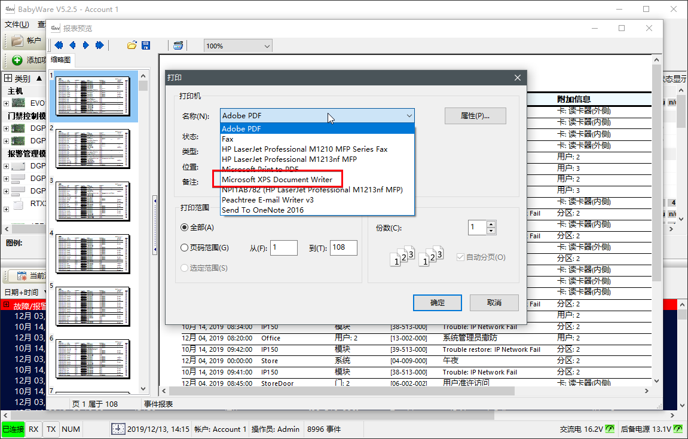
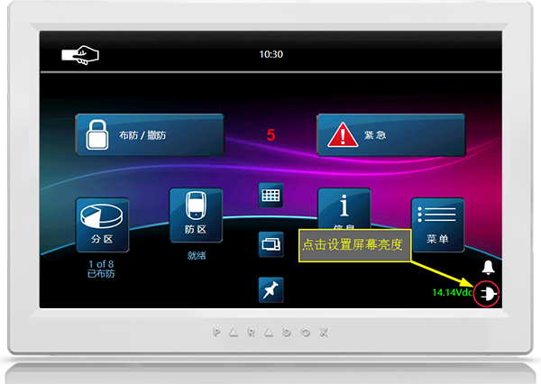

# 编程设置

本文主要针对安装人员，如何编程（设置）和调试枫叶系统，此文档是调试枫叶系统的指南，主要针对通过软件设置枫叶系统的方法。

::: tip
实现简单的一些功能通过键盘和软件都可以实现，但一些特殊的功能，比如修改防区和分区标签等功能只能通过软件。
:::

## 简介

枫叶为安装人员专门提供了一套工具软件Babyware，用来设置、调试、售后维护枫叶安防系统的专用工具软件，非常直观，高效。支持汉语，支持枫叶全系列主机，支持串口、网络、拨号等通讯方式。

## 视频教程

视频介绍较简单，仅供参考，请以文档为准。  

 <video controls="controls">
    <source src="https://senbollwebsite.oss-cn-shenzhen.aliyuncs.com/media/video/babyware-teaching-video-cover-picture.mp4" type="video/mp4">
 </video>

## 安装软件

系统要求：兼容Windows10/11，**不兼容家庭版**。下载Babyware请联系业务员。启动软件：  
步骤一：启动Babyware，默认用户名是`Admin`,密码是`1234`。  
步骤二：选择主机，创建账户。在创建账户后，请选择相应的主机型号，再连接或打开账户。

步骤三：汉化软件。打开Languages菜单，选择SC，即是中文界面。

## 连接软件

安防主机连接编程软件的方式主要有以太网和串口，二选一。

### 方式一：串口

串口直连方式需要307USB模块和USB(A-B)线：

#### 安装Windows驱动

选串口通讯方式，需要准备307USB通讯模块，并需要安装Windows驱动。驱动下载请访问 → [307USB驱动下载](https://senboll.com/zh-hans/product-detail/80)。请根据Windows系统版本下载并安装驱动。

::: tip
1. 安装的过程有时候需要两次才能安装成功。
2. 安装驱动之前，请插好设备再操作，否则无法安装。
:::

如果安装驱动遇到困难，请参考下面的步骤。

#### 设置连接方式

307USB的USB端连接电脑，另一端连枫叶主机Serial端口，如图：

### 方式二：网口

以太网方式需要网络模块：

::: tip
网络模块联网成功后，Internet指示灯是绿灯常亮状态，如果不亮或闪烁说明网络不通，请检查网络或相关设置。
:::

#### 设置连接方式

将网络模块的Panel端和枫叶主机的Serial端口连接，插上网线。
- IP/Panel S/N方式，需要网络模块，通过天鹅云方式连接，Panel S/N 填主机8位序列号，IP模块访问密码默认是`paradox`。如图：

- IP/Static静态地址，通过IP地址连接，填入IP地址和IP Port（默认：10001），IP Module Password默认是`paradox`。如图：

### 连接主机

回到主页，点连接图标，将会连接当前主机。

## 基本设置

### 编程和测试防区

防区分为有线防区和无线防区，其中有线防区分为板载防区和扩展防区，板载防区是主机板自带的防区，扩展防区是其他模块上的防区。

**提示：防区类型的概念参考请点[防区类型说明](/content/node1/important-knowledge/#防区zone)。**

#### 编程防区

使用Babyware软件编程，推荐的防区类型选择方法如下：

| 探测器 | 安装位置 | 防区类型 |
|---|---|---|
| 红外探测器，门磁 | 非出入口 | **立即** |
| 红外探测器，门磁 | 出入口 | **进入延时** |
| 对射 | 围墙 | **立即** |
| 水浸探测器 | 漏水处 | **24小时 水浸** |
| 烟感探测器 | 室内公共区域（**厨房禁止安装**） | **24小时 高温** |
| 燃气探测器 | 有燃气泄漏的区域（厨房） | **24小时 瓦斯** |
| 紧急按钮 | 室内 | **24小时 劫持** |
| 震动探测器 | 内墙或ATM机内 | **24小时 入侵** |

板载防区编程方法：

扩展防区编程方法：

无线防区编程方法：

通过软件：

通过键盘（EVO主机）：

注意：编程无线探测器，要求无线接入模块必须连接到枫叶主机，并且通信正常才可以进行编程。

步骤一：

[进入编程模式](#通过键盘进入编程模式) → 输入`0400` → 然后输入防区编号（从001-192） → 输入无线接入模块（RTX3）8位序列号和3位input端口号（一个RTX3模块最多接入32个无线探测器） → 输入防区类型（默认是01，如设置立即防区，请将01改为41即可） → 点下一步直到出现下一个防区的序号，表示当前防区设置成功。

比如，编程第一个无线探测器为防区001：[进入编程模式](#通过键盘进入编程模式) → 输入`001` → 输入RTX3模块序列号（如：3B0000001）和input端口号（如：001） → 输入防区类型（如：41） → 点下一步直到出现下一个防区的序号，即当前防区设置成功。

步骤二：

[进入编程模式](#通过键盘进入编程模式) → 输入`4003` → 输入RTX3模块序列号 → 输入无线探测器序列号短号（如：101，从101-132） → 输入无线探测器6位序列号，点击下一步即保存完成。

#### 防区测试

防区测试的目的是检验编程的功能是否能够实现，通过触发探测器，监测对应的防区是否有反馈的信号来判断。通过键盘和软件都能测试防区，下面通过键盘进行防区测试的方法。

通过键盘进入防区状态版，按下防区测试按钮，然后逐个触发需要测试的防区，观察如果变化说明此防区已经功能正常。如果防区图标没有变化，有可能是防区线路问题、或者探测器损坏，或者防区编程的信息错误，需要耐心的逐个检测，通过排除法来找到原因再解决。步骤如下：

步骤1：通过键盘进入防区状态版

步骤2：按下防区测试按钮

### 编程遥控器和无线紧急按钮

通过编程遥控器，就能在任何有信号（需要枫叶无线收发器）覆盖的地方对系统布防、紧急求助报警或者通过遥控器的自定义按键来实现一些功能，如自定义功能键开关灯等功能。

#### 布撤防

编程遥控器，只需进入用户编程界面，输入遥控器6位序列号即可。

但是处于安全考虑，默认情况下遥控器只支持常规布防模式，如果有防区开路，无法布防。如果一定要布防，就需要改成强制布防，下面是具体步骤：

第1步：进入遥控器功能模板

第2步：将按钮A的布防模式设置成强制布防

操作键盘编程的方法：进入高级编程 → 输入`2900` → 将第一位（默认：1）修改为`4`，保存退出即可。

#### 紧急求助

此功能需要在Babyware上设置才能生效，如图：

然后进入遥控器功能模板，将对应的按钮功能设置为紧急类型，例如：将按钮B设置为**紧急报警1**，当此按钮被按下，系统将会启动对应类型的报警，如下图：

#### 自定义功能键

自定义功能键就是通过遥控器的按钮来控制PGM继电器输出一个信号来控制其他设备，比如开关灯。

第1步：设置遥控器按钮所对应的功能键类型：

第2步：在Babyware上继电器(PGM)编程界面上根据需要编程激活事件和恢复事件，编程方法如图：

### 编程密码和权限

主机支持多用户，每个用户拥有单独的密码和权限，编程用户密码请参考：

编程用户权限请参考：

### 编程和维护警号

::: tip
对于多个无线警号，不同的无线警号不能给分配到不同的RTX3，就是所有的无线警号只能分配到同一个RTX3模块里。
:::

下面是无线警号编程方法演示：

警号鸣笛时间设置请看下面演示：

#### 使用键盘编程

有些情况下，使用软件无法编程，请通过键盘编程，方法如下：  
**步骤一**：进入编程模式，请参考 → [进入编程模式方法](#通过键盘进入编程模式)。  
**步骤二**：在步骤一的基础上进行下面步骤：

| 主机 | 编程方法 |
|---|---|
| EVO192/EVOHD | 输入`2851`-`2858`（第一个警号分配到2851中，以此类推，最多支持8个警号） |
| MG/SP | 输入`683`-`686`（第一个警号对应683，以此类推，最多支持4个） |
| MG6250 | 输入`0801`-`0804`（第一个警号对应0801，以此类推，最多支持4个） |

#### 无线警号的信号强度

安装无线警号的时候，需要查询信号强度，以确保无线信号质量，保证可靠性。  
步骤一：进入编程模式，请参考 → [进入编程模式方法](#通过键盘进入编程模式)。  
步骤二：进入查询信号强度段号

| 主机 | 编程方法 |
|---|---|
| EVO192/EVOHD | 输入`2871`-`2878`（第一个警号分配到2871中，以此类推，最多支持8个警号） |
| MG/SP | 输入`687`-`690`（第一个警号对应687，以此类推，最多支持4个） |
| MG6250 | 输入`0801`-`0804`（第一个警号对应0801，以此类推，最多支持4个） |

步骤三：按下警号的Reset/Training按钮3秒以上再松开，信号强度将会返回到键盘上。

#### 警号的维护

无线警号在正常工作时一旦挪移或者拆装将会触发防拆报警，为了便于维护，设计了维护模式，开启此模式后30分钟之内拆装不会触发防拆报警，需要在键盘上通过编程开启此模式，方法如下：  
步骤一：进入编程模式，请参考 → [进入编程模式方法](#通过键盘进入编程模式)。  
步骤二：开启维护模式

| 主机 | 编程方法 |
|---|---|
| EVO192/EVOHD | 输入`2870` |
| MG/SP | 输入`695` |
| MG6250 | 输入`0800` |

### 修改退出延时

::: tip
退出延时的概念请访问 → [退出延时概念](/content/node1/important-knowledge/#退出延时)。
:::

编程方法请参考下图：

### 短信通知设置方法

需要设置3个参数，分别是手机号，分配所属分区和通知事件类型。也可以通过触摸屏键盘进入菜单→ 高级设置→ SMS短信设置。Babyware软件方式设置请参考动画：

通过Babyware设置中文短信，如果失效的话，请用键盘进入高级编程设置，具体的方法如下：

- EVO主机-在触摸屏键盘上操作步骤：菜单 → 高级设置 → 安装设置 → 系统编程 → 安装者密码（默认：000000） → 输入`2953` → 输入`019`。
- SP/MG主机-在触摸屏键盘上操作步骤：菜单 → 系统设置 → 安装者密码（默认：0000） → 高级设置 → 安装者密码（默认：0000） → 系统编程 → 输入`856` → 输入`019`。

### 电话通知设置方法

通过软件（EVO主机）：

通过键盘（EVO主机）：

1. 进入编程模式，请参考 → [进入编程模式方法](#通过键盘进入编程模式)。
2. 设置手机号码（最多支持8个电话号码，分别对应3091-3098），请输入`3091` → 输入手机号码点下一步会保存并且跳转到`3092`，此时如果需要设置第2个手机号码直接输入即可。

### 更换主机

当主机发生故障或者维修的时候，为了保证系统正常运行，可以用一台新的主机替换旧主机，Babyware支持将旧主机的编程数据导入到新主机，这样就不用重新编程，节省时间。步骤如下：

#### 步骤一：准备编程数据

Babyware上有旧主机的编程数据，如果没有，新建一个账户连接这台旧主机读取编程数据；

#### 步骤二：替换设备

拆下旧主机，按原有接线方法接好新主机，并对新主机进行复位操作 → [复位方法](#复位)。

::: tip
替换主机的时候，请务必先手动复位新主机。不然的话，新主机里如果有旧的编程数据，会和新的编程数据合并，导致编程数据错乱。
:::

#### 步骤三：导入数据

在Babyware使用旧主机的账户连接新主机，连接新主机的时候，会弹出一个提示页面，提示序列码不匹配，需要输入主机编号（默认:`0000`）和PC访问密码（默认:`0000`），如果没有修改过，填入默认值即可。

## 其他设置

### 通过键盘进入编程模式

进入编程模式，具体方法如下：

针对EVO：

|键盘|步骤|
|:------|:------|
| TM70 | 菜单 → 高级设置 → 安装设置 → 安装者密码（默认：000000） → 系统编程|
| TM50 | 菜单 → 高级设置 → 安装设置 → 安装者密码（默认：000000） → 系统编程|
| K656/K641+ | 长按0 → 输入安装者密码（默认：000000） |

针对SP/MG：

|键盘|步骤|
|:------|:------|
| TM70 | 菜单 → 系统设置→ 安装者密码（默认：0000） → 高级设置→ 安装者密码（默认：0000） → 系统编程|
| TM50 | 菜单 → 系统设置→ 安装者密码（默认：0000） → 高级设置→ 安装者密码（默认：0000） → 系统编程|
| K10V/K32+ | 长按0→ 输入安装者密码（默认：0000）|

针对MG6250：长按0 → 输入安装者密码（默认：0000）。

### 定时自动布防

::: tip
需要说明的是，安防系统没有自动撤防功能，因为自动撤防有极大的安全隐患，所以为了保证可靠性，很多国家的安防标准强制规定取消自动撤防功能。
:::

定时自动布防可以避免忘记布防，消除安全隐患。

#### 通过Babyware设置（EVO）

进入Babyware如下的设置界面，设置对应的分区的**定时布防允许**选项和**布防时间**：

#### 通过键盘设置（EVO）

请先通过键盘进入高级编程模式，开启这个功能需要3个步骤：

步骤一：进入编程模式，请参考 → [进入编程模式方法](#通过键盘进入编程模式)。

步骤二：开启自动定时布防的选项。各个分区的定时自动布防开启选项段号如下，打开如下对应短号的选项1。

| 分区1 | 分区2 | ... | 分区7 | 分区8 |
| :-- | :-- | :-- | :-- | :-- |
| 3122 | 3222 | ... | 3722 | 3822 |

步骤三：设置自动布防时间。各个分区的自动布防时间选项段号如下：

| 分区1 | 分区2 | ... | 分区7 | 分区8 |
| :-- | :-- | :-- | :-- | :-- |
| 3101 | 3201 | ... | 3701 | 3801 |

### 查询无线防区信号强度

#### 针对EVO系列主机

说明：EVO主机所有的无线设备是通过无线收发模块RTX3来接入的，每一个RTX3最多可以接入32个无线探测器，在RTX3里面有32个段号来查询每一个防区的信号强度，即：601-632，例如需要查询RTX3里第1个无线探测器的信号强度，输入601即可，如果是第5个无线防区的信号强度，输入605即可。注意这里说的第一个无线防区，并不是防区001，而是此RTX3里定义的第一个防区，RTX3里的第一个防区可以通过编程设置为任何序号的防区，具体方法请参考上文中的防区编程。

::: tip
目前只支持通过触摸屏操作键盘来查询。
:::

下面演示查询RTX3的第一个探测器信号强度：

操作步骤：菜单→ 高级设置→ 安装设置→ 系统编程→ 安装者密码（默认：000000） → 输入`4003` → 输入RTX3八位序列号 → 输入`601` → 再去触发探测器，键盘上将会显示返回结果。`|<<<<<<<<<<|`这个表示信号是100%，即最强，如图：

#### 针对SP系列和MG5000/MG5050主机

说明：SP和MG系列主机最多可以接入32个无线探测器，在RTX3里面有32个段号来查询每一个防区的信号强度，即：101-132，例如需要查询第防区1的信号强度，输入`101`即可，如果是防区5的信号强度，输入`105`即可。

::: tip
目前只支持通过触摸屏操作键盘来查询
:::

下面演示查询防区1信号强度：

操作步骤：菜单→ 系统设置→ 安装者密码（默认：0000） → 高级设置→ 安装者密码（默认：0000） → 系统编程→ 输入`101` → 针对MG系列主机可以直接去触发探测器，针对SP主机需要重启探测器或者触发防拆开关才能返回查询结果，比如：`|<<<<<<<<<<|`表示信号是100%，即最强。

#### 针对MG6250主机

MG6250的信号强度不能通过命令查询，可以在Babyware上直接查看。

### 查询无线探测器电池电量

提示：目前仅EVO系列主机支持此功能

说明：

1. EVO主机所有的无线探测器是通过无线收发模块RTX3来接入的，每一个RTX3最多可以接入32个无线探测器，在RTX3里面有32个段号来查询每一个探测器的电池剩余电量，即：701-732，例如需要查询RTX3里第1个无线探测器的电池电量，输入`701`即可，如果是第5个无线探测器的电池电量，输入`705`即可。注意这里说的第一个无线探测器，并不是防区001，而是此RTX3里定义的第一个防区，RTX3里的第一个探测器可以通过编程设置为任何序号的防区，具体方法请参考上文中的防区编程。
2. EVO主机还提供了32个段号用来查询当前电池已经使用过的时间，即：801-832，例如需要查询RTX3里第1个无线探测器的电池电量，输入`801`即可，如果是第5个无线探测器的电池电量，输入`805`即可。

::: tip
目前只支持通过触摸屏操作键盘来查询。
:::

下面演示查询RTX3的第一个探测器电池剩余电量：

操作步骤：菜单→ 高级设置→ 安装设置→ 系统编程→ 安装者密码（默认：000000） → 输入`4003` → 输入RTX3八位序列号 → 输入`701` → 再去触发探测器，键盘上将会显示一个数字，这个数字的单位是周，表示当前的电量还可以用多少周。

下面演示查询RTX3的第一个探测器的时间：

操作步骤：菜单→ 高级设置→ 安装设置→ 系统编程→ 安装者密码（默认：000000） → 输入`4003` → 输入RTX3八位序列号 → 输入`801` → 再去触发探测器，键盘上将会显示一个数字，这个数字的单位是周，表示当前的电池用了多少周。

### 打印事件

Babyware支持下载所有主机的日志，日志就是我们说的事件，这些日志对维护系统有很重要的作用，通过日志可以还原和找到系统出现异常的真实的原因。下面介绍步骤：

步骤1 下载日志，请看下面的动图演示:

步骤二 分为3步:  
①：选择Buffered Events标签；  
②：请通过过滤器，选择想要查询或打印的的日志；  
③：执行打印。

步骤三 执行打印，需要注意的是，在打印的时候选择合适的虚拟打印机，有时候选择不当会出现乱码，推荐使用 **Microsoft XPS Document Writer**，如图：

### 校正系统时间和日期

对于整个系统来说，需要记录所有发生的事件或者日志所发生的时间，就需要时钟功能，由于系统的时钟通常不能联网自动校准，时间长了会有误差，就需要人为校正。可以用个两个途径设置系统时间和日期：

途径一：通过Babyware，请看下面的动图演示:

途径二：通过操作键盘:  

| 键盘/主机 | 操作步骤 |
|---|---|
| TM50/TM70(SP/MG/EVO系列) | 操作步骤：菜单→ 系统设置→ 时间和日期→ 输入管理员密码（默认：`1234`）** 设置相应的时间和日期。|
| K636/K10V/K32+(SP/MG系列) | 操作步骤：按 &#xE7E8  → 输入管理员密码（默认：`1234`） → 按TBL键 → 按5键 → 输入小时和分钟（格式：HH:MM，HH是小时，MM是分，例如：18：31分输入1831。）  → 设置时间格式，[1]表示24小时制，[2]表示上午，[3]表示下午 → 输入年月日`YYYY/MM/DD`，例如：2019年12月23日，输入`20191223`。**注意：SP4000/SP65仅支持24小时制！**|
| K656/K641+(EVO系列) | 操作步骤：输入管理员密码 → 按TRBL键 → 按8键 → 输入小时和分钟 → 输入年月日 → 按Enter键 |
| MG6250(MG系列) | 操作步骤：按menu键 → 选择`08-SYSTEM SETUP`，按ok键 → 输入管理员密码（默认：`1234`） → 选择`04-Time and Date` → 选择时间格式，12和24小时制 → 设置时间 → 设置年月日 → 按ok返回，设置相应的时间和日期。|

### 复位

有些误操作会导致内置程序错乱，出现一些奇怪的现象，可通过复位解决，其中复位分为软件复位和硬件，为了提高效率和便于操作，建议用硬件复位，下面介绍硬件复位方法：

|设备|复位方法|
|:------|:------|
|EVO192主机|将主机板上Reset和AUX两个按钮同时长按，直到指示灯全部熄灭即可|
|EVOHD主机|长按Reset按钮，直到指示灯快闪的时候松开再短按一下即可|
|SP5500 SP6000 SP7000 MG5000 MG5050 MG6250主机|长按Reset按钮，直到指示灯快闪的时候松开短按一下即可|
|MG6250主机|断开电源，同时长按\* | #按钮，然后上电，等系统启动后屏幕亮起，并且无任何显示的内容，此时松开按键，并按一下任意键，屏幕会出现`Factory Default`字符，表示是否要复位，按ok即可。|
|SP4000 SP65主机|断开电源，将PG1和Z1短接，然后上电，等待指示灯闪烁即可|
|网络模块IP100 IP150|长按Reset按钮，直到指示灯快闪的时候松开短按一下即可|
|总线模块：总线模块包括操作键盘、总线探测器、无线信号覆盖模块RTX3、对接模块PRT3，防区模块，继电器模块等|仅针对EVO系统，在触摸屏键盘上操作步骤：菜单→ 高级设置→ 安装设置→ 系统编程→ 安装者密码（默认：000000） → 输入`4001` → 输入模块序列号即可|

### 刷固件

Infield软件是专门用来刷枫叶设备固件的工具软件，支持串口，网络，拨号等通讯方式。固件是内置在设备中的程序文件，有些问题可能只适用于特定版本的固件。多数设备都可以通过连接主机进行升级，对于一些特殊的设备，升降级的时候需要直连设备，具体请咨询设备提供商。

由于Infield被集成到Babyware中，所以请先下载安装Babyware，具体步骤请访问[Babyware使用说明-安装软件](#安装软件)。

步骤一：启动Babyware，Infield启动入口如图：

步骤二：设置连接方式，选择合适的方式建立连接。请参考[Babyware使用说明-初始化](../babyware/#初始化)。

- Serial是串口方式，需要307USB通讯模块。
- Internet网络方式，需要网络模块，通过天鹅云方式连接，Panel S/N填入主机8位序列号，IP password默认是`paradox`。
- Static IP，通过IP地址连接，填入IP地址和端口号（默认：10001），IP password默认是`paradox`。

步骤三：选择需要升级的设备，准备好固件，开始升级。最新固件下载请访问[枫叶安防官网（需要注册登陆）](https://senboll.com/zh-hans/product-list/all)。升级的过程有时候比较慢，请耐心等待，切记不要中断通讯线路、关闭电脑或者Infield软件，否则有可能升级失败，甚至报废。如图：

### 触摸键盘待机黑屏的设置方法

如果键盘待机的亮度影响到生活或者休息，可以按照下面的步骤将亮度设置到最低，将会黑屏，点击屏幕将会再次唤醒。

步骤一，点击右下角电源图标：

步骤二，设置屏幕待机亮度到最低即可：

### 智能防区

智能防区功能专门针对误报而设计，目的是为了大幅度降低误报，更加人性化、智能化，其实就是今天热炒的人工智能技术。

::: warning
在能保证智能防区延时期间入侵者实施入侵过程中会触发到至少2个智能防区或同一个智能防区会触发2次以上的前提下使用此功能，否则后果自负。
:::

每一个防区（排除火警防区）都有智能防区属性（编程防区方法请参考编程手册或者使用Babyware软件）。这里约定开启智能防区属性的防区简称为智能防区，当智能防区被触发后，系统会进入一个智能防区倒计时，在这个延时期间如果发生了以下3种情况中的一种，将会产生真实报警（请先设置智能防区选项，见下文）：

- 选项1：有一个智能防区被触发后直到延时结束还没有恢复，将会产生真实报警；
- 选项2：在延时期间，有一个智能防区至少触发2次(含2次)，将会产生真实报警；
- 选项3：在延时期间，至少有2个不同的智能防区触发，将会产生真实报警；

#### 设置方法一： 通过Babyware设置

请参考下图设置：

#### 设置方法二：通过键盘

进入高级编程进行设置。

第一步：智能防区延时，智能防区延时时间默认是32秒，延时范围（10-255秒），如果输入的值小于10秒，将会重置为32秒。针对EVO主机设置段号：

| 分区1 | 分区2 | ... | 分区7 | 分区8 |
| :-- | :-- | :-- | :-- | :-- |
| 3110 | 3210 | ... | 3710 | 3810 |

第二步：智能防区选项设置，选项说明：

| 选项 | 描述 |
| :-- | :-- |
| [1] | 有一个智能防区被触发后直到延时结束还没有恢复，将会产生真实报警（默认=打开） |
| [2] | 在延时期间，有一个智能防区至少触发2次(含2次)或至少有2个不同的智能防区触发，将会产生真实报警（默认=打开） |
| [3] | 在延时期间，至少有2个不同的智能防区触发，将会产生真实报警（默认=打开） |

设置段号：

| 分区1 | 分区2 | ... | 分区7 | 分区8 |
| :-- | :-- | :-- | :-- | :-- |
| 3126 | 3226 | ... | 3726 | 3826 |

## 常见问题

### Babyware连接主机

#### 强制修改主机编号和PC密码

Babyware连接一台主机的时候，如果主机编号和PC密码的值是默认的，处于安全考虑，将会弹出强制修改主机编号和PC密码的提示窗口。如图：

按照提示修改即可，但修改的值需要记住，以免下次无法连接。

#### 错误的主机编号

主机编号和PC密码是系统的一种通信安全机制。Babyware连接主机的时候，如果主机编号和PC密码不正确，将会返回错误。

遇到这个错误的时候，是软件和主机的主机编号和PC密码验证错误，通过[操作键盘进入编程模式](#通过键盘进入编程模式)，进入下面的选项查看：
- EVO系列主机
  - 进入`3011`，然后输入4位主机编号（Panel ID）；
  - 进入`3012`，然后输入4位PC密码（PC Password）。
- SP/MG系列主机（注意：SP/MG主机两个段号默认是清空的，就表示其值为：0000，请不要再输入0000。）
  - 进入`910`，然后输入4位主机编号（Panel ID）；
  - 进入`911`，然后输入4位PC密码（PC Password）。
  
然后点击菜单通讯→主机编号/PC访问密码，输入正确的主机编号（默认：`0000`）和PC密码（默认：`0000`）再重新连接即可。

### 软件上出现无关的模块

这是因为之前有可能测试或者其他原因，这些模块曾经连接过这台主机，产生了记忆。

解决方法：

- EVO系列主机

触摸屏键盘上操作步骤：   
菜单→ 高级设置→ 安装设置→ 系统编程→ 输入安装者密码（默认：000000） → 输入`4005`  等待扫描完毕，**重新创建一个新账号连接这台主机**。

- SP/MG系列主机

触摸屏键盘上操作步骤：  
菜单→ 系统设置→ 安装者密码（默认：0000） → 高级设置→ 安装者密码（默认：0000） → 系统编程→ 输入`955` 等待扫描完毕，**重新创建一个新账号连接这台主机**。