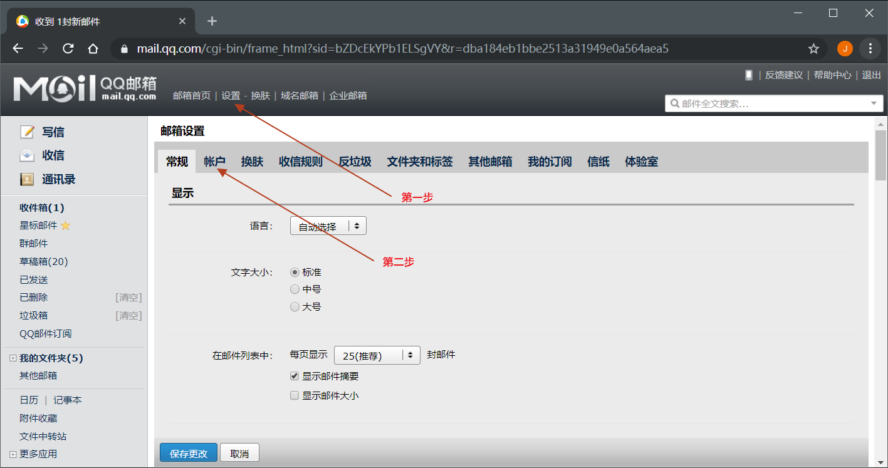
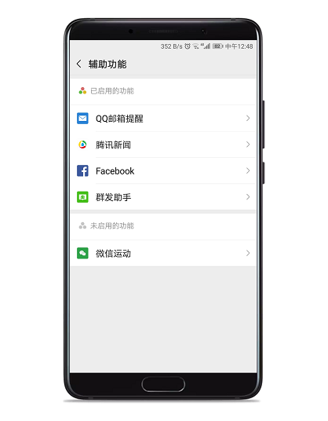

# 安装设置 - 手机APP(Insite Gold)

枫叶APP（Insite Gold）的安装调试和使用说明

## 简介

Insite Gold是枫叶针对枫叶安防系统自主开发的手机应用APP，集成了报警，视频复核，门禁控制和自动化控制功能，是报警系统、监控系统、门禁系统和智能家居控制的“一站式”解决方案。

## 功能

- 支持多语言；
- 支持系统级推送（国内安卓无法推送）；
- 支持布撤防操作；
- 支持多用户不同权限；
- 支持视频实时查看，报警视频下载；
- 支持门禁直接控制；
- 支持通过系统继电器直接控制电器，家电等；
- 故障实时提醒，比如蓄电池故障，模块离线故障；
- 设备状态提醒，比如掉线等；
- 不限制用户手机的数量。

## 版本日志

版本日志请访问 → [这里](https://senboll.com/zh-hans/product-detail/95)；
  
## 准备工作

### 硬件

枫叶主机和网络模块IP150/IP150+，并接入互联⽹（路由器需要开启DHCP）。

### 软件

手机上安装 Insite Gold 软件，安卓版下载请访问 → [这里](https://senboll.com/zh-hans/product-detail/95)，IOS用户到商店搜索Insite Gold。

## 初始化设置

### 步骤一：上电

1. 确保IP150的软件版本在V4.0以上，Internet灯长亮，如下图：

2. 记录枫叶主机8位序列号。如下图：

### 步骤二：激活

请将主机的序列号提供给枫叶技术人员。

### 步骤三：添加账户

激活成功后，打开APP，点击APP的`+`加号按钮，添加账户。  
**地点名称**是可选项，可以不填；  
**地点编号**处填入8位主机序列号；  
**SWAN邮箱**处填入`paradox-support@qq.com`。

如果只有IP网络模块，只需要输入用户密码（默认用户密码是`1234`）即可登陆。如图：

## 邮件推送设置

由于安卓版本推送借助了谷歌服务，在国内无法使用谷歌服务，如果是安卓手机用户，我们建议采用邮件来推送消息，推荐使用qq邮箱。

qq邮箱有独立手机APP，也可以通过qq或者微信添加推送服务来实现。下面介绍APP和微信方式设置方法。

### 通用设置

#### 步骤一：设置邮箱

准备一个qq邮箱，登录[mail.qq.com](https://mail.qq.com)，设置步骤如下：

步骤一：点击设置，打开账户选项，如图：

步骤二：将qq邮箱的POP3/SMTP服务和IMAP/SMTP服务开启，然后生成授权码，将授权码记下来下面的步骤要用到。如图：

#### 步骤二：设置网络模块

步骤一：确保计算机和网络模块在同一网段下，启动Babyware，查询网络模块IP地址，双击搜到的模块会弹出网页登录界面，输入用户密码将会进入网页设置界面，如图：

输入用户密码将会进入网页设置界面，如图：

步骤二：切换的email设置界面，Username填入您QQ邮箱，Password填入授权码（参见：设置邮箱步骤三），下面的 Email Account 可以填入10要推送的邮箱，您如果只有一个邮箱的话，也可以填入上面Username填入的邮箱，如图所示：

### qq邮箱APP方式推送

qq邮箱APP有个特别的功能，支持系统级推送（系统级推送是借助手机厂商内置服务来实现推送，比如华为手机服务，小米手机服务等，不需要启动APP，只需手机开机且能上网便能接收推送），目前我们测试了华为，小米，魅族等手机，均可以实现系统级推送。

首先请访问 [https://app.mail.qq.com](https://app.mail.qq.com) 下载qq邮箱APP，也可在其他安卓市场下载。启动APP，登录邮箱qq即可。

### qq邮箱微信方式推送

#### 步骤一：绑定qq号

要求微信要绑定qq号，进入微信点击**我→设置→账号与完全→更多安全设置→QQ号**，如图：

#### 步骤三：启用qq邮箱推送提醒

进入微信点击**我→设置→通用→辅助功能→QQ邮箱提醒**，如图：

## 软件操作

启动APP后，会看到下面有4个菜单，分别是报警系统，视频复核，自动控制，启动APP后，会看到下面有4个菜单，分别是报警系统，视频复核，自动控制，门禁系统。

### 报警系统

这里列出该用户权限下所有的防区和分区，提供留守和常规布防两种方式，防区的旁路功能，布撤防可以一键操作或者分别操作，如果有故障或者报警记录会有提示图标，双击可查看提示内容。

::: tip
如果有防区开路将无法布防，需要恢复防区状态或者旁路才能布防。
:::

### 视频复核

HD77/78/88系列探测器支持视频复核功能，通过APP可以直接查看实时视频，本身是个探测器，如果报警后会自动录一段带声音的视频，视频长度取决于触发的频率，每个视频都会从触发前3秒预录。除此之外还可以设置系统内其他防区作为启动录视频的条件。

所有的视频保存在探测器的内置的sd卡（也支持存储在谷歌云盘，但是国内无法使用谷歌云盘），这对于保护用户隐私是很有用的。点开菜单直接可以查看视频并下载，如图：

### 自动控制

这个功能对于实现智能家居的控制很有用，枫叶主机提供继电器功能，继电器可以通过编程来自动触发实现一些自动控制，比如控制灯光，窗帘等。如图：

### 门禁系统

门禁系统是枫叶EVO系统功能之一，将门禁和报警两个系统合二为一，支持刷卡，指纹，密码开门，支持权限划分，支持设置时间表。除了家用，对于商用可实现考勤，如果需要报警和门禁功能，这是最理想的解决方案。

对于门禁的控制，APP支持两种方式，参考图上的图标，第一个图标表示按下后在会在一段时间内自动恢复，第二个图标表示按下后，不会定时自动恢复，需要手动恢复。如图：

## 交费

两种途径：

1. 通过APP直接交费，要求需要准备具备Visa标志的银行卡，请自行按照APP支付页面支付费用；
2. 代付，如果没有跨境⽀付渠道，访问[枫叶APP交费](http://other.senboll.com/swan)。
