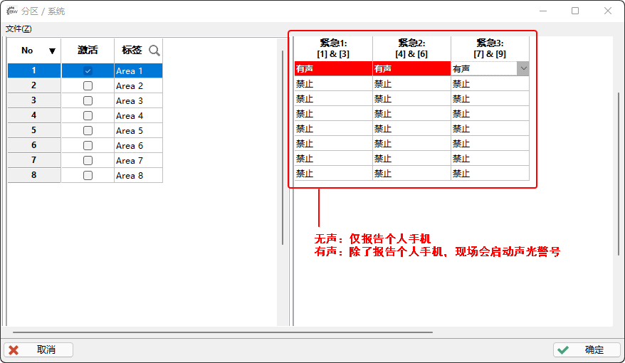

# 安装设置 - 对接Control4

针对枫叶和Control4对接进行全方位指导说明，包括驱动下载激活，安装，调试等。

## 简介

安防系统里有很多传感器，比如探测人的，探测温度、湿度的，探测门状态的，探测气体的，探测漏水，烟雾等等。这些探测器除了提供信号给安防系统使用，还可以通过集成接口送给其他系统来调度使用，使用这些信号可以完成很多智能化效果，比如：探测到人自动开灯、开门，或者探测到空气干燥启动加湿器，定时自动给鱼缸加水甚至喂鱼等等。试想一下，这样的生活是不是多姿多彩，充满乐趣。

为什么要通过系统和系统之间对接集成？

这是因为通过这种集成方式不会影响各个系统独立工作的可靠性，不损坏各个系统的完整性。也许有些朋友并不清楚为什么防入侵或者防盗要上独立的安防系统，所以再次提醒：安防系统从设计的时候，为了最大减少安全风险，确保7*24小时不间断工作，这种可靠性从软硬件研发设计的时候就不同于其他智能系统，所以没有替代性。大量的经验和教训告诫我们，防入侵，防盗的最佳方案一定是专业安防系统，完成这件事需要一个系统，一个单品（探测器）是无法做到的。

通过这套集成方案，整合各系统的资源，让很多个性化需求得到满足。这种集成方式更加灵活、智能和人性化。
这是驱动的唯一官方网站，提供驱动的下载，激活，使用指南和售后，感谢各位合作伙伴关注和支持。

## 功能参数

- 最大支持8个分区和192个防区；
- 通过Control4执行分区布/撤防、报警状态展示、解除报警等操作；
- 通过Control4一键紧急报警求救(110,120,119)；
- Control4可实时获取并展示防区开路、闭合或报警状态；
- 支持退出延时；
- 支持分区、防区标签自定义；
- 分区、防区状态自动和安防主机双向实时自动同步；
- 防区分配至所属分区；
- 分区状态(布防、撤防、报警和紧急报警)、防区状态、故障、门禁事件可用于联动；
- 通过Composer编程可对分区布/撤防、一键紧急报警；
- 通过驱动中的功能键联动安防主机的继电器，实现更加个性化的智能体验；
- 支持状态信息、故障信息和报警信息日志。

## 版本更新日志

- 20160327
  - 发布第一个版本；
  - 新增：退出延时；
  - 新增：立即、强制和留守布防类型和撤防。
- 20160827
  - 新增：3种紧急报警110，119，120功能；
  - 新增：防区状态文字提示；
  - 修复：钥匙开关自动撤防界面不同步撤防状态。
- 20160914
  - 新增：安防系统中的用户刷卡输出不同的信号，可用于中控联动。
- 20160919
  - 新增：驱动在初始化的时候，主动发起分区状态查询；
- 20160921
  - 新增：192个防区状态实时显示功能；
  - 新增：单独实时输出防区状态信号，可以用来联动灯光等用途；
  - 新增：支持防区自动分配到相应的分区。
- 20170415
  - 新增：最大支持8个分区和192个防区；
  - 新增：支持在Composer上自定义防区和分区中文标签；
  - 修复：分区显示消失问题；
  - 新增：为了提供更好的和有针对性的服务，增加注册码激活机制；
  - 新增：自动更新统分区，防区状态，保持状态实时同步到中控主机。
- 20170418
  - 优化：提高串口并发处理数据的能力，增强稳定性；
  - 修复：重启中控主机后分区内的防区消失的问题；
- 20170426
  - 优化：针对有些操作系统Composer上驱动属性的描述显示问题，修改驱动属性说明为ToolTip方式。
- 20170818
  - 优化：去掉EntryDelay属性；
  - 优化：减少全局变量，提高运行效率；
  - 优化：自动同步状态功能和算法，提高可靠性；
  - 新增：增加防区报警后状态保持，直到撤防后恢复，此功能是APP无法查看报警记录的替代解决方案；
  - 新增：增加防区报警状态字段；
  - 修复：撤防或者解除报警时偶尔不弹出密码输入界面。
  - 新增：增加5个功能键，功能键对应安防主机里面的功能键，可以根据需要作为触发继电器的条件；
  - 新增：Composer中可以联动一键撤防主机。
- 20170823
  - 新增：Composer中增加获取分配防区命令按钮；
  - 新增：Composer中增加全局变量命令按钮。
- 20170907
  - 修复：Control4主机重启分区的防区列表为空；
  - 修复：防区被分配到多个分区(枫叶安防系统规定一个防区只能属于一个分区)；
  - 新增：驱动试用，试用时间延长到300分钟。
- 20171016
  - 新增：新增功能键事件，当按钮被按下会以Event(事件)方式通知Control4，实现联动功能。
- 20180314
  - 退出延时时间上限增加到255秒。
- 20180503
  - 新增：门禁状态反馈事件：外出请求成功
  - 新增：门禁状态反馈事件：进入请求失败
  - 新增：门禁状态反馈事件：开门时间超时报警
  - 新增：门禁状态反馈事件：开门时间超时报警后恢复
  - 新增：门禁状态反馈事件：门被强制打开报警
  - 新增：门禁状态反馈事件：门被强制打开报警后恢复
  - 新增：门禁状态反馈事件：某个用户请求进入成功
  - 新增：门禁状态反馈事件：某个用户请求进入失败
- 20180615
  - 新增：报警后防区状态是否保持驱动属性可选项。
- 20180625
  - 修复：在退出延时未结束之前取消布防后分区状态依然显示正在布防。
- 20181105
  - 优化：提升用户体验，解决Control4部分主机重启后，防区显示不全的问题。
- 20181214
  - 修复：强制/留守/立即布防状态同步问题。
- 20181227
  - 新增：增加医疗、应急和火灾事件，可用于联动场景。
- 20190102
  - 优化：驱动图标（更换为枫叶触摸屏键盘）。
  - 新增：增加电话线故障和恢复事件。
  - 新增：增加交流电故障和恢复事件。
  - 新增：增加AUX输出过载故障和恢复事件。
  - 新增：增加警号输出过载故障和恢复事件。
  - 新增：增加警号未接故障和恢复事件。
  - 新增：增加时钟丢失故障和恢复事件。
- 20190603
  - 变更：用于驱动Key属性。
  - 变更：驱动在线帮助链接地址。
- 20190625
  - 新增：增加布撤防失败的提示。
  - 优化：去掉布防模式前缀。
  - 汉化：刷新功能按钮。
- 20190701
  - 优化：退出延时完毕后查询分区状态。
  - 优化：优化定时器的用法，增加驱动稳定性。
- 20190710(v3.0.1013)
  - 新增：自动升级驱动。
  - 新增：手动一键升级驱动。
- 20220331(v3.0.1026)
  - 新增：添加`Is Connected To Alarm System`属性，用来实时显示和报警系统的连接状态，以便调试和维护系统。
- 20220420(v3.0.1042)
  - 优化：驱动加载后的初始化机制。
  - 修复已知问题。
- 20220426(v3.0.1049)
  - 修复紧急报警后系统状态更新问题。
- 20230901(v3.0.1071)
  - 修复重启主机后防区参数（防区标签，是否隐藏等参数）恢复默认的问题。
  - 增加驱动属性描述。
- 20240116(v3.0.1072)
  - 修复防区错误。

## 建立通信

### 所需的软硬件

#### Control4

- Control4主机(带双向通信串口)；
- 编程软件Composer；
- Control4 APP （安卓版下载）:
  - [下载：control4-os2 v2.10.11.87.zip](/files/control4-os2_v2.10.11.87.zip)
  - [下载：control4-os3 v323.49.0.18.zip](/files/control4-os3_v323.49.0.18.zip)
- 枫叶驱动文件：
  - [下载：ParadoxDriver.zip](/files/ParadoxDriver.zip)
  
<!-- <FileList /> -->

<!-- <file-list></file-list> -->

#### 枫叶

- 编程软件Babyware，关于软件的安装和使用说明请访问[编程调试和维护](/content/node2/babyware/)；
- 编程模块，串口307USB模块或网口IP150模块（选择一个即可）；
- 安防主机(EVO192/EVOHD)；
- 对接专用模块，型号APR-PRT3或BUS2SER（简称对接模块）。

#### 串口线

用来连接对接模块和中控主机，有些Control4中控主机带9针串口输出用RS232标准直连串口线连接即可，有些Control4主机串口是3.5mm输出，需要3.5转RS232，如果是自制的线，线序请参考： 

**3.5mm转DB9：**

**标准直连串口线：**

### 步骤1：驱动的安装和激活

驱动安装方法和其他驱动一样。

::: tip
第一次安装驱动后可以免费用6个小时，可用来测试或体验。
:::

1. 在Composer中加载枫叶驱动；
2. 驱动激活，请访问 -> [驱动授权](http://other.senboll.com/codepay)，请按页面提示输入真实的信息，提交会生成微信支付二维码，支付成功后，服务器自动发送激活码将到提交的邮箱。
3. 将激活码填入驱动**Active Code**属性中。

驱动授权成功后：

### 步骤2：安防系统的接线和设置

::: warning
对接模块模块和安防主机是采用枫叶总线方式通信，枫叶总线的通信距离可以延伸至900米，如果安防主机和中控主机距离比较远，请将对接模块模块置于中控主机处，千万不要延长串口线来解决，因为串口通信标准的理论最大距离是15米，通常不可超过9米，否则会不稳定，并且距离跟波特率有关系。
:::

请完成安防系统的接线和上电，并且掌握基本操作和设置，具体请咨询设备提供商。

::: tip
- 设置对接模块可以通过枫叶操作键盘和Babyware软件，推荐用操作键盘（速度快），Babyware设置会很慢且有时候不会成功。
- 设置完毕后请重启枫叶主机和模块生效。
:::

方法一：通过键盘设置，在触摸屏键盘上操作步骤：**菜单** → **高级设置** → **安装设置** → **系统编程** → 安装者密码（默认：000000） → 输入`4003` → 输入对接模块八位序列号 → 输入`016` → 将1,2,4选项打开，效果如图：

方法二：通过软件Babyware设置，请参考下图所示的内容设置：

### 步骤3：连接安防系统

- 用串口线将对接模块和Control4主机连接起来；
- 在Composer上做串口连接，注意硬件串口和Composer上的串口要对应，如果前面的步骤都没有问题，驱动会自动获取安防系统的状态，默认5分钟会自动同步安防主机的状态。

连接成功：如果建立了连接，可以通过Conotrol4来控制安防系统，安防系统的状态也会实时反馈，连接成功后，驱动属性 `Is Connected To Alarm System` 会显示为：`已连接`，如图：

同时也可以通过Composer来直接控制安防系统，演示如下：

**如果长时间显示未连接或连接中，表示无法通信，请尝试 → [驱动无法通信的原因和解决方法](#驱动无法通信)。**

### 步骤4：驱动属性设置

关于用户、分区、防区、退出延时的定义和一些安防基础知识请访问[基础知识](/content/node1/important-knowledge/)，本站仅提供的一些参考，更详细的请咨询设备提供商，最好请设备提供商做个培训指导。

请先完成安防系统的设置，再根据安防系统的设置内容来设置驱动属性，如图：

驱动属性中有几个比较重要属性需要设置，下面是属性的说明：

- **用户密码（User Code）** ，默认是`1234`，因Control4目前不支持多用户，所以此处填入安防系统里的某一个用户密码（有布撤防权限），通常填入管理员密码即可。Babyware中设置：

- **分区数（Number of Partitions）**，默认是`1`，分区数量就是开启了多少个分区。分区数量太多会让用户感觉繁琐复杂，管理起来容易混乱，通常我们建议最多开启2个分区，室外一个区，室内一个区是最典型的应用。Babyware中设置：

- **防区数（Number of Zones）**，默认是`1`，防区数量就是开启了多少个防区，Babyware中设置：

- **退出延时（Exit Delay）**，默认是`60秒`，请将安防系统的每一个分区退出延时设置为相同的时间，因Control4目前不支持对某一分区单独设置退出延时时间，Babyware中设置：

- **报警后防区状态保持（Keep Open When Zone Alarm）**，表示当防区报警，状态是否需要保持直到系统撤防，根据实际需要设置。
- **心跳周期（Polling Period）**，查询安防主机状态周期，默认5分钟查询一次。

### 步骤5：分配防区

分配防区就是将防区划分到对应的分区，如果只有一个分区，可以忽略此步，如果分区超过1个，通过下面的方法可以将防区分配到对应的分区内。在操作前，请确保枫叶和Control4连接成功。

请用Babyware编程防区编程完防区，然后对防区的标签单独设置。规则：需要在标签加前缀`PX`，其中P是Partition分区的第一个字母，字母请大写，X表示分区号，如果是1分区就是`P1`，2分区是`P2`，前缀后面的内容可以自定义，只支持数字和字母。例如：

然后在Composer中执行分配防区命令：

### 步骤6：编辑分区和防区标签

**分区标签**
整个过程和效果参考下图：

**防区标签**
切换到防区列表，双击要编辑的防区，输入新标签，参考下图：

## Composer联动编程和其他设置

### 通过事件执行动作

本驱动提供了安防系统的分区状态，防区状态，门禁，故障和功能键等事件的联动功能，通过这个功能，可以实现一些高级功能，实现场景的智能联动。

#### 分区联动

驱动支持8个分区，每一个分区提供了9个事件，都可用于联动，下面是事件的说明：

|事件名称|描述|
|:--|:--|
|Alarm|发生报警|
|Alarm Clear|取消报警|
|Disarmed|分区已撤防|
|Armed|分区已布防|
|Partition State Changed|分区状态发生变化|
|Arm Failed|布防分区失败|
|Disarmed|撤防分区失败|
|Emergency Triggered|分区发生紧急报警|
|Arm Status|分区布防状态发生变化|

编程界面如下：

#### 防区联动

下面以防区状态为例来演示具体的联动编程步骤，EVO主机，最多可以支持192个防区，所有防区信号都会通过驱动发送到中控。在驱动初始化完毕，默认的防区数量是1，根据主机实际的防区数量，修改驱动防区数量属性即可。要实现这个功能，需要2步：

- 第一步：创建Contact Switch，数量取决于要联动的探测器数量，以3个防区为例，进入Composer -> Connections，拖动Control Outputs下的防区和Contact Switch建立连接；
- 第二步：进入Composer -> Programming，假设当防区1开路使继电器Relay输出开路Open信号；

下面是一个例子，演示如何设置2个防区和一个继电器的联动，实现当防区1开路，继电器输出开路信号，当防区1闭合，继电器输出闭合信号；防区2开路，继电器切换输出状态。演示如下：

#### 其他事件联动

以下是门禁、故障和功能键事件描述，请参考：

|事件名称|描述|
|:------|:------|
|Request For Exit Door1|外出请求成功 - 1号门|
|Request For Exit Door2|外出请求成功 - 2号门|
|Access Denied Door1|进入请求失败 - 1号门|
|Access Denied Door2|进入请求失败 - 2号门|
|Door Left Open Alarm Door1|开门时间超时报警 - 1号门|
|Door Left Open Alarm Door2|开门时间超时报警 - 2号门|
|Door Left Open Restore Door1|开门时间超时报警后恢复 - 1号门|
|Door Left Open Restore Door2|开门时间超时报警后恢复 - 2号门|
|Door Forced Alarm Door1|门被强制打开报警 - 1号门|
|Door Forced Alarm Door2|门被强制打开报警 - 2号门|
|Door Forced Open Restore Door1|门被强制打开报警后恢复 - 1号门|
|Door Forced Open Restore Door2|门被强制打开报警后恢复 - 2号门|
|Access Granted To User001|用户 001 请求进入成功|
|Access Denied To User001|用户 001 请求进入失败|
|Access Granted To User002|用户 002 请求进入成功|
|Access Denied To User002|用户 002 请求进入失败|
|Access Granted To User003|用户 003 请求进入成功|
|Access Denied To User003|用户 003 请求进入失败|
|Access Granted To User004|用户 004 请求进入成功|
|Access Denied To User004|用户 004 请求进入失败|
|Access Granted To User005|用户 005 请求进入成功|
|Access Denied To User005|用户 005 请求进入失败|
|Trouble - TLM|电话线故障|
|Trouble Restore - TLM|电话线故障恢复|
|Trouble - Auxiliary Current Failure|交流电故障|
|Trouble Restore - Auxiliary Current Failure|交流电故障恢复|
|Trouble - Battery Failure|蓄电池故障
|Trouble Restore - Battery Failure|蓄电池故障恢复|
|Trouble - Auxiliary Current Limit|AUX输出过载故障|
|Trouble Restore - Auxiliary Current Limit|AUX输出过载故障恢复|
|Trouble - Bell Current Limit|警号输出过载故障|
|Trouble Restore - Bell Current Limit|警号输出过载故障恢复|
|Trouble - Bell Absent|警号未接故障|
|Trouble Restore - Bell Absent|警号未接故障恢复|
|Trouble - Clock|时钟丢失故障|
|Trouble Restore - Clock|时钟丢失故障恢复|
|Utility Key1 is pressed|功能键 1 被按下的时候|
|Utility Key2 is pressed|功能键 2 被按下的时候|
|Utility Key3 is pressed|功能键 3 被按下的时候|
|Utility Key4 is pressed|功能键 4 被按下的时候|
|Utility Key5 is pressed|功能键 5 被按下的时候|

编程界面如下：

### 通过事件对安防系统执行布撤防

通过调用事件来对安防系统执行动作，从而通过Composer的Actions来执行布防和撤防动作。编程的界面如下：

### 功能键

功能键对应枫叶安防系统中的功能键(Utility Key)，可以作为触发安防系统继电器(PGM)的条件，继电器可以实现控制的设备很多，意味着这个按钮可以控制安防系统继电器，一种常见的用法是控制门禁功能。

在驱动初始化完毕，Composer上会出现5个功能键，默认情况下APP界面不显示，需要在Room上打开导航栏，将其设置为可见，如图：

在Babyware上继电器(PGM)编程界面上根据需要编程激活事件和恢复事件，编程方法如图：

### 显示和隐藏分区

Control4 OS2：开启分区将会显示，关闭防区将会隐藏。
Control4 OS3：默认只显示一个分区，需要在Composer设置才能显示其他分区，设置步骤如下：

### 显示和隐藏防区

::: tip
请按照 → [步骤5：分配防区](#步骤2分配防区)的规则修改防区标签，如果标签名称前没有添加分区前缀，会导致无法隐藏防区。
:::

如果不想再Control4的APP或屏上显示某些防区，可以打开`Hide From UI Screens`选项将其隐藏，如图：

### 紧急求助

枫叶驱动界面提供了3种紧急求助一键按钮，分别是火灾，救护，应急，分别对应国内的119，120，110。

此功能需要在Babyware上设置才能生效，设置内容如图：

### 日志功能

通过这个功能，可以记录3类日志，报警日志，故障，状态信息日志，启动方法和效果如下：

## 常见问题

### 驱动无法通信

常见原因有3种：

1. 硬件连接问题，接口未插好，或串口线质量问题，但最常见原因是串口线的线序问题；
2. 驱动的设置问题，加载好驱动后，在Composer上需要将驱动和串口建立连接；
3. 对接模块的参数没有设置成功，建议请用键盘设置，请尝试 → [步骤2：安防系统的接线和设置](#步骤2安防系统的接线和设置)。

### 提示分区锁定

请看 → [键盘显示分区锁定](/content/node2/touchscreen-lable/#提示分区锁定)

### Control4无法布撤防

**Control4 提示失败**：  
可能是分区锁定（如果在5分钟之内输入密码错误5次会导致分区锁定），或者密码错误，属密码错误最常见。例如：

**Control4无任何提示**：  
请在枫叶操作键盘上尝试是否能成功布防，如果不行，问题在安防系统这边，请仔细检查接线和设置，一步步盘查问题。如果枫叶操作键盘可以布防，Control4不能布防，请首先检查接线和设置。

如果偶尔不能布防，首先请确认**强制布防**模式会不会出现这种情况，如果不会，只有**常规布防**，**留守布防**，**立即布防**会有时候出现布防不了，这是由于有防区未准备好，除了**强制布防**会忽略防区状态是否准备好，其余的布防模式都要求防区准备好才能进行布防动作，关于布防方式的详细描述请看 → [布防和撤防](/content/node1/important-knowledge/#布防和撤防)。

### 疑难问题

如果碰到了一些奇怪的问题，通过常见方法都解决不了，请尝试 → [疑难问题 - 通用方法](/content/node4/hardware/#通用方法)

## 联系方式

请务必先仔细阅读此文档，或加微信沟通：

