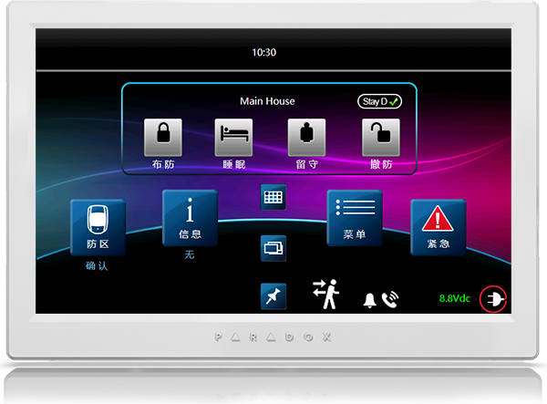
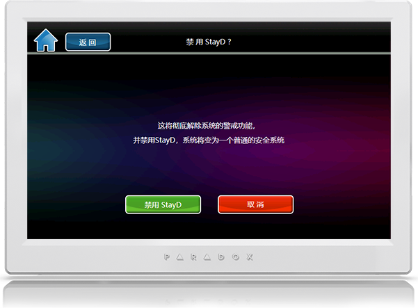
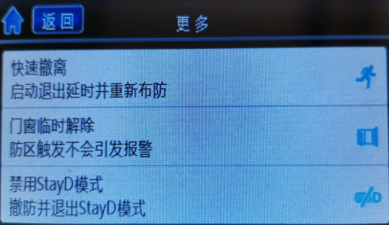
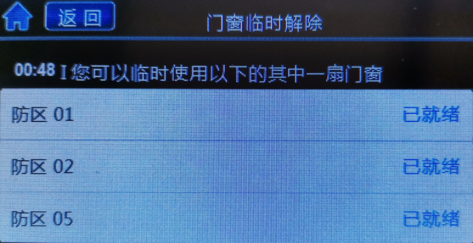

# 高级功能 - StayD模式

本文讲述枫叶StayD模式的使用和说明

## 简介

传统安全系统，在居家时由于家人的活动出入，经常撤防系统，会留下巨大安全漏洞。

StayD提供7*24小时不间断安全守护，永不撤防，提供更多的安全保护。

## 启用/禁用StayD模式

请参考下图步骤设置

步骤一：在键盘主页面点击StayD图标：

步骤二：选择启用或禁用

## 使用场景

以下场景，在不撤防系统的情况下，提供了一个可以方便的临时出入和周边门窗的使用方式。

请在以下三种场景下在触摸屏键盘上点击**更多**，选择需要的场景：

### 出/入大门

- 出（家中有人）：点**快速撤离** → 大门防区退出延时 → 走出大门延时结束后自动转为留守布防；
- 出（家中无人）：点**外出** → 大门防区退出延时 → 走出大门延时结束后自动转为全区布防；
- 入：走进大门 → 大门防区进入延时 → 走到键盘密码撤防 → 自动转为留守布防。

### 临时开门/窗

点**门窗临时解除** → 键盘提示可使用的门/窗号 → 延时内可以打开门/窗 → 同时系统不间断处于留守布防。如图：

### 留守/睡眠布防转换

- 点**睡眠** → 留守转睡眠 → 睡眠防区延时 → 有足够时间走入卧室，安全等级提高；
- 点**留守** → 睡眠转留守 → 立刻切换到留守布防 → 活动空间变大。
