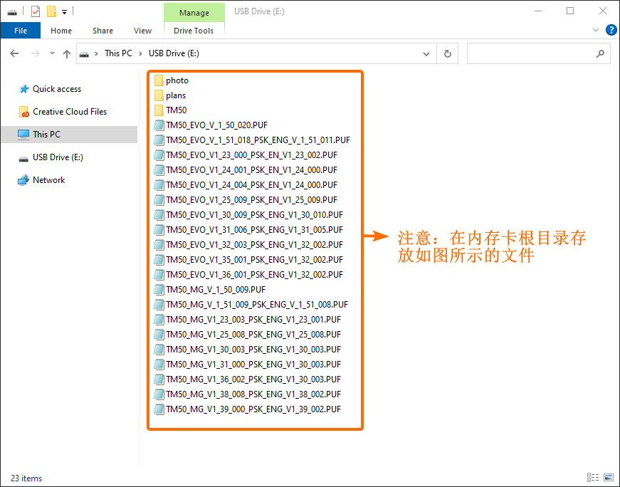
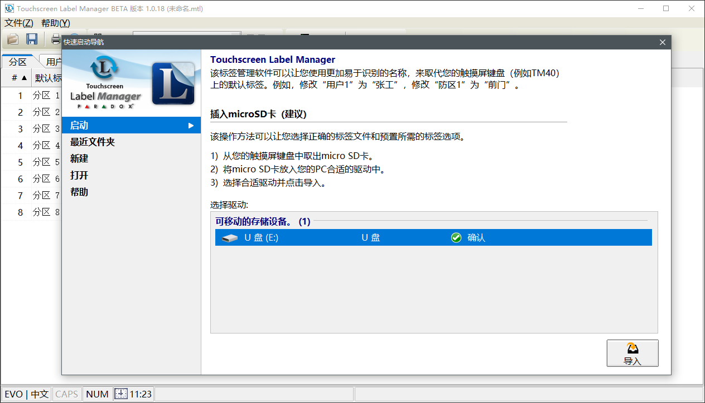
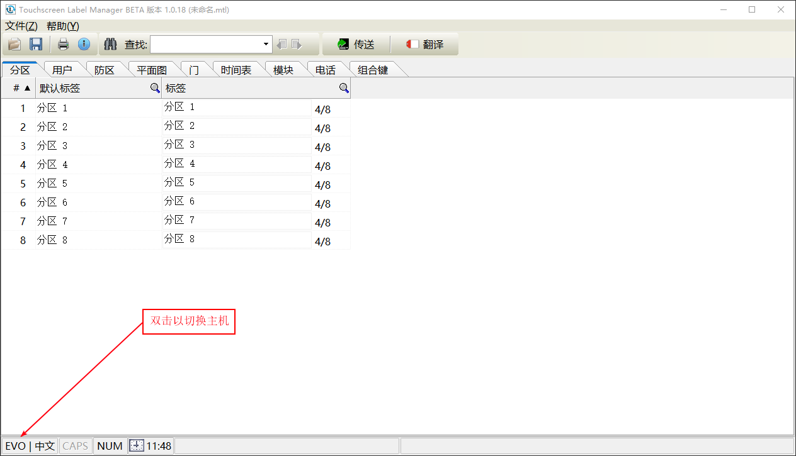
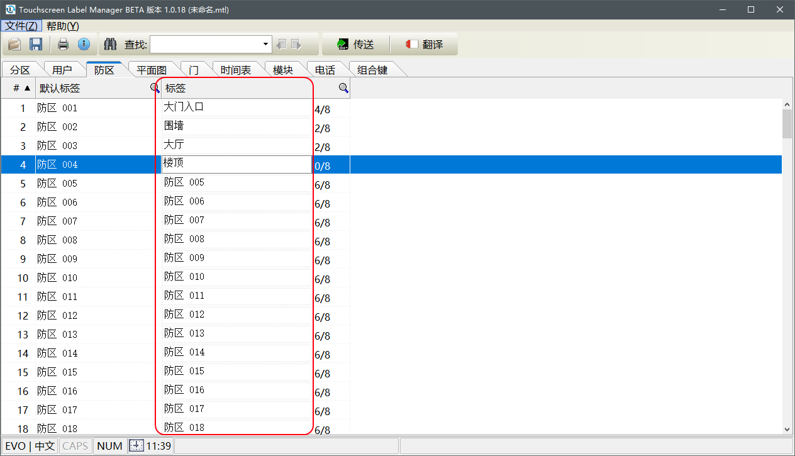
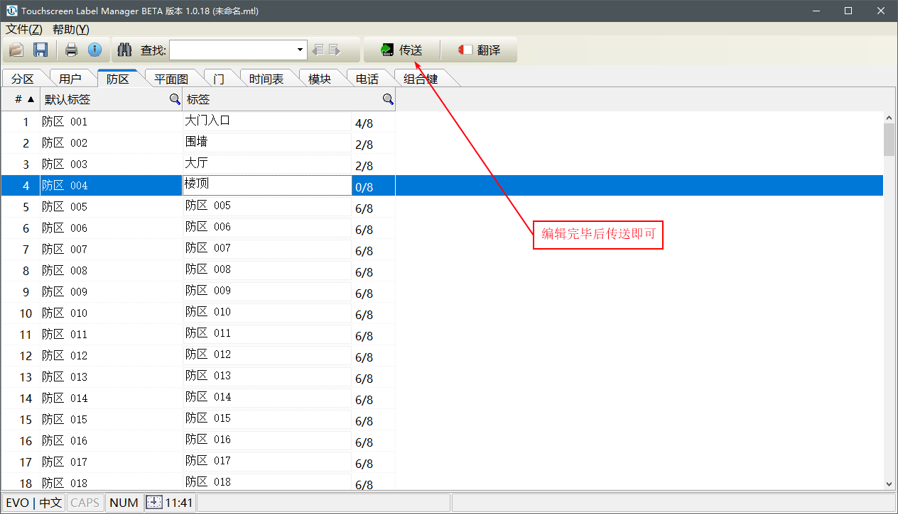
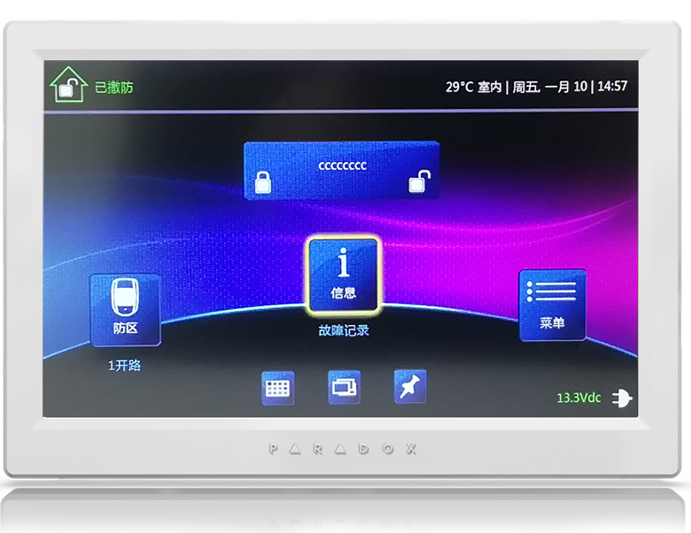
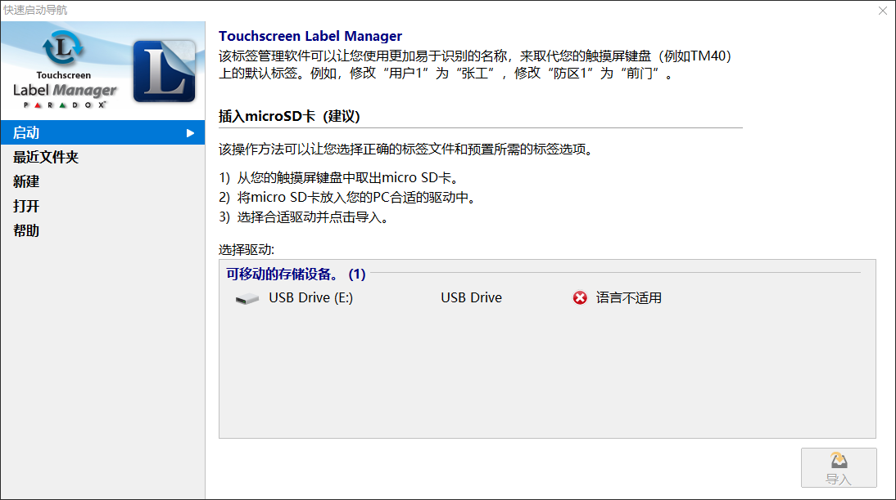
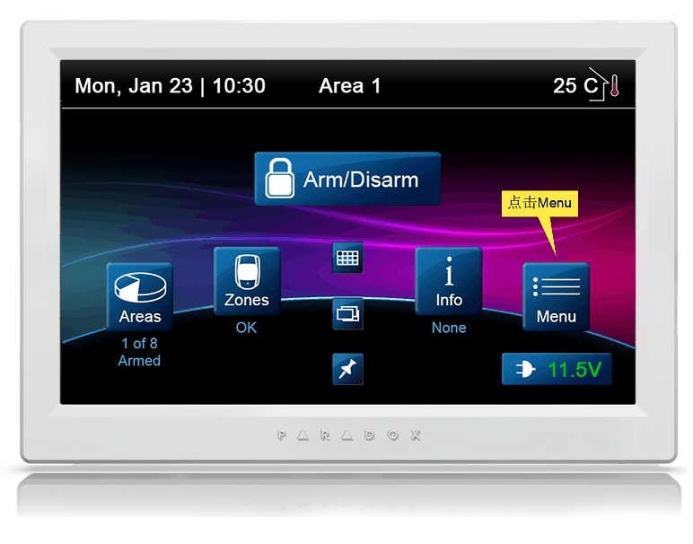

# 安装设置 - 触摸键盘

通过枫叶触摸键盘标签工具可以对触摸键盘的防区，分区等名称进行自定义，支持中文。

## 简介

触摸屏操作键盘提供多国语言，借助触摸键盘标签工具可以对其中的标签（如：防区标签、分区标签、用户标签等）自定义，本文介绍工具的使用方法。

## 视频教程

视频介绍较简单，仅供参考，请以文档为准。  

 <video controls="controls">
    <source src="https://cdn.senboll.com/media/video/tm50-touchscreen-label-manage-teching-video-cover-picture.mp4" type="video/mp4">
 </video>

## 操作步骤

### 安装软件

工具软件下载，请根据实际选择下载使用：

- TM50请访问 → [TM50键盘标签管理软件](https://senboll.com/zh-hans/product-detail/462)
- TM70请访问 → [TM70键盘标签管理软件](https://senboll.com/zh-hans/product-detail/471)

### 更新或替换内存卡初始文件

内存卡初始文件下载，请根据实际选择下载使用：

- TM50请访问 → [TM50键盘内存卡初始文件](https://senboll.com/zh-hans/product-detail/46)
- TM70请访问 → [TM70键盘内存卡初始文件](https://senboll.com/zh-hans/product-detail/47)

找到对应的触摸屏操作键盘在**其他文件**下载。根据操作键盘型号找相应的内存卡文件，拷贝文件到内存卡根目录。请参考下面TM50的内存卡的文件，如图：

### 编辑标签

请将触摸屏操作键盘的内存卡插入电脑，读卡成功后如下图，然后点击导入。

选择主机，按实际选择相应的系列主机：

可以对分区，防区，用户，平面图，门等常用标签自定义，如图：

::: tip
**默认标签**不能修改，只可以自定义**标签**。
:::

编辑完成点击传送，如图：

## 其他问题

- 如果电脑无法读内存卡，有可能是读卡器的问题或者损坏请更换再尝试。
- 内存卡的文件不能空白或者损坏，存储的文件是键盘默认的文件，如果文件损坏或者丢失，请参考 → [更新或替换内存卡初始文件](#更新或替换内存卡初始文件)。

### 内存卡编程文件丢失

错误如图：

有两个原因：

1. 刚出厂键盘还**未上过电**，需要上电初始化后，才可以使用标签管理工具读取写内存卡，所以需要先将内存卡插入键盘并启动完成初始化，再使用电脑读内存卡。
2. 卡内的文件有问题，更新和替换内存卡初始化文件请参考 → [更新或替换内存卡初始文件](#更新或替换内存卡初始文件)，根据操作键盘型号找相应的内存卡文件，**切记请先格式化内存卡**，再拷贝文件到内存卡根目录。

### 防区分区标签错误

错误如图：

两种解决方法：

方法一：通过键盘菜单命令复位标签。

针对EVO：

|键盘|步骤|
|:------|:------|
| TM70 | 菜单 → 高级设置 → 安装设置 → 安装者密码（默认：000000） → 设置该键盘 → 恢复出厂语言并重新启动 |
| TM50 | 菜单 → 高级设置 → 安装设置 → 安装者密码（默认：000000） → 设置键盘 → 恢复出厂语言并重新启动 |

针对SP/MG：

|键盘|步骤|
|:------|:------|
| TM70 | 菜单 → 系统设置 → 安装者密码（默认：0000） → 高级设置 → 安装者密码（默认：0000） → 键盘设置 → 恢复出厂值 |
| TM50 | 菜单 → 系统设置 → 安装者密码（默认：0000） → 高级设置 → 安装者密码（默认：0000） → 键盘设置 → 恢复出厂值 |

方法二：请使用标签管理工具修改有问题的标签，访问 → [触摸键盘标签工具说明书](/content/node2/touchscreen-lable/)

### 提示分区锁定

一般是输入的密码错误次数太多导致，如果在5分钟之内输入密码错误5次会导致整个情况发生，每次锁定时间是15分钟。

### 出现花屏

这是由于系统突然断电导致内存卡内的文件损坏，可以尝试格式化内存卡，然后重新拷贝初始化文件到内存卡，如果格式化不成功，可能卡已损坏，请更换。

更新和替换内存卡初始化文件请参考 → [更新或替换内存卡初始文件)](/content/node2/touchscreen-lable/#更新或替换内存卡初始文件)，根据操作键盘型号找相应的内存卡文件，**切记请先格式化内存卡**，再拷贝文件到内存卡根目录。

### 图标显示不全

请通过键盘上的升级固件菜单解决。

### Memory Read Error

`Memory Read Error！Error #：000029` 这是内存卡读取失败，请检查内存卡，如果损坏请更换。

### 内存卡语言不适用

当键盘语言是非中文的时候，会出现这个错误，如图：

请把内存卡插回键盘，在键盘上切换到中文（方法参考 → [无法显示中文](#无法显示中文)）。

### 无法显示中文

请先在触摸键盘上切换语言，EVO系列请参考下面的步骤：

如果没有找到中文，请尝试下面的方法。

情况一：固件版本的问题，请更新固件版本，方法如下：

|主机类型|步骤|
|:------|:------|
|EVO | Menu → Advanced → Upgrade → 选择最新的固件|
|SP | Menu → Settings → Update Firmware → 选择最新的固件|

情况二：内存卡文件问题，请替换文件，方法如下：

有可能是内存卡文件的问题，请下载最新的文件，更新和替换内存卡初始化文件请参考 → [更新或替换内存卡初始文件)](/content/node2/touchscreen-lable/#更新或替换内存卡初始文件)，根据操作键盘型号找相应的内存卡文件，**切记请先格式化内存卡**，再拷贝文件到内存卡根目录。
