# 安装设置 - 微信模块

通过对微信模块的安装调试，实现消息推送到用户手机微信上。

## 简介

微信端给用户提供了实时的消息推送，包括文字报警消息和视频报警消息，故障消息，布撤防消息，还有系统的日志等其他消息，这些消息保存在我们的后端服务器上，这一点对于有些极端情况会很有用，如：当安防设备遭到破坏或盗走，报警消息和视频依然可以通过微信端查阅，这些都可以为后期警察侦破案件提供有力的证据！

实现将文本消息和视频消息推送至用户手机微信端的一款安防消息推送方案。微信在国内可以说是必装的手机应用，消息推送的稳定性、时效性有保障，我们正是基于此推出了微信端解决方案。至少有2个优势：

1. 应用越多手机越慢大家都知道，这种方案避免手机安装过多的应用程序。
2. 经过测试微信推送的时效性目前来说是最靠谱的，胜过系统级推送，这对于安防报警需求来说很重要。

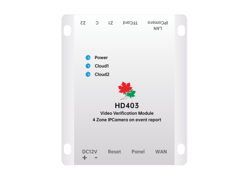

## 功能参数

- 支持4路（模块型号：HD403）或8路（模块型号：HD803）（最大1080P）高清IPC接入，支持三码流
- 支持1080P/720P/WD1/4CIF/DCIF/2CIF/CIF/QCI分辨率录像
- 2个板载有线防区，1路LAN/WAN以太网接口
- 支持报警联动视频复核
- 支持视频移动侦测、视频遮挡、视频丢失，支持30s（2M码流，全帧率）延时预览，延时时间可配置
- 支持通过网络传输报警、视频数据
- 支持APP（报警推送、视频预览、视频回放、远程布撤防、消警、防区编程等功能）
- 支持2000条报警事件记录、500条操作事件记录，500条用户管理操作记录，支持条件过滤查询
- 查询事件日志
- 支持独立的以太网接警中心，支持2组独立的中心IP地址
- 支持定时布撤防（日常计划、优先计划）
- 支持主机防拆报警，支持探测器防拆报警
- 支持1路串口
- 支持TF卡本地录像存储
- 支持微信平台，事件及报警视频推送
- 尺寸：94 x 76 x 30mm（长度 x 宽度 x 厚度）

## 安装调试

### 准备工作

- 硬件：枫叶主机和微信模块，互联⽹（连接微信模块的路由器需要开启DHCP选项）。
- 软件：
  - 一台电脑，推荐 Windows 10 操作系统。
  - 下载搜索工具 → [搜索工具下载](https://www.senboll.com/zh-hans/product-detail/484) → 找到**其他文件**点击**搜索工具**即可下载。

请提前（例如，探测器，警号，蓄电池，操作键盘）接线并对防区，分区，用户等内容进行编程设置。使用微信模块包装盒里的四芯线将微信模块的**Panel口**和安防主机**Serial口**连接，保证网络畅通，插网线至微信模块**Wan口**，然后给整个系统上电。

### 指示灯说明

以下是模块指示灯状态说明：

| 指示灯 | 状态说明 |
|---|---|
| Power | 指示模块供电状态，绿灯常亮表示模块供电正常。 |
| Cloud1 | 指示云平台1的服务状态，模块正常工作后绿灯常亮表示已成功注册到云平台1，并且开通服务。::: tip
Cloud1如果不亮，有可能是未注册开通云服务或者云服务到期，不一定是网络不通或者模块问题。
::: |
| Wan | 缺口朝上的情况下：左边黄灯表示数据发送状态，如果闪烁，表示有数据传输；右边绿灯表示物理联通。 |

### 步骤1：模块设置

打开搜索模块，搜索微信模块。请保证电脑和微信模块在同一个局域网。如图：  

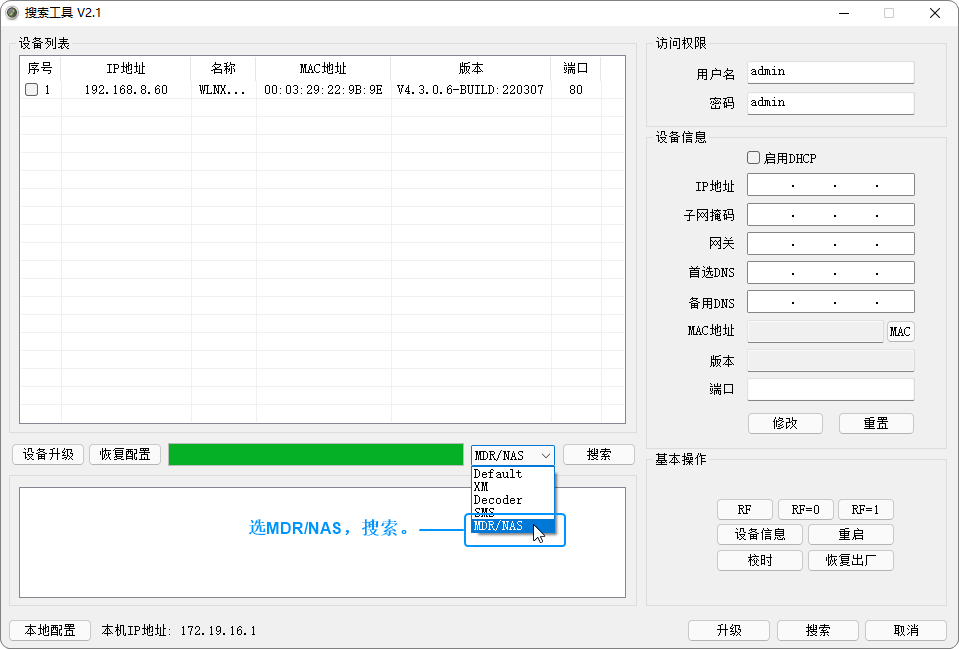

搜索到模块之后，双击搜索结果会自动打开浏览器，进入登陆界面，默认用户名和密码是`admin`。

#### 平台设置

平台设置是接入枫叶微信服务器的重要一步，请按照图上标注的设置内容设置即可，如图：

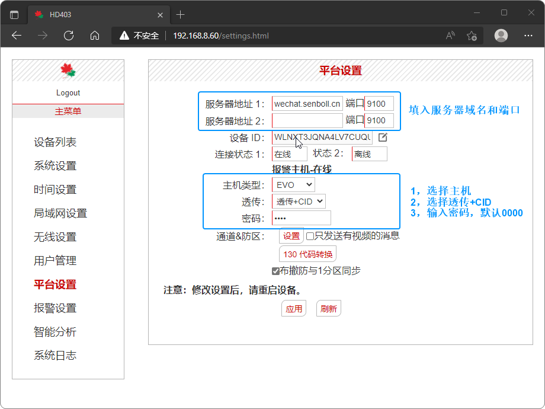

设置完请重启设备，也可以打开左侧菜单**系统设置**，找到重新启动系统选项执行软件重启。如图：

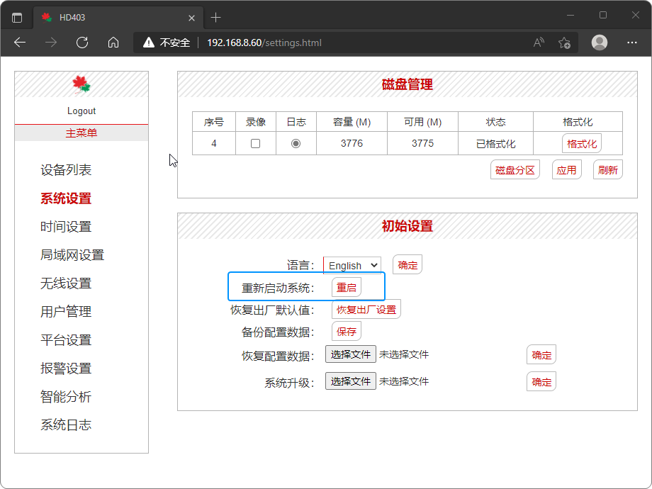

#### 视频联动的设置

目前一个模块最多支持绑定4路摄像机，如果要扩展，可以增加微信模块，如：需要添加11路摄像机，则需3个微信模块，多个微信模块的设置在下面的内容中专门会讲。

- 只有一个微信模块

微信模块支持枫叶HD系列摄像机，还支持onvif协议的第三方摄像机。打开页面左侧**设备列表**菜单，按照下图的步骤：

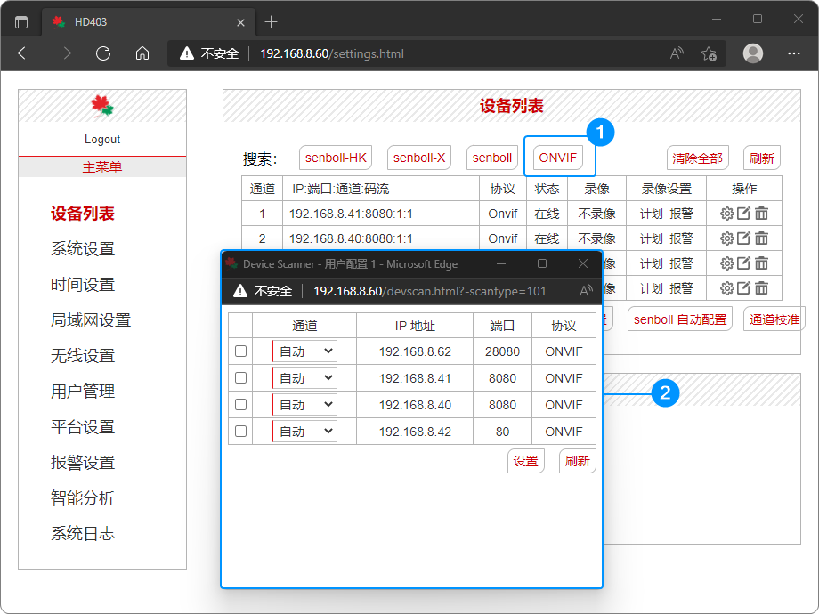

如果显示摄像机离线，有可能是访问摄像机的用户名和密码（此密码即是web直接访问摄像机所需的用户名和密码）不对，请按照下面步骤：

点击摄像机编辑按钮

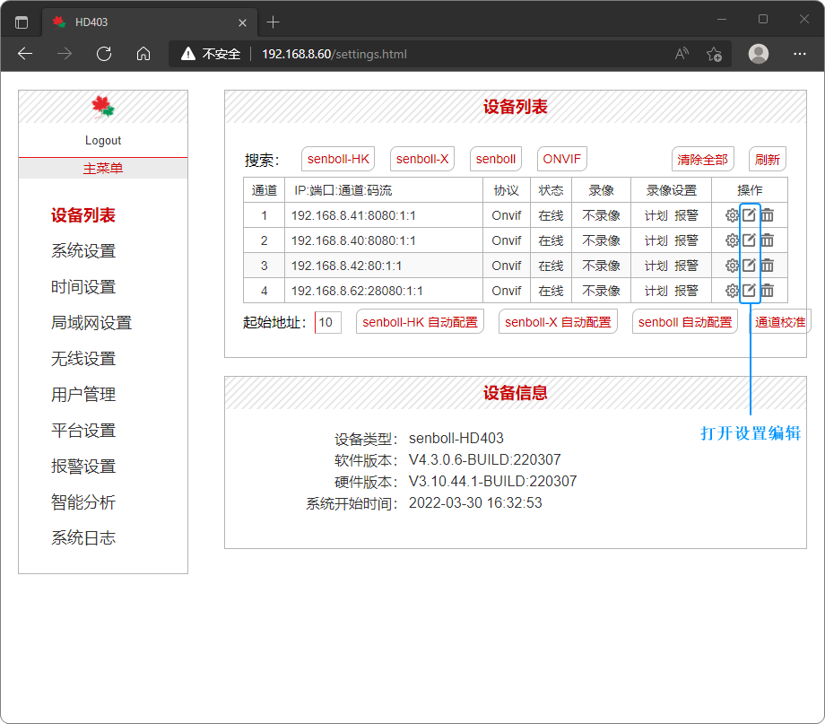

打开页面，填入用户名密码。

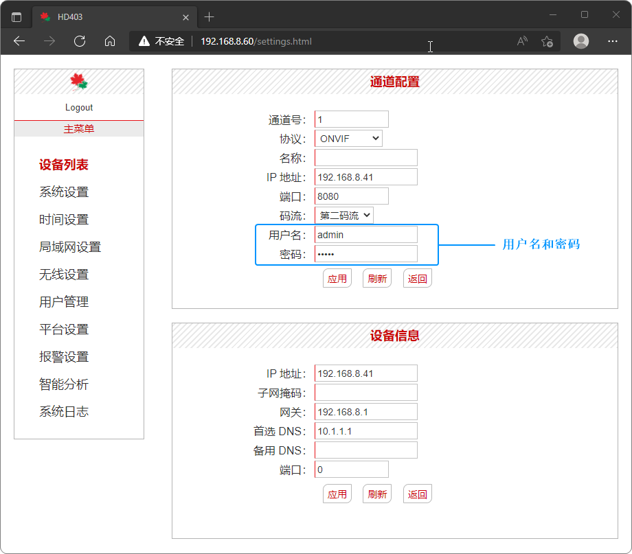

- 多个微信模块（如果只有一个微信模块，请忽略此内容）
  
如果需要联动的摄像机数量超过4路，需额外增加微信模块，每个微信模块支持4路，具体需要多少个微信模块，可由摄像机数量计算得到。

1. 首先需要正确的连接线路，方法：将这些微信模块并接到主机端或者对接模块上。
2. 接下来是web设置，将其中1个微信模块作为主模块（主模块设置类似上文只有一个微信模块的设置方法），其余作为从模块，主从模块的设置只有一处不同：在从模块的网页设置页面中勾选**只发送有视频的消息**，如图：

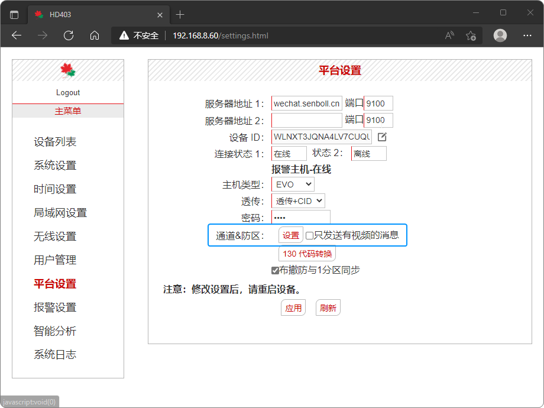

- 防区绑定摄像机

每一个防区都可以绑定一个摄像机，以实现报警视频推送至微信端，点击左侧菜单**平台设置** → 找到通道和防区选项点击**设置**进入通道和防区联动设置界面，找一个需要联动摄像机的防区选择一个通道即可。方法如图：

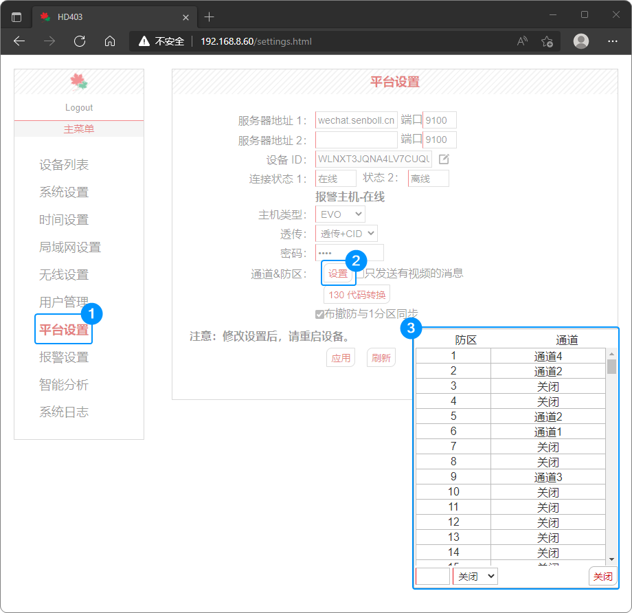

#### 网络设置

WAN口默认IP地址服从路由器的DHCP自动分配，当然支持手动指定IP，按需设置即可。如图：

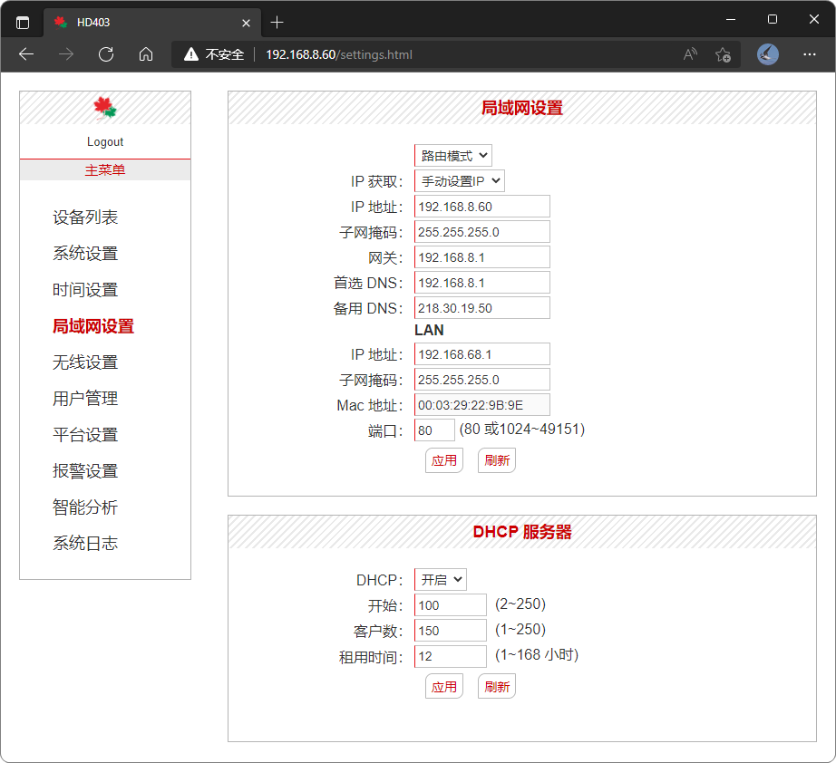

### 步骤2：手机注册

::: tip
建议：安装人员先使用自己的手机关注公众号调试，待功能测试通过后，再转移管理员给业主。
:::

新用户，请使用手机微信扫描以下二维码，关注公众号：  

然后进入公众号 → **账户管理** → **账号管理**，按照页面提示注册账户。

#### 添加主机

::: tip

- 第一个添加主机的手机会默认为管理员，其余手机只能通过管理员添加。
- 管理员可以移交管理员给任何一个成员。
- 管理员可以设置其他成员的权限，包括能否控制主机、调取视频和推送消息类别。
- 报警消息默认永久推送，不可关闭。
  
**强烈建议：只推送报警消息给普通成员。**
:::

点击账户管理 → 账号管理 → 添加主机，扫描微信模块外壳上的二维码，并完善一些信息和选择需要的推送事件，如图：

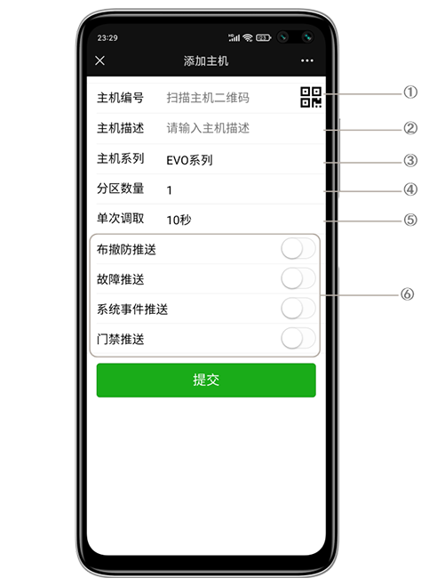

①：点击扫描微信模块二维码  
②：添加一个描述  
③：选择主机类别  
④：配置分区数量，要和编程开启的分区数量匹配  
⑤：调取实时视频的时长

#### 开通或续费

回到公众号首页点击账户管理 → 充值交费，在弹出的新页面点续费。

接下来的页面中有3个选择：

- 试用一个月，点击确认支付，即可开启1个月的试用期，试用期到了会停止推送，续费后将会继续提供服务。
- 推荐选择360元/三年，相当于每年120元，比较划算，充值后1个月的试用期会自动累加进去。
- 1年交费150元，充值后1个月的试用期会自动累加进去。

### 步骤3：微信端一些设置

第一个添加主机的手机就是管理员，通过管理员手机可以设置一些系统参数，添加删除成员，分配成员的权限等功能。

管理员进入管理模式的方法：公众号首页点击账户管理 → 账户管理，在弹出的页面按住已添加的主机左滑，将打开更多配置选项：

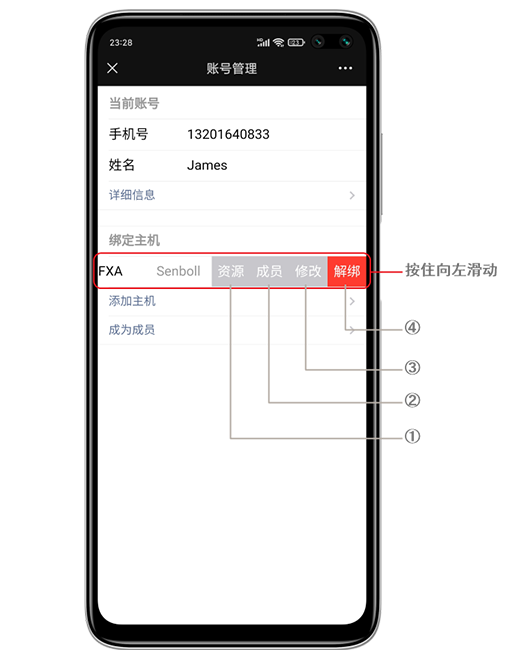

①：资源 - 目前主机配置参数不能自动同步到微信端，微信端需要手动配置，如：**分区标签**、**防区数和标签**、**用户数和标签**、**门数和标签**等；  
②：成员 - 增减成员和设置其权限；  
③：修改 - 修改当前主机的一些配置信息，如**分区数**等；  
④：解绑 - 解绑当前手机，替换或者转移系统给其他人。

#### 资源设置

打开资源设置页面，对主机的一些资源设置，包含防区、分区、用户、门、视频通道的标签等，如图：

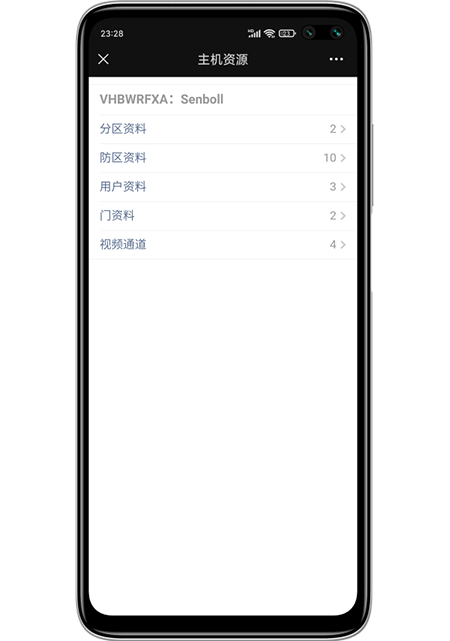

#### 成员管理

微信端最多支持16个成员，即16个手机用户，包括管理员。管理员可对每个普通成员设置权限，管理员可以转移管理员权限给其他普通成员。

::: warning
目前使用中发现，因为设置了推送大量的不重要的信息（布/撤防信息等），久而久之，疲于查看推送来的消息，甚至有人将公众号设置为**消息免打扰**模式，如果真有报警消息，会导致手机无法提示，造成隐患。

因此为了减少这些干扰，突出报警消息的重要性，**强烈建议：取消布撤防、系统事件和门禁推送**。
:::

##### 添加其他成员

- 步骤一：新成员需要提前关注此公众号，并在公众号首页点击账户管理 → 账户管理，在弹出的页面下面点成为成员，将会生成二维码，如图：

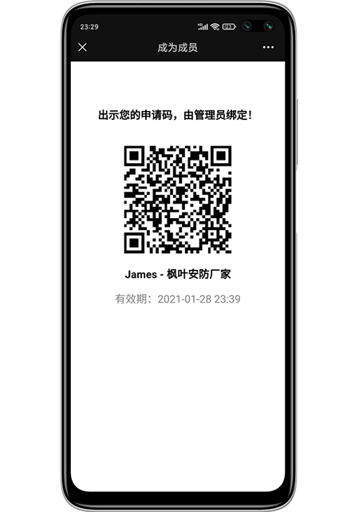

- 步骤二：管理员回到公众号首页点击账户管理 → 账户管理，在弹出的页面按住已添加的主机左滑，将打开更多配置选项，选择成员选项，在打开添加成员的设置页面点添加成员，然后扫描上一步新用户的二维码，同时对其资料和权限做一些设置。如图：

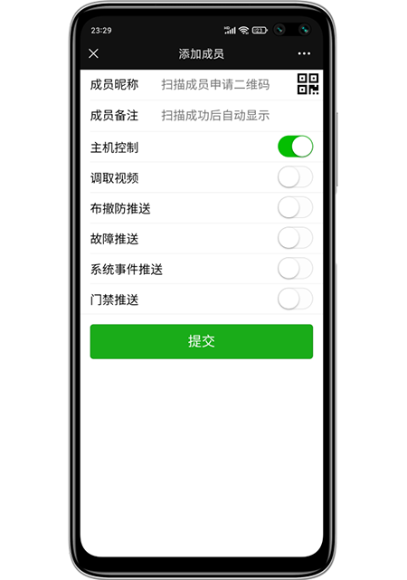

##### 设置成员

管理员可以添加或删除其他成员，也可以对每一个成员的权限单独设置。管理员回到公众号首页点击账户管理 → 账户管理，在弹出的页面按住已添加的主机左滑，选择成员，即可进入成员管理页面，此时可以对已有的成员进行设置，方法如图：

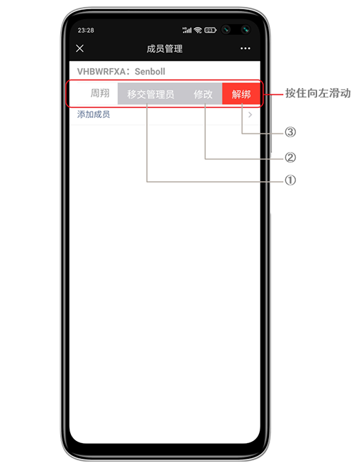

①：移交管理员 - 转移管理员给其他成员  
②：修改 - 修改当前成员权限  
③：解绑 - 删除成员

##### 设置成员权限

管理员回到公众号首页点击账户管理 → 账户管理，在弹出的页面按住已添加的主机左滑，将打开更多配置选项，选择成员选项，在打开添加成员的设置页面选择一个用户，按住向左滑动打开设置选项，点修改进入权限设置页面：

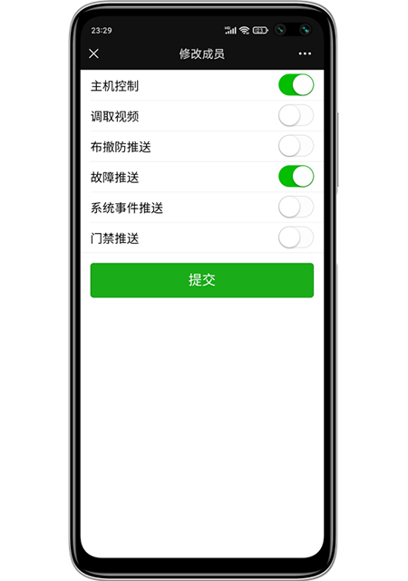

#### 修改

如果已添加了主机，需要修改当前主机的分区数等，进入此菜单设置即可，如下图：

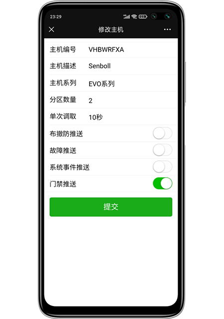

### 复位

按住微信模块Reset复位按钮15秒后，Cloud1指示灯如果有变化（闪烁一次），松开按钮，即复位重置成功。

### 模块升级

模块支持通过web升级固件，请提前下载好固件，固件下载地址 → [最新固件](https://www.senboll.com/zh-hans/product-detail/484)。方法如图：

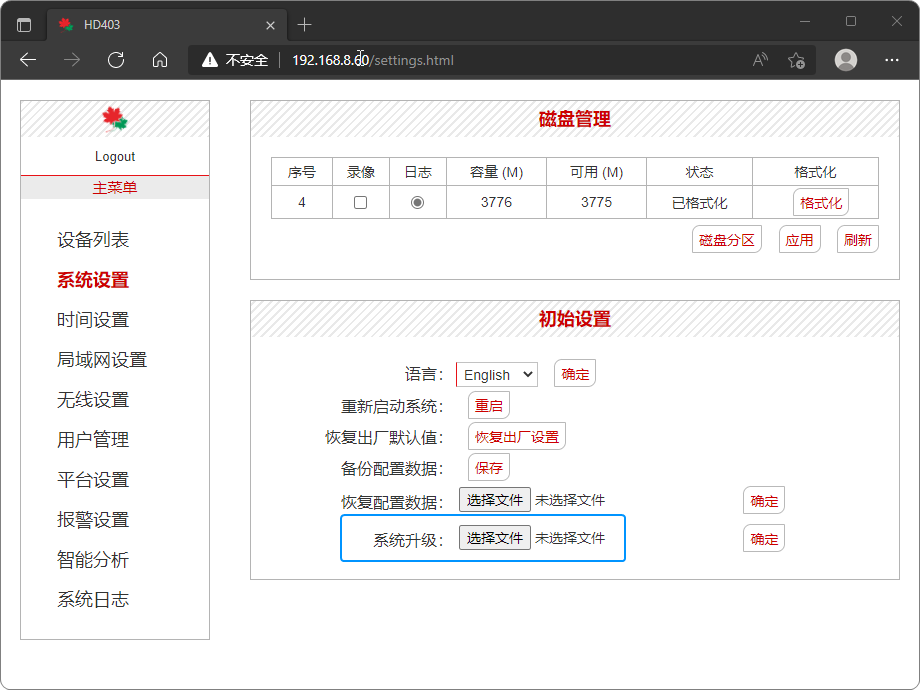

## 用户操作指南

下面是一些常见的操作的方法，如果需要更多的支持或建议，请联系我们 → [联系方式](#售后服务)。

### 布撤防操作

告别复杂繁琐的操作，通过微信端实时对安防系统进行布撤防操作，进入公众号点主机控制 → 分区控制，即可实现布撤防操作，如图：

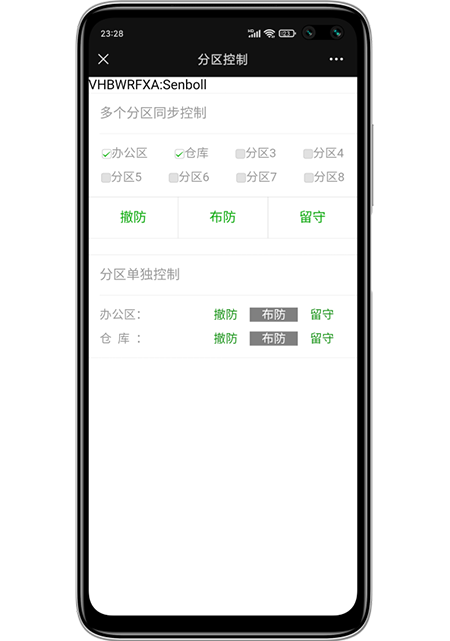

### 查询事件

事件查询是很有用的一个功能，为事后的核实提供重要的证据，我们提供了多种事件类型，进入公众号点主机控制 → 分区控制，选择需要查询的条件，如图事件类型，时间等条件，如图：

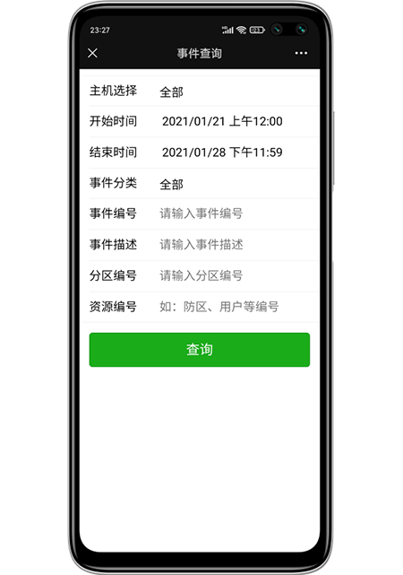

### 查询系统状态

进入公众号点主机控制 → 主机状态，即可显示当前系统的状态，包含分区和联动的监控摄像头状态，如图：

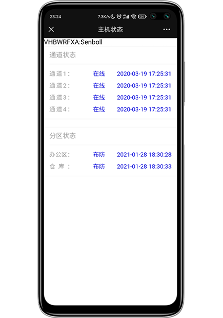

### 调取现场实时视频

进入公众号点主机控制 → 防区视频，在打开的页面，点击相应的通道所对应调取的时间来获取现场视频，如图：

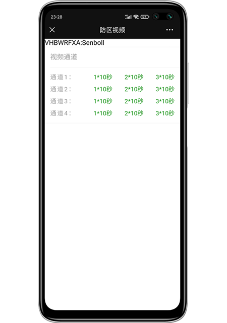

### 成员管理

微信端最多支持16个成员，即16个手机用户，包括管理员。管理员可对每个普通成员设置选项，管理员可以转移管理员权限给其他普通成员。

请访问 → [成员管理指南](/content/node2/wechat-module/#%E6%88%90%E5%91%98%E7%AE%A1%E7%90%86)

### 交费

回到公众号首页点击账户管理 → 充值交费，在弹出的新页面点续费，如图：

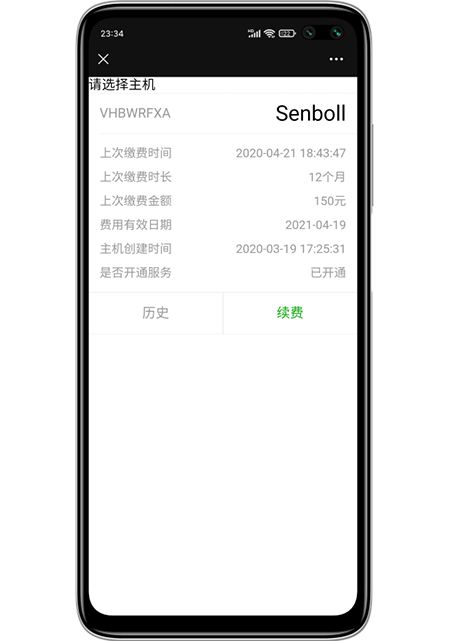

接下来的页面中有两个选择：

- 推荐选择360元/三年，相当于每年120元，比较划算。
- 1年交费150元。

### 售后服务

进入公众号点客户服务，选择对应选项来获取我们的服务。

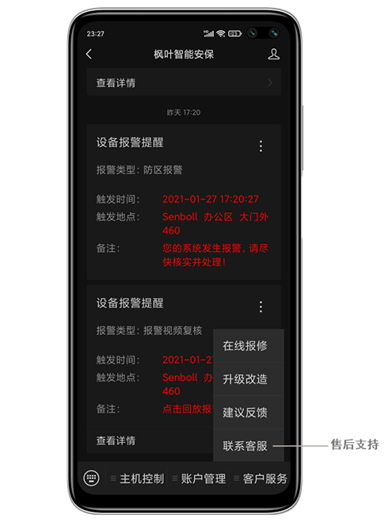

## 常见问题

### 手机无法播放视频

请在摄像机的视频设置里，将**子码流**的编码格式设置为h.264，输出流只选视频流，帧率（推荐值：25）和比特率（推荐值：1024）不宜太高。如图：

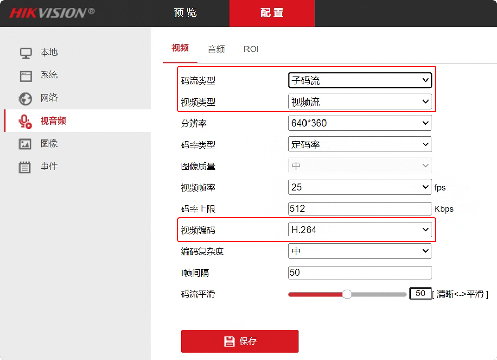

### 海康摄像机协议升级

针对2023年海康摄像机协议发生变化，HD模块添加海康摄像机一直提示“密码错误”。由于最新的安全认证基于时间，确保摄像机“NTP校时”开启，需要用onvif协议添加。配置方式如下：
1. 登录到摄像机web页面，开启NTP自动校时，并保存。

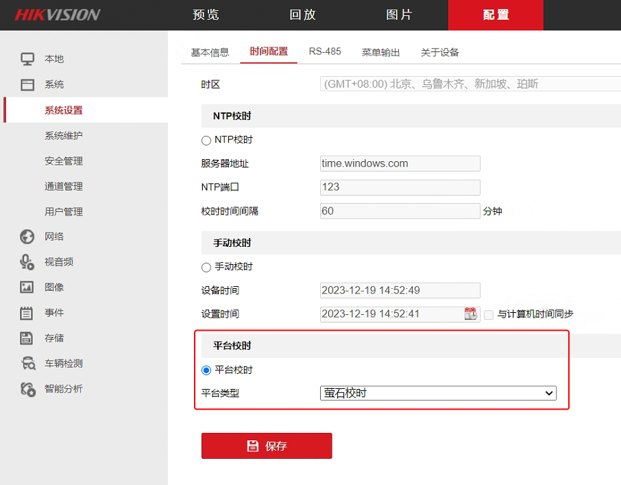

2. 登录到摄像机web页面，找到集成协议设置选项，将“启用开放型网络视频接口”选到开启状态，并增加一个用户，如下图：

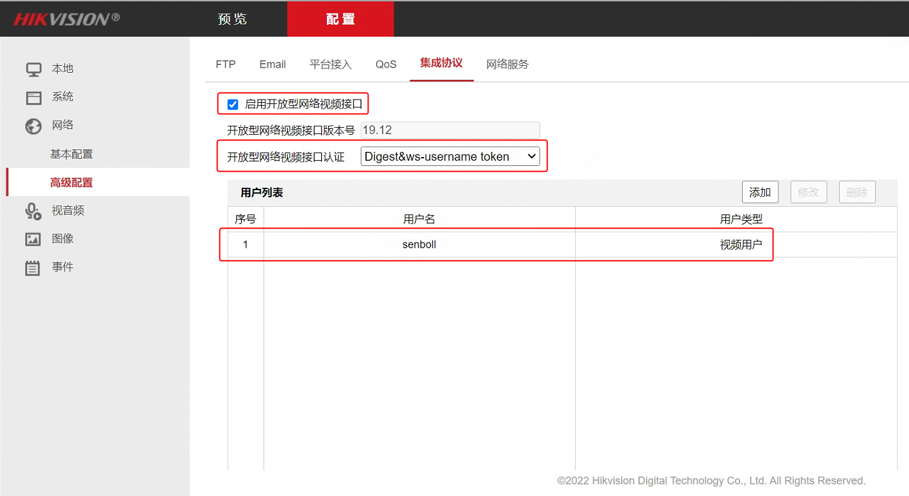

3. 在微信模块web页面中添加通道，协议选择为onvif，端口号为80，用户名和密码为上一步添加的用户。