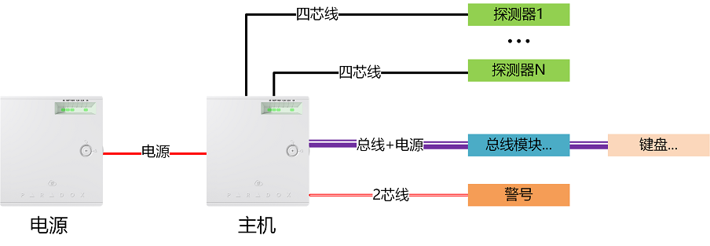
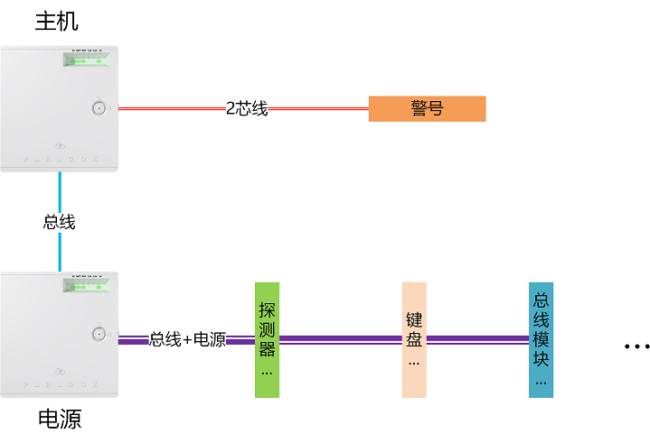
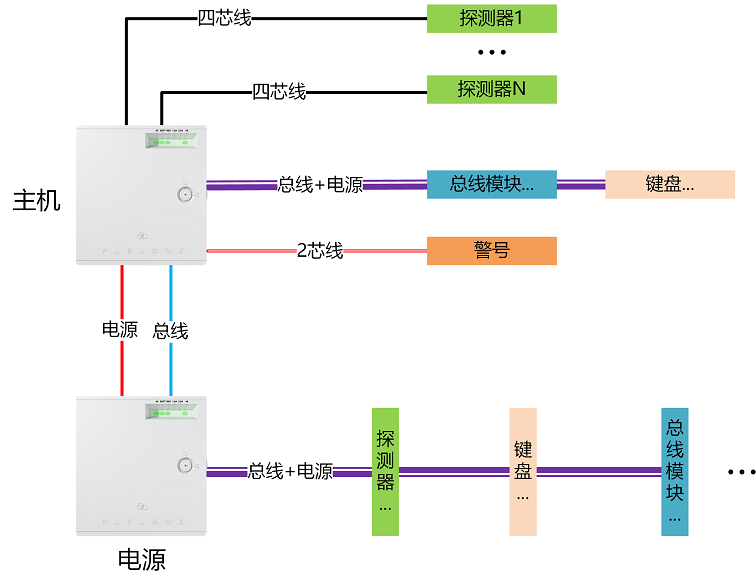
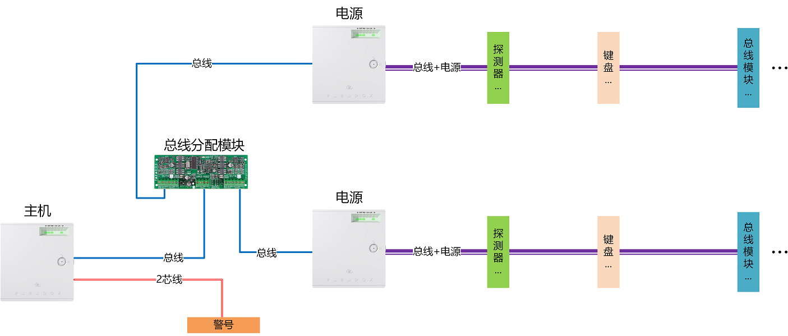
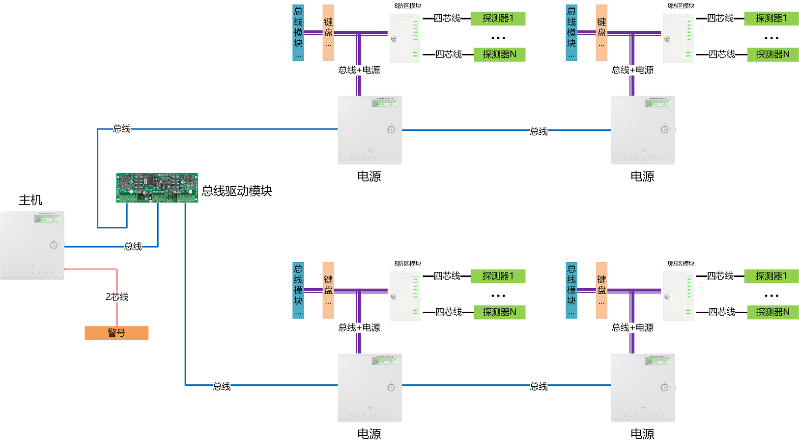
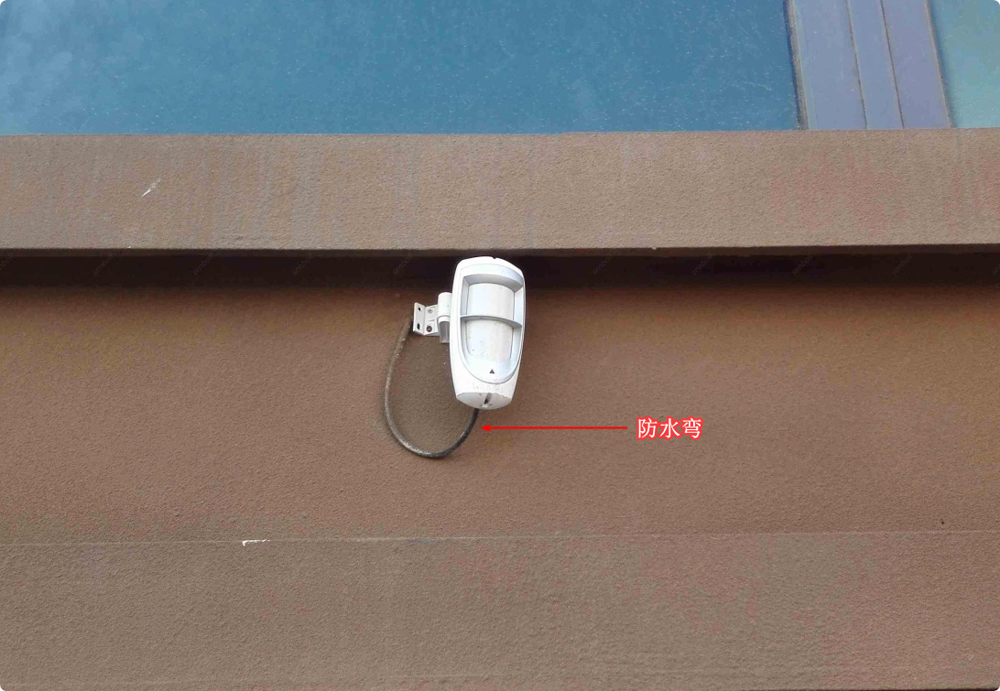

# 布线安装指南

本文主要针对安防系统设计和施工人员，一个项目能否取得成功，前期的设计是非常重要的一步。

## 简介

布线是安防系统施工重要的一环，要结合通讯方式，通信距离，设备数量等因素选择合理的方式布线。安防系统包含主机、键盘、探测器、警号和其他通讯模块，下面逐个介绍一下如何专业的布线。

## 接线图

为了更直观的便于大家理解，我们对常用的设备制作了详细的CAD接线图，具体到接线端子之间的对应关系，请咨询业务人员。

## 线材

本系统中的设备主要是总线和干接点两种方式，干接点两个接点间没有极性，无电源，可以互换，输出通断信号；总线是数字通信方式，采用了通信协议，比如常见的485，CAN总线等等，枫叶的总线方式属于枫叶自己研发的通信协议。下文提到的总线即是枫叶总线。

::: tip

1. 针对于枫叶总线我们建议采用带屏蔽RVVP4 x 0.75+ 线材，干接点通信方式的线材建议RVV4 x 0.75+，其中“+”表示不低于这个规格，可以比这个规格更高。
2. 关于总线模块，只要具备枫叶总线通信方式的模块都是总线模块，如键盘，探测器，无线扩展模块，对接模块，继电器，防区模块都属于总线模块。
3. 枫叶探测器有的带总线接口，有的只带干接点输出接口，也有两种接口都带。如果不带总线接口，可以加单防区模块将干接点通讯模式转换为总线通讯模式。所以只要主机支持总线通讯模式，所有探测器都可以通过总线模式布线。
:::

以下是枫叶设备通信方式和线材规格：

| 设备 | 通信方式 / 线材 |
|---|---|
| 操作键盘  | 枫叶总线；4芯带屏蔽，规格：RVVP4 x 0.75+ |
| 探测器（总线通信）  | 枫叶总线；4芯带屏蔽，规格：RVVP4 x 0.75+ |
| 无线功能扩展模块  | 枫叶总线；4芯带屏蔽，规格：RVVP4 x 0.75+ |
| 门禁模块  | 枫叶总线；4芯带屏蔽，规格：RVVP4 x 0.75+ |
| 集成打印模块  | 枫叶总线；4芯带屏蔽，规格：RVVP4 x 0.75+ |
| 防区模块  | 枫叶总线；4芯带屏蔽，规格：RVVP4 x 0.75+ |
| 继电器模块  | 枫叶总线；4芯带屏蔽，规格：RVVP4 x 0.75+ |
| 电源模块-PS25/PS45 | 枫叶总线；4芯带屏蔽，规格：RVVP4 x 0.75+ |
| 探测器（干接点通信） | 干接点；4芯，规格：RVV4 x 0.75+ |
| 警号 | 有源方式；2芯，规格：RVV2 x 1.0+ |

::: warning
请避免下面两种错误的做法，一旦因为线路不符合要求而发生了干扰或者供电不足，几乎没有办法补救，只能换成无线系统！

1. 如果是总线通信方式，请用带屏蔽线材，因为在施工的过程中，万一和强电并行走线的时候，可能会产生强磁场，干扰正常通信甚至无法通讯。
2. 不要用网线，网线是用来连接网络设备，传输高速数字信号，线径细，不可当做电源线用，否则电源无法保证。
:::

## 关于电源线径和线路压降

要配置合理可行的方案，在设计方案的时候应该提前对综合布线的线缆敷设长度，线缆的规格选择，以及电源规格等进行估算，下面提供了导线规格选择，传输长度具体的计算方法，请参考。

### 根据线径和负载来计算导线最远传输距离

传输长度由线路压降、导线截面积和负载最大电流决定，传输长度计算公式为：

L = ( r * ΔU * S ) / I

- I：导线中最大电流(安)；
- L：导线长度(米)，等于距离的2倍；
- r：电导率（电阻率的倒数),铜取57，铝取34；
- ΔU：导线设定压降(伏)，12V时取1.8V；
- S：导线截面积(平方毫米)。

如：采用铜导线，导线截面积为1mm²，最大电流1A，压降不小于1.8（枫叶主机AUX输出电压为13.8v，因为设备和蓄电池充电电压应不小于12V，所以最大压降=13.8-12=1.8V）。则导线有效距离最大值等于 = L/2 = ( 57 * 1.8 * 1) / 1 / 2 = 51.3米，因此最大传输距离不可超过51.3米，否则会导致设备工作电压低于额定电压。

### 根据导线长度和负载来确定线径

直流电缆线径由线路压降决定，导线截面积计算公式为：

S = ( I * L ) / ( r * ΔU )

- I：导线中最大电流(安)；
- L：导线长度(米)，等于距离的2倍；
- r：电导率（电阻率的倒数),铜取57，铝取34；
- ΔU：导线设定压降(伏)，12V时取1.8V；
- S：导线截面积(平方毫米)。

如：采用铜导线，导线长度为50m，最大电流1A，压降不小于1.8（枫叶主机AUX输出电压为13.8v，因为设备和蓄电池充电电压应不小于12V，所以最大压降=13.8-12=1.8V）。则应选择的导线截面积等于 = (1 * 100 * 2) / ( 57 * 1.8 ) = 0.97 mm²，因此截面积最小应选1mm²导线。

## 电源配置

电源是非常关键的一环，经常有反应各种各样的问题（比如搜不到模块或者探测器，操作键盘响应慢等），很多都是电源不稳定或者供电不足导致的。

首先，选择合适电源，这经常让年轻没有经验的工程师为难，很多方案在实施的时候都发现当初设计的电源容量不够，需要追加设备，造成和甲方扯皮现象。

实际上，由于设备在启动瞬间，电流很大，再加上工程上远距离传输的损耗，所以需要的电源，不是简单地把所有设备的额定功率相加。正确的做法是把整个系统的设备的额定功率相加再乘以1.3倍，这个是系统实际需要的功率，然后再加上约30%的损耗；最后再加上30%的余量，作为将来扩容使用。

比如，有10个探测器，每个探测器的功耗约等于80mA，所需电源功率 = 10 x 0.08 x 1.3 x 1.3 x 1.3 = 1.7576A，具体的设备功耗请看[枫叶设备功耗](#枫叶设备功耗)。

根据以上的计算方法，选择配置电源。

::: warning
1. 请选择枫叶专业安防电源，目前市场上的第三方电源质量参差不齐。以前发生过使用劣质电源烧坏主机和模块，电子元器件在非额定状态下工作，使用寿命很难保证。
2. 另外输出规格不符合枫叶设备电源标准，第三方电源通常输出DC12V，枫叶专业电源输出是DC13.8V或DC15V，并且有后备电池，电源模块和主机通过总线实时报告系统实时状态，确保系统稳定可靠的7天24小时工作。
3. 再次强调一下，使用第三方电源无蓄电池接口，这将是一个巨大的安全隐患，请看[重要提醒](/content/node1/important-knowledge/#重要提醒)
:::

## 综合布线

供电方式和通信方式决定了布线方式，下面按照供电方式来介绍如何布线。对安防系统供电主要有2种方式：集中式和分散式。根据经验我们对两种布线方式提出以下要求，请参考：

| 供电方式 | 需供电模块总数和线路距离 |
|---|---|
| 集中式 | 模块（包括探测器，键盘等）总数不超过20个；在同一楼层，距离不可过远 |
| 分散式 | 模块总数不限制，理论值支持255个；可以跨层，所有总线距离之和不超过914米 |

两种供电布线方式比较：

- 集中式：适合防区数量少，需要线材多，维护方便；
- 分散式：需要的线材少，相对布线成本低，系统稳定可靠，可以灵活扩充。

### 集中式供电

::: tip
通常情况，如果探测器数量比较少，模块（包括探测器，键盘等）总数不超过20个；在同一楼层，距离不可过远，可以采用这种方式。
:::

集中供电指的是将电源设备集中安装在电力室和电池室，电能经统一变换分配后向各通信设备供电的方式。前提是模块或者前端设备比较少，且距离不远的时候，可以采用这种方式。

这种做法确实施工较方便，便于维护，统一控制和管理。但有很多问题，直流低压供电传输距离过远电压损耗高，系统维修的时候，经常需要打开、关闭电源。所有的设备在打开电源瞬间同时启动，启动电流特别大，对电源的冲击力很大，严重的会烧毁电源。另外所有的设备共用一台电源，当电源发生故障时，整个系统陷入瘫痪，可能会造成不必要的麻烦。选择分散式供电为后续维护保养提供很好的铺垫。

探测器带有总线通讯模式，探测器不需要单独走线到主机，共用（通常说的手拉手布线）一条4芯总线通讯即可。因为每一个探测器都有一个身份识别码（通常所说的地址码），保证每一路信号都能传回主机。

比如常闭（触发后输出开路信号）输出，如果忽略电阻，理论上传输距离是无限远。用4芯线连接主机和探测器即可，只要线路能满足供电要求即可，不用考虑信号的干扰问题。这种布线方式需要每一个探测器单独布线到主机或防区模块，需要的线材多，比较浪费

#### 集中式供电（星型布线）

以下是星型布线方式，所有模块需单独布线到主机，通常情况主机本身的电源可以支持3-5个探测器，如果超过5个，建议加枫叶系统专用电源，如图：

#### 集中式供电（总线型布线）

以下是总线（手拉手）布线方式，所有模块是总线通信方式，如果是干接点可以加单防区模块转换为总线方式，如图：

#### 集中式供电（混合型布线）

以下是星型和手拉手混合布线方式，干接点模块可以单独布线到主机，总线模块可以手拉手布线。这种方式比较灵活，在实际项目中推荐使用。如图：

### 分散式供电

电源分布在前端的节点上，这种方式解决了集中式线路距离太长产生压降的问题。能保证所有设备的电源供应，这是最佳供电方式。

::: tip
如果总线模块（总线探测器也是总线模块的一种）数量比较多，通常情况如果超过20个，总线上的模块数量越多，通讯速度会变慢，有时候甚至会无法通信。建议采用8防区模块来扩展防区，以此减少总线模块的数量，来提高可靠性和速度。
:::

#### 分散式（方式一）

对于探测器数量超过20个，且距离比较远，通常如果设备分布在不同楼层，我们建议采用分散式供电，每层楼至少要加一个电源，如图：

#### 分散式（方式二）

如果探测器数量更多，超过40个以上，建议加8防区模块，并且每一个防区模块配一台电源，电源和防区模块放置在一起，防区模块的探测器全部由这台电源供电，除了给探测器供电，还可以给就近的其他总线模块供电，如键盘，无线功能扩展模块等等，如图：

::: warning
为了节省成本，将多个干接点方式的探测器的信号线首尾相连，串联成一个回路，当做一个防区用，当某一个探测器线路出了问题，整个线路中的所有探测器都不能和主机通讯了，这种做法存在很多的隐患，得不偿失。

- 主机不能识别具体的哪一个探测器被触发，如果发生报警后，找不到具体的探测器对应的安装位置；
- 一旦线路或者某一个探测器出问题，其余的探测器就不能和主机通讯；
- 后期维护造成很多麻烦；
- 违反了安防系统的设计原理和安防规范。
:::

## 设备的防水

为了避免设备进水，针对能直接淋到雨的位置安装的设备，要严格按照说明书要求进行安装，比如有些探测器必须壁装才能防水，如果不按要求可能会导致雨水流进设备。另外有时候雨水或者露水会顺着线缆流进设备内部，为了避免进水，需要安装的时候要做**防水弯**，甚至还要对进线孔打胶进行密封。

防水弯的制作要求弯曲半径不小于线缆直径的5倍。效果如图：

## 附表

### 枫叶设备功耗

下面是枫叶设备功耗，请参考：

| 名称/型号 | 功耗（mA） |
|---|---|
| 操作键盘-TM50 | 230mA |
| 操作键盘-TM70 | 330mA |
| 操作键盘-K10V | 50mA |
| 操作键盘-K636 | 50mA |
| 操作键盘-K32 | 150mA |
| 操作键盘-K641 | 150mA |
| 操作键盘-K656 | 150mA |
| 探测器-NV35M/NV37MX | 30mA |
| 探测器-NV35M/NV37M | 30mA |
| 探测器-NV790 | 50mA |
| 探测器-DG467 | 30mA |
| 探测器-NV75M | 30mA |
| 探测器-NV75MW | 30mA |
| 探测器-DG85 | 50mA |
| 探测器-NVX80 | 100mA |
| 探测器-NV780M | 80mA |
| 探测器-VE9935 | 80mA |
| 探测器-VE918 | 50mA |
| 探测器-VE981 | 130mA |
| 探测器-VE912 | 100mA |
| 探测器-960 | 30mA |
| 探测器-980 | 30mA |
| 探测器-VE40M | 80mA |
| 探测器-VE60M | 90mA |
| 探测器-VE80M | 100mA |
| 探测器-VE100M | 120mA |
| 门禁模块-ACM12 | 150mA |
| 读卡器-R915 | 150mA |
| 总线分配模块-HUB2 | 50mA |
| 无线功能扩展模-RTX3 | 150mA |
| 语音模块-VDMP3 | 150mA |
| GRPS模块-PCS250G | 450mA |
| GSM/GPRS模块-PCS250 | 450mA |
| 网络模块-IP150 | 100mA |
| 集成打印模块-PRT3 | 25mA |
| 单防区模块ZC1 | 30mA |
| 8防区模块ZX82 | 100mA |
| 继电器模块PGM82 | 100mA |
| 有线警号-HC103 | 300mA |
