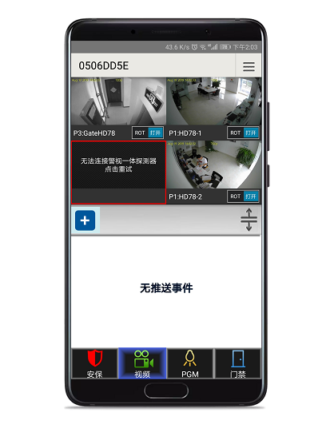
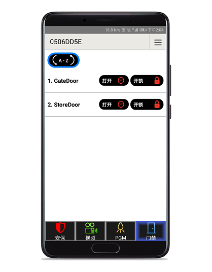

# 简介

Insite Gold是枫叶针对枫叶安防系统自主开发的手机应用APP，集成了报警，视频复核，门禁控制和自动化控制功能，是报警系统、监控系统、门禁系统和智能家居控制的“一站式”解决方案。

## 功能参数

- 支持多语言；
- 支持系统级推送（国内安卓无法推送）；
- 支持布撤防操作；
- 支持多用户不同权限；
- 支持视频实时查看，报警视频下载；
- 支持门禁直接控制；
- 支持通过系统继电器直接控制电器，家电等；
- 故障实时提醒，比如蓄电池故障，模块离线故障；
- 设备状态提醒，比如掉线等；
- 不限制用户手机的数量。

## 版本日志

版本日志请访问 → [这里](https://senboll.com/zh-hans/product-detail/95)；
  
## 操作说明

启动APP后，会看到下面有4个菜单，分别是报警系统，视频复核，自动控制，启动APP后，会看到下面有4个菜单，分别是报警系统，视频复核，自动控制，门禁系统。

### 报警系统

这里列出该用户权限下所有的防区和分区，提供留守和常规布防两种方式，防区的旁路功能，布撤防可以一键操作或者分别操作，如果有故障或者报警记录会有提示图标，双击可查看提示内容。

::: tip
如果有防区开路将无法布防，需要恢复防区状态或者旁路才能布防。
:::

### 视频复核

HD77/78/88系列探测器支持视频复核功能，通过APP可以直接查看实时视频，本身是个探测器，如果报警后会自动录一段带声音的视频，视频长度取决于触发的频率，每个视频都会从触发前3秒预录。除此之外还可以设置系统内其他防区作为启动录视频的条件。

所有的视频保存在探测器的内置的sd卡（也支持存储在谷歌云盘，但是国内无法使用谷歌云盘），这对于保护用户隐私是很有用的。点开菜单直接可以查看视频并下载，如图：

### 自动控制

这个功能对于实现智能家居的控制很有用，枫叶主机提供继电器功能，继电器可以通过编程来自动触发实现一些自动控制，比如控制灯光，窗帘等。如图：

### 门禁系统

门禁系统是枫叶EVO系统功能之一，将门禁和报警两个系统合二为一，支持刷卡，指纹，密码开门，支持权限划分，支持设置时间表。除了家用，对于商用可实现考勤，如果需要报警和门禁功能，这是最理想的解决方案。

对于门禁的控制，APP支持两种方式，参考图上的图标，第一个图标表示按下后在会在一段时间内自动恢复，第二个图标表示按下后，不会定时自动恢复，需要手动恢复。如图：

## 交费

两种途径：

1. 通过APP直接交费，要求需要准备具备Visa标志的银行卡，请自行按照APP支付页面支付费用；
2. 代付，如果没有跨境⽀付渠道，访问[枫叶APP交费](http://support.senboll.com:88/swan)。
