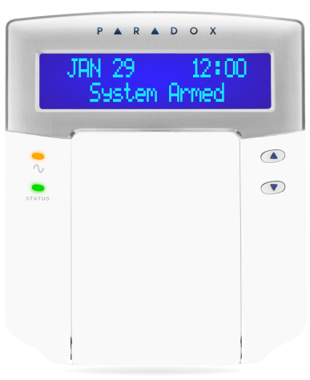
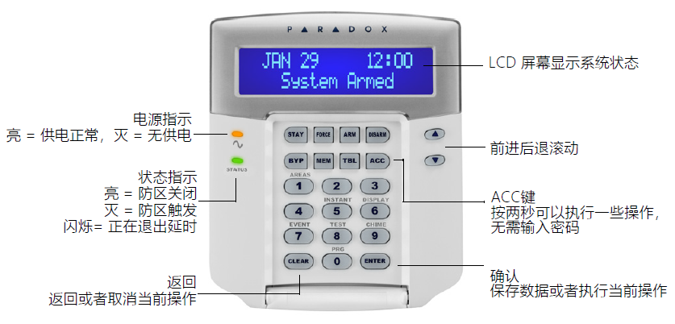

# 简介

这款键盘带液晶屏，支持所有分区的控制，状态显示，支持多国语言（遗憾的是不支持中文），LCD屏幕实时显示系统的状态，故障和时间等，相对比较直观。

k641操作键盘:

## 功能参数

- 美观大方的3D弧面设计
- 防区警报显示：锁定显示警报中的防区，直到系统撤防为止
- 可通过CONV4USB升级现场固件
- 简化的最终用户远程控制编程
- 支持EVO192和EVOHD
- 32个字符的蓝色LCD带有可编程标签（通过PMC编程钥匙，NEware或模块广播功能）
- 提供保加利亚语，克罗地亚语，捷克语，荷兰语，英语，法语，德语，希腊语，希伯来语，匈牙利语，意大利语，波兰语，葡萄牙语，俄语，斯洛伐克语，斯洛文尼亚语，西班牙语，瑞典语，土耳其语，立陶宛语，芬兰语和土耳其语
- 可分配给一个或多个分区
- 1个可寻址防区和1个PGM输出
- 独立设置的门铃防区
- 14个一键式快捷操作按钮
- 同时按下3个按键激活紧急警报
- 背光，对比度和滚动速度可调
- 使用12小时或24小时格式的显示时间
- 符合安规 EN50131 三级

## 使用指南

面板说明：

### 布防

**布防**：顾名思义布置防护，让系统启动防护功能，或进入防护工作状态，此时已布防的防区一旦触发，会发生[报警](/content/node1/important-knowledge/#%E6%8A%A5%E8%AD%A6alarm)。布防可以通过安防操作键盘，遥控器，手机APP，短信，电话，电脑等方式实现。

布防模式说明：

| 布防模式 | 描述
|---|---|
|常规布防|外出 - 整个区域被布防，在使用键盘布防的时候如果有防区开路会提示，可以旁路开路防区再布防。|
|强制布防|外出 - 在布防的时候，如果有防区开路，会自动旁路开路的防区后再布防。|
|立即布防|留守 - 将防区的延时防区类型会转为立即防区类型再布防，防区触发后没有延时，立即报警。|
|留守布防|留守 - 仅仅布防周界防区，室内防区不会被布防，您可以在室内活动。|

**操作方法**

- 离开的时候（常规布防和强制布防）

|步骤|操作|
|---|---|
|1|输入用户密码（默认1234）如果是常规布防，请按下ARM键，必须所在分区内所有的防区都是闭合的；如果是强制布防，请按下FORCE键，防区如果开启了强制布防属性的时候，布防时防区状态不会影响。|
|2|选择分区序号即可布防该分区，或者按下0，布防全部分区。|

- 留守的时候（留守布防和立即布防）

|步骤|操作|
|---|---|
|1|输入用户密码（默认1234） 如果是留守布防，请按下STAY键，仅仅布防周界防区，您仍然可以在室内活动； 如果是立即布防，请按下5键，防区如果开启了强制布防属性的时候，布防时防区状态不会影响。|
|2|选择分区序号即可布防该分区，或者按下0，布防全部分区。|

### 撤防

**撤防**：顾名思义撤销防护，让系统撤销防护功能，或停止防护工作状态，此时已撤防的防区触发，不会发生报警。

- 全部撤防

|步骤|操作|
|---|---|
|1|输入用户密码（默认1234）|
|2|选择分区序号即可布防该分区，即可撤防该分区。|

- 部分撤防（比如只撤防室内分区）

|步骤|操作|
|---|---|
|1|输入用户密码（默认1234）|
|2|按下DISARM键|
|3|选择分区序号即可布防该分区，即可撤防该分区。|

### 紧急报警

注意：此功能默认关闭，需要开启请联系安装人员。

在紧急情况发生的时候，可以按下键盘的组合键2秒钟，实现有声或者无声报警，组合键定义如下：

|报警类型|按键组合|
|---|---|
|110 报警|1 和 3 同时按下|
|120 报警|4 和 6 同时按下|
|119 报警|7 和 9 同时按下|

### 解除报警

::: warning
一旦有报警发生，应第一时间力求减少人身和财产的损失，直到这种危险解除后，才能解除报警！
:::

当系统发生报警时，键盘会显示某个防区报警，直接输入用户密码（默认1234），系统会解除报警，当系统有多个分区报警时，仅解除当前处于报警状态的分区，其余分区状态不变。

::: tip
另外如果有紧急按钮触发过报警，在系统解除报警后，需要使用专用复位钥匙（紧急按钮出厂带的专用配件）对其复位。
:::

### 查看防区状态

在未布防的时候状态如下表：

|防区状态|键盘显示|
|---|---|
|防区全部闭合（未触发）状态|键盘显示`All Disarmed + 时间`|
|有防区是触发状态|键盘显示`Area 1 Not Ready 001 Zone Open + 防区标签`|

### 查看故障

::: warning
一旦有故障发生，都会实时显示到屏幕上，为了系统正常使用，应尽快排除故障。如需支持，请联系安装人员或者直接拨打全国服务热线400-002-5577。
:::

|步骤|操作|
|---|---|
|1|按TBL键|
|2|通过&#xEB11 &#xEB0F 翻阅，有关详细的故障描述请参考下面的说明。|
|3|如果有故障发生，请尽快排除，如果不清楚怎么解决，请联系经销商。|
|4|按CLEAR键退出|

故障说明如下：

| 故障主菜单 | 故障子菜单 |
|---|---|
|1System（系统故障）|1AC failure（交流电故障）2Battery trouble（后备电源故障）3Aux. current limit（辅助电源输出过载）4Bell current limit（警号输出接口过载）5Bell absent（警号未接）6ROM check error（ROM错误）7RAM check error（RAM错误）|
|2Communicator（通讯故障）|1TLM1（电话线故障）2Fail to Com. 1（com1故障）3Fail to Com. 2（com2故障）4Fail to Com. 3（com3故障）5Fail to Com. 4（com4故障）6Fail to Com. PC（PC通信错误）|
|3Module Trouble（模块故障）|1Module tamper（模块防拆故障）2Module ROM check error（模块ROM故障）3Module TLM trouble（模块拨号故障）4Module Fail to Com.（模块通信故障）5Printer trouble（打印机故障）6Module AC failure（模块交流电源故障）7Module battery failure（模块后备电源故障）8Module supply output（模块电源输出故障）|
|4Network (Combus) Troubles（总线故障）|1Missing keypad（键盘离线）2Missing module（模块离线）3Missing voice module（语音模块离线）6General failure（一般总线故障）7Combus overload（总线过载）|
|5Zone Tamper（防区防拆故障）|按5显示防拆故障的所有防区|
|6Zone Low Battery（防区电池电量不足故障）|按6显示电池电量不足的所有防区|
|7Zone Fault（防区故障）|按7显示火警回路防区故障|
|8Clock Loss（时间丢失）|按8重新设置时间|
|9GSM Troubles（GSM移动网故障）|1Missing GSM module（GSM模块掉线）2GSM RF jam supervision（移动网发生干扰故障）3No service（移动网无服务）5Fail to communicate with IP receiver 1（IP中心1通信失败）6Fail to communicate with IP receiver 2（IP中心2通信失败）7Fail to communicate with IP receiver 3（IP中心3通信失败）8Fail to communicate with IP receiver 4（IP中心14通信失败）9IP receiver unregistered（IP中心注册失败）|
|10IP Troubles（以太网故障）|1Missing IP module（网络模块掉线）2No service（无以太网）3Fail to communicate with IP receiver 1（IP中心1通信失败）4Fail to communicate with IP receiver 2（IP中心2通信失败）5Fail to communicate with IP receiver 3（IP中心3通信失败）6Fail to communicate with IP receiver 4（IP中心14通信失败）7IP receiver unregistered（IP中心注册失败）|

### 查看报警记录

可以通过键盘查看最近一次布防期间发生的报警事件。

|步骤|操作|
|---|---|
|1|如果是布防状态请先撤防|
|2|按MEM键，可以显示所有被触发过的防区，例如，防区1的报警记录显示为：Alarm Zone 001。通过&#xEB11 &#xEB0F 翻阅。|
|3|按CLEAR键退出|

### 设置门铃防区

如果有个防区触发后，键盘或主机会有类似门铃的声音提示，这就是门铃防区功能。可以用来提示是否有人出现，通常在出入口会用到。

|步骤|操作|
|---|---|
|1|输入用户密码（默认1234）|
|2|按9|
|3|使用&#xEB11 &#xEB0F 键，选择一个防区，然后按ACC键开启或者取消该防区的门铃功能|
|4|按ENTER键保存|
|5|按CLEAR键退出|

### 校正系统时间

对于整个系统来说，需要记录所有发生的事件或者日志所发生的时间，就需要时钟功能，由于系统的时钟通常不能联网自动校准，时间长了会有误差，就需要人为校正。

|步骤|操作|
|---|---|
|1|输入用户密码（默认1234），再按TRBL键|
|2|按8|
|3|按&#xEB11 &#xEB0F 选择或者输入需要设置的时间参数，按ENTER键保存。|
|4|按&#xEB11 &#xEB0F 选择或者输入需要设置的日期参数|
|5|按ENTER键保存退出|

### 键盘静音设置

键盘静音打开后，布/撤防和报警的时候键盘的蜂鸣器不会有声音提示。可以通过以下方法打开或关闭：

|步骤|操作|
|---|---|
|1|输入用户密码（默认1234）|
|2|按6，进入LCD键盘设置菜单|
|3|按4，进入静音设置选项，然后按ACC键静音开启（Mute Enable）或关闭静音（Mute Disable）功能|
|4|按两次CLEAR键退出|