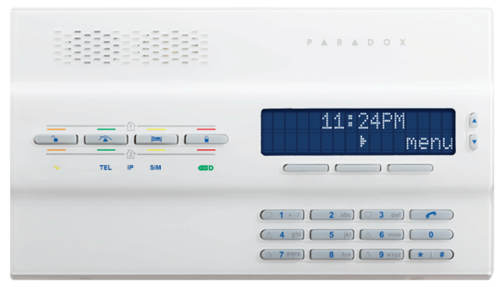
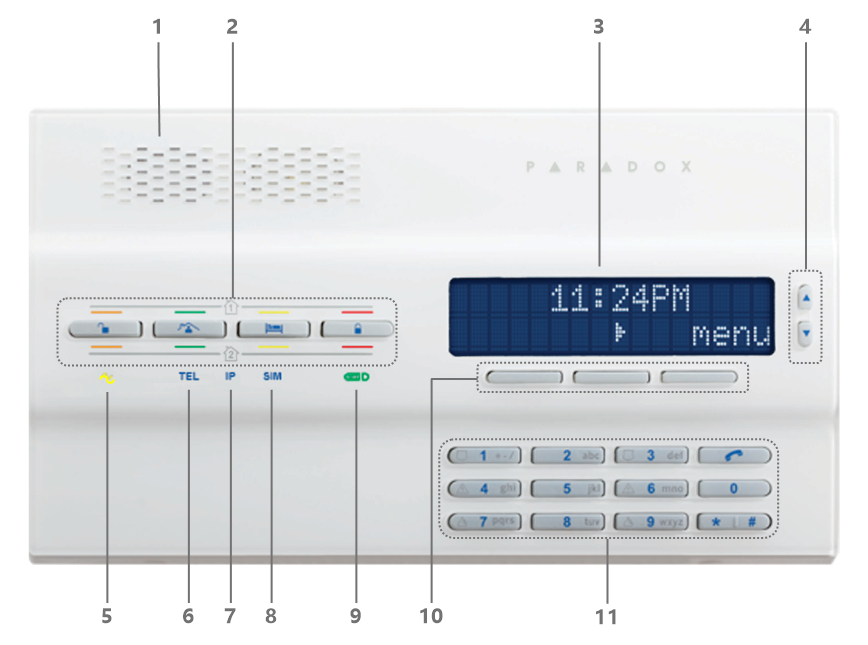
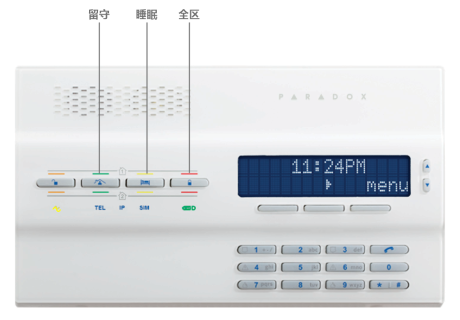
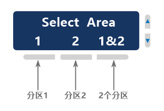
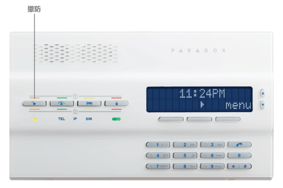
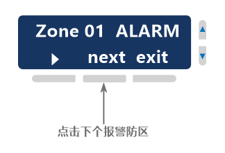
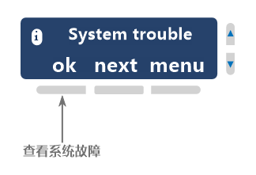

# 简介

这是一款集成了键盘的报警主机，操作的时候带语音提示，支持2个分区的控制，状态显示，支持多国语言（遗憾的是不支持中文），LCD屏幕实时显示系统的状态，故障和时间等，相对比较直观。

MG6250一体化报警主机:

## 功能参数

- 同步五通道报告功能可通过GPRS，GSM，SMS，语音和传统电话线提供报告，并支持预定义的通信顺序，以节省安装时间
- 支持2个分区和多达64个无线防区
- 支持带有2张SIM卡（GPRS14）的可选四频GPRS / GSM模块
- 内置无线收发器（433或868 MHz）
- 通过GSM或固定电话的进行免提电话对讲
- 内置语音和个人传呼报告Pager（最多8个电话号码）
- 双向语音对讲 （通过GSM或固定电话）
- 支持16个用户和16个遥控器(用户一对一分配)
- 8个无线PGM（2个I/O可以有线连接）
- 256个事件缓存
- 支持4个无线警报器（SR150）
- 支持4个无线键盘（K32RF/K35/K37），仅显示前32个防区
- 支持4个无线中继器（RPT1）
- 支持16个双向遥控器（REM2/REM25/REM3）
- 内置90dB警笛
- 通过GPRS远程固件升级
- 通过GSM完全语音菜单式互动的电话远程遥控访问
- 可自定义防区语音标签和菜单指导的高质量声音
- 家庭电话消息留言中心（带时间水印，最多30秒）
- 闹钟功能
- 支持安规 EN50131 二级

## 使用指南

面板说明：

1：扬声器  
2：布撤防快捷键，分别是撤防、留守布防、睡眠布防和全区布防；  
3：LCD屏幕  
4：菜单上下滚动按钮  
5：系统电源状态指示  
6：电话功能工作状态指示 确认保存或者执行当前操作并退出  
7：IP网络工作状态指示  
8：SIM卡状态  
9：StayD模式指示  
10：对应LCD菜单键  
11：输入键盘  

### 布防

**布防**：顾名思义布置防护，让系统启动防护功能，或进入防护工作状态，此时已布防的防区一旦触发，会发生[报警](/content/node1/important-knowledge/#%E6%8A%A5%E8%AD%A6alarm)。布防可以通过安防操作键盘，遥控器，手机APP，短信，电话，电脑等方式实现。

布防模式：  

- 全区：布防当前分区下的所有防区
- 睡眠：跟全区布防只有一点不同，即[延时防区](/content/node1/important-knowledge/#%E9%98%B2%E5%8C%BA-zone)触发后会立即（无延时）报警。
- 留守：仅布防部分防区（非留守防区），通俗的讲，就是暂时禁用内部的防区，只启用外围的防区。如：周界防区，您仍然可以在室内活动。

**布防操作方法：**

::: tip
默认情况下，如果有防区正在处于触发状态（打开状态），会执行强制布防。
:::

如果只有1个分区：

- 方法1：在面板上，直接长按全区、睡眠和留守快捷键超过3秒，系统将进入布防倒计时，直到布防成功。
- 方法2：在面板上，按全区、睡眠和留守快捷键，输入用户密码（默认1234），系统将进入布防倒计时，直到布防成功。

如果有2分区，在布防操作的时候，需要先选择分区，如下：

布防成功后布防模式对应的按键处的指示灯会亮起，会有语音提示，同时LCD屏幕上会显示。如：分区1布防成功后，LCD显示如下：

### 撤防

**撤防**：顾名思义撤销防护，让系统撤销防护功能，或停止防护工作状态，此时已撤防的防区触发，不会发生报警。

如果只有1个分区，在面板上，直接按撤防快捷键，输入用户密码（默认1234），执行撤防，操作成功后，撤防快捷键处的指示灯会亮起，同时会有语音提示。

如果有2分区，撤防操作的时候，需要先选择分区，如下：

### 解除报警

::: warning
一旦有报警发生，应第一时间力求减少人身和财产的损失，直到这种危险解除后，才能解除报警！
:::

当系统发生报警时，主机扬声器和声光警号会启动，同时LCD屏上会显示某个防区报警，如下：

解除报警请直接输入用户密码（默认1234），系统会解除报警，当系统有多个分区报警时，仅解除报警的分区，其余分区状态不变。

### 查看防区状态

在未布防的情况下：

**无防区开路**

如果只有1个分区，防区全部闭合（未触发）状态，显示：`System Ready`或`Area 1 Ready`；

如果有2个分区，交替显示`Area 1 Ready`和`Area 2 Ready`，表示所有防区都是未触发状态。

**有防区开路**

如果只有1个分区，有防区开路（触发）时，键盘显示`Area 1 Not Ready`，点击view对应的按键查看开路防区，同时伴有语音提示，如图：

如果有2个分区，交替显示`Area 1 Unready`或`Area 2 Unready`，表示该分区下有防区处于触发状态。

### 查看故障和新报警记录

::: warning
一旦有故障发生，都会实时显示到屏幕上，为了系统正常使用，应尽快排除故障。如需支持，请联系安装人员或者直接拨打全国服务热线400-002-5577。
:::

在待机状态是，一旦系统产生故障或新报警记录，液晶LCD屏会亮起一个消息符号，如图：

此时点击这个符号进如查看模式，如果显示`Alarm in memory`，表示有新报警记录，需要查看才能清除次消息，如图：

如果显示`System trouble`，表示有故障，如图：

故障说明如下：

| 故障主菜单 | 故障子菜单 |
|---|---|
|System trouble（系统故障）|AC failure（交流电故障）Battery trouble（后备电源故障）Aux. current limit（辅助电源输出过载）Bell current limit（警号输出接口过载）Bell absent（警号未接）ROM check error（ROM错误）RAM check error（RAM错误）|
|Communicator（通讯故障）|TLM1（电话线故障）Fail to Com. 1（com1故障）Fail to Com. 2（com2故障）Fail to Com. 3（com3故障）Fail to Com. 4（com4故障）Fail to Com. PC（PC通信错误）|
|Zone Tamper（防区防拆故障）|按next查看防拆故障的所有防区|
|Zone Low Battery（防区电池电量不足故障）|按next查看电池电量不足的所有防区|
|Zone Fault（防区故障）|按next查看火警回路防区故障|
|Clock Loss（时间丢失）|需要重新设置系统时间|
|GSM Troubles（GSM移动网故障）|Missing GSM module（GSM模块掉线）GSM RF jam supervision（移动网发生干扰故障）No service（移动网无服务）Fail to communicate with IP receiver 1（IP中心1通信失败）Fail to communicate with IP receiver 2（IP中心2通信失败）Fail to communicate with IP receiver 3（IP中心3通信失败）Fail to communicate with IP receiver 4（IP中心14通信失败）IP receiver unregistered（IP中心注册失败）|
|IP Troubles（以太网故障）|Missing IP module（网络模块掉线）No service（无以太网）Fail to communicate with IP receiver 1（IP中心1通信失败）Fail to communicate with IP receiver 2（IP中心2通信失败）Fail to communicate with IP receiver 3（IP中心3通信失败）Fail to communicate with IP receiver 4（IP中心14通信失败）IP receiver unregistered（IP中心注册失败）|

### 查看历史报警记录

可以通过键盘查看最近一次布防期间发生的报警事件。

|步骤|操作|
|---|---|
|1|如果是布防状态请先撤防|
|2|按menu → 按next找到`05-ALARM MEMORY` → 按ok，将显示所有的报警记录。通过LCD屏右边&#xEB11 &#xEB0F 键翻阅。|
|3|按exit键退出|

### 设置门铃防区

如果有个防区触发后，键盘或主机会有类似门铃的声音提示，这就是门铃防区功能。可以用来提示是否有人出现，通常在出入口会用到。

|步骤|操作|
|---|---|
|1|如果是布防状态请先撤防|
|2|按menu → 按next找到`04-CHIME ZONE` → 按ok → 选择防区 → 按edit → 选择一个门铃声音类型 → 按ok。|
|3|按back键返回退出|

### 设置闹钟

闹钟的作用：提醒人们注意一些容易忽略的时间，可以让人们养成良好的作息习惯，拒绝懒惰。对一些时间掌握力不强的人，做到提醒通知，是家庭里面不错的小助手。在照顾婴儿的时段，可以提醒妈妈们按时喂奶，以免错过时间。注意，闹钟只是辅助作用，遵守时间还应从自己做起，如果主观上不去遵守，那么有没有闹钟也是不行的。

|步骤|操作|
|---|---|
|1|如果是布防状态请先撤防|
|2|按menu → 按next找到`03-ALARM CLOCK` → 按ok → 按on打开闹钟功能 → 按next → 选择12或者24小时制 → 设置时间 → 设置一个闹钟声音 → 按ok保存。|
|3|按back键返回退出|

### 校正系统时间

对于整个系统来说，需要记录所有发生的事件或者日志所发生的时间，就需要时钟功能，由于系统的时钟通常不能联网自动校准，时间长了会有误差，就需要人为校正。

|步骤|操作|
|---|---|
|1|如果是布防状态请先撤防|
|2|按menu → 按next找到`08-SYSTEM SETUP` → 按ok → 输入用户密码（默认1234） → 按next找到`04-Time and Date` → 按ok → 选择12或者24小时制 → 设置时间 → 设置年月日。|
|3|按back键返回退出|
