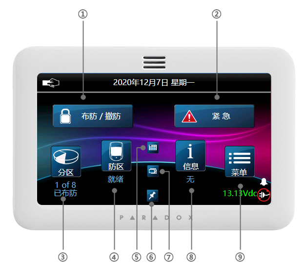
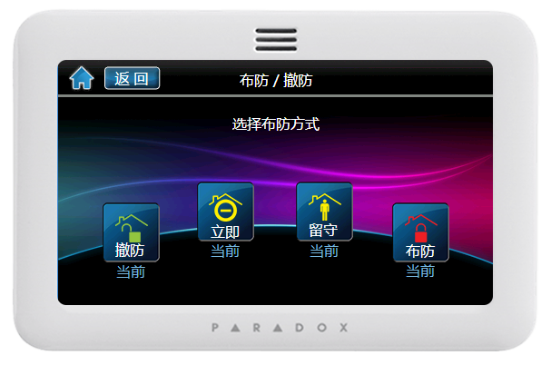
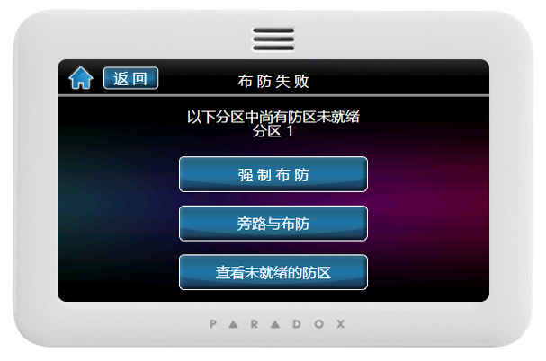
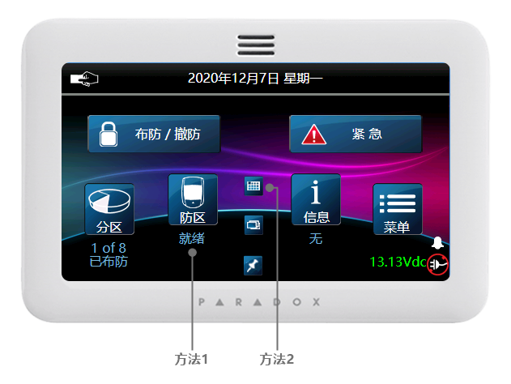
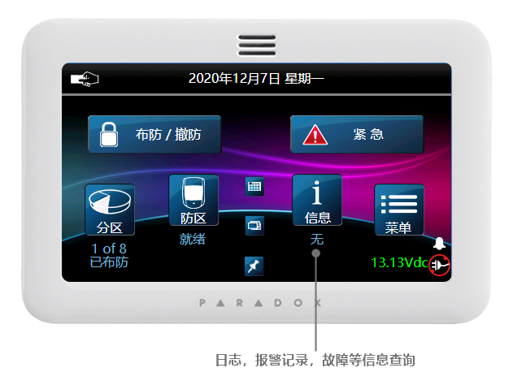
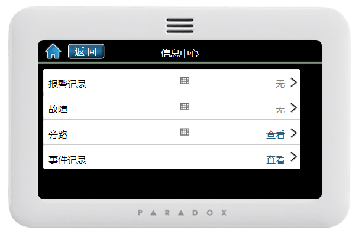
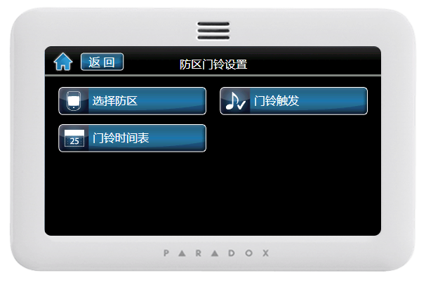
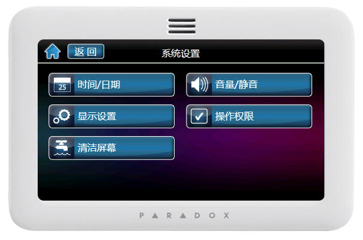

# 简介

这是TM50触摸屏针对EVO系列主机（EVO192 / EVOHD / EVO48 / EVO96）的操作键盘说明书，这款全屏触摸键盘，支持所有分区的控制，状态显示，支持多国语言（包括中文），具有直观的菜单和图标，滚动页面时超快的响应时间以及清晰，精确的菜单驱动提示；使用户体验比以往更轻松，更友好。

TM50触摸屏操作键盘:

## 功能参数

- 纤薄时尚的设计
  - 5.0英寸/12.7厘米鲜艳的LCD彩色显示屏（480 x 272像素）
  - 直观的基于图标的菜单驱动交互方式, 无需手动输入控制命令
- 控制多达8个PGM输出
- 可通过Micro SD卡进行现场固件升级
- 强大的先进处理器以提供更强大的界面响应和更好的交互体验
- 板载1个防区/温度输入，用于连接检测设备或任何外部温度传感器（10K OHM热敏电阻）
- 通过Web应用程序定制语言翻译版本
- 表面安装尺寸 14.4 x 9.6 x 1.4厘米（5.7 x 3.8 x 0.6英寸）
- 提供经典的钢琴黑和珍珠白，以及其他令人兴奋的颜色选择

## 使用指南

主界面说明：

① 布撤防操作  
② 紧急报警快捷键  
③ 所有分区  
④ 所有防区  
⑤ 防区实时状态展示  
⑥ 防区平面分布图  
⑦ 屏保  
⑧ 所有消息，故障，日志等  
⑨ 菜单入口

### 布防

**布防**：顾名思义布置防护，让系统启动防护功能，或进入防护工作状态，此时已布防的防区一旦触发，会发生[报警](/content/node1/important-knowledge/#%E6%8A%A5%E8%AD%A6alarm)。布防可以通过安防操作键盘，遥控器，手机APP，短信，电话，电脑等方式实现。

- 步骤1

按分区1键（仅有一个分区）或布防/撤防键（多个分区） → 输入用户密码（默认是1234）

- 步骤2  
  - 选择布防类型：
  - 方式一：布防，布防当前分区下的防区；
  - 方式二：留守，仅布防部分防区（非留守防区），如：周界防区，您仍然可以在室内活动；
  - 方式三：立即，跟方式一只有一点不同，即[延时防区](/content/node1/important-knowledge/#%E9%98%B2%E5%8C%BA-zone)触发后会立即（无延时）报警。

- 步骤3  
步骤2执行后，如果有防区正在处于触发状态（未就绪），将出现一个提示界面：
  - 先点查看未就绪的防区来检查这些防区，以排除隐患；
  - 在确认未就绪的防区无安全隐患，可以选择强制布防或者旁路与布防，此时这些未就绪的防区将会失效。

- 步骤4  
执行完上面的步骤，系统将进入布防倒计时，直到布防。

### 撤防

**撤防**：顾名思义撤销防护，让系统撤销防护功能，或停止防护工作状态，此时已撤防的防区触发，不会发生报警。

- 步骤1：按分区1键（仅有一个分区）或布防/撤防键（多个分区） → 输入用户密码（默认是1234）
- 步骤2：若只有一个分区，直接可以撤防，若多个分区，先选择所需分区再执行撤防即可。

### 解除报警

::: warning
一旦有报警发生，应第一时间力求减少人身和财产的损失，直到这种危险解除后，才能解除报警！
:::

当系统发生报警时，键盘会显示某个防区报警，直接输入用户密码（默认1234），系统会解除报警，当系统有多个分区报警时，仅解除当前处于报警状态的分区，其余分区状态不变。

::: tip
另外如果有紧急按钮触发过报警，在系统解除报警后，需要使用专用复位钥匙（紧急按钮出厂带的专用配件）对其复位。
:::

### 查看防区状态

在撤防状态，有两种方法，如下图：

- 方法1：进入防区列表逐个查看；
- 方法2：预览所有防区实时状态。

### 查看故障，报警记录，日志等

::: warning
一旦有故障发生，都会实时显示到屏幕上，为了系统正常使用，应尽快排除故障。如需支持，请联系安装人员或者直接拨打全国服务热线400-002-5577。
:::

在撤防状态下，在首页点击信息按钮：

进入信息查询页面：

通过此页面可以查询报警记录，故障，旁路信息，事件记录。其中事件记录包括用户报警日志，操作日志，门禁日志，故障日志。

### 设置门铃防区

如果有个防区触发后，键盘或主机会有类似门铃的声音提示，这就是门铃防区功能。可以用来提示是否有人出现，通常在出入口会用到。

在首页，点菜单 → 报警功能 → 防区门铃设置 → 输入用户密码（默认1234），进入如下页面：

- 选择防区：选择需要设置门铃功能的防区
- 门铃触发：门铃触发的方式，可将防区触发或恢复作为触发门铃的条件
- 门铃时间表：设置门铃功能在什么时间段有效

### 校正系统时间

对于整个系统来说，需要记录所有发生的事件或者日志所发生的时间，就需要时钟功能，由于系统的时钟通常不能联网自动校准，时间长了会有误差，就需要人为校正。

在首页，点菜单 → 系统设置 → 时间/日期 → 输入用户密码（默认1234），进入如下页面，按照提示设置即可：

### 用户管理

通过屏幕进入菜单界面可以实现增减和和编辑用户的参数，比如用户密码。

在首页，点菜单 → 用户（密码）管理，输入管理员密码（默认：1234）。然后对可以根据页面提示增加和删除用户，或者修改选定用户的标签和密码。

