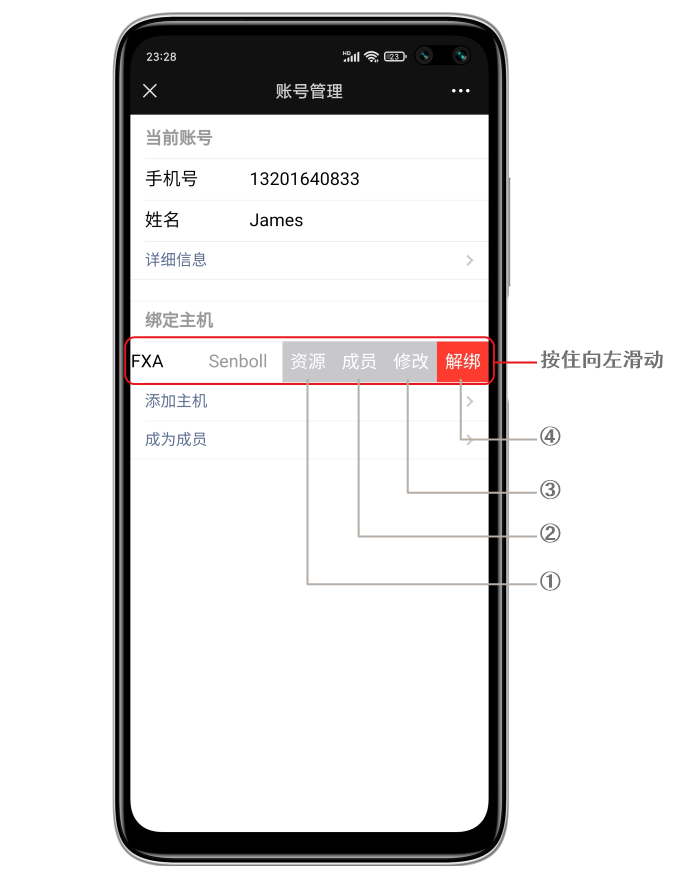

# 简介

微信端给用户提供了实时的消息推送，包括文字报警消息和视频报警消息，故障消息，布撤防消息，还有系统的日志等其他消息，这些消息保存在我们的后端服务器上，这一点对于有些极端情况会很有用，如：当安防设备遭到破坏或盗走，报警消息和视频依然可以通过微信端查阅，这些都可以为后期警察侦破案件提供有力的证据！

实现将文本消息和视频消息推送至用户手机微信端的一款安防消息推送方案。微信在国内可以说是必装的手机应用，消息推送的稳定性、时效性有保障，我们正是基于此推出了微信端解决方案。至少有2个优势：

1. 应用越多手机越慢大家都知道，这种方案避免手机安装过多的应用程序。
2. 经过测试微信推送的时效性目前来说是最靠谱的，胜过系统级推送，这对于安防报警需求来说很重要。

## 功能参数

- 支持4路（最大1080P）高清IPC接入，支持三码流
- 4路高清IPC接入
- 支持1080P/720P/WD1/4CIF/DCIF/2CIF/CIF/QCI分辨率录像
- 2个板载有线防区，1路LAN/WAN以太网接口
- 支持报警联动视频复核
- 支持视频移动侦测、视频遮挡、视频丢失，支持30s（2M码流，全帧率）延时预览，延时时间可配置
- 支持通过网络传输报警、视频数据
- 支持APP（报警推送、视频预览、视频回放、远程布撤防、消警、防区编程等功能）
- 支持2000条报警事件记录、500条操作事件记录，500条用户管理操作记录，支持条件过滤查询
- 查询事件日志
- 支持独立的以太网接警中心，支持2组独立的中心IP地址
- 支持定时布撤防（日常计划、优先计划）
- 支持主机防拆报警，支持探测器防拆报警
- 支持1路串口
- 支持TF卡本地录像存储
- 支持微信平台，事件及报警视频推送
- 尺寸：94 x 76 x 30mm（长度 x 宽度 x 厚度）

## 操作指南

下面是一些常见的操作的方法，如果需要更多的支持或建议，请联系我们 → [联系方式](#售后服务)。

### 微信注册

新用户，请使用手机微信扫描以下二维码，关注公众号：  

然后进入公众号 → **账户管理** → **账号管理**，按照页面提示注册账户。

### 微信端设置

第一个添加主机的手机就是管理员，通过管理员手机可以设置一些系统参数，添加删除成员，分配成员的权限等功能。

管理员进入管理模式的方法：公众号首页点击账户管理 → 账户管理，在弹出的页面按住已添加的主机左滑，将打开更多配置选项：

①：资源 - 目前主机配置参数不能自动同步到微信端，微信端需要手动配置，如：**分区标签**、**防区数和标签**、**用户数和标签**、**门数和标签**等；  
②：成员 - 增减成员和设置其权限；  
③：修改 - 修改当前主机的一些配置信息，如**分区数**等；  
④：解绑 - 解绑当前手机，替换或者转移系统给其他人。

#### 资源设置

打开资源设置页面，对主机的一些资源设置，包含防区、分区、用户、门、视频通道的标签等，如图：

#### 成员管理

微信端最多支持16个成员，即16个手机用户，包括管理员。管理员可对每个普通成员设置权限，管理员可以转移管理员权限给其他普通成员。

::: warning
目前使用中发现，因为设置了推送大量的不重要的信息（布/撤防信息等），久而久之，疲于查看推送来的消息，甚至有人将公众号设置为**消息免打扰**模式，如果真有报警消息，会导致手机无法提示，造成隐患。

因此为了减少这些干扰，突出报警消息的重要性，**强烈建议：取消布撤防、系统事件和门禁推送**。
:::

##### 添加其他成员

- 步骤一：新成员需要提前关注此公众号，并在公众号首页点击账户管理 → 账户管理，在弹出的页面下面点成为成员，将会生成二维码，如图：

- 步骤二：管理员回到公众号首页点击账户管理 → 账户管理，在弹出的页面按住已添加的主机左滑，将打开更多配置选项，选择成员选项，在打开添加成员的设置页面点添加成员，然后扫描上一步新用户的二维码，同时对其资料和权限做一些设置。如图：

##### 设置成员

管理员可以添加或删除其他成员，也可以对每一个成员的权限单独设置。管理员回到公众号首页点击账户管理 → 账户管理，在弹出的页面按住已添加的主机左滑，选择成员，即可进入成员管理页面，此时可以对已有的成员进行设置，方法如图：

①：解绑 - 删除成员  
②：修改 - 修改当前成员权限  
③：移交管理员 - 转移管理员给其他成员  

##### 设置成员权限

管理员回到公众号首页点击账户管理 → 账户管理，在弹出的页面按住已添加的主机左滑，将打开更多配置选项，选择成员选项，在打开添加成员的设置页面选择一个用户，按住向左滑动打开设置选项，点修改进入权限设置页面：

#### 修改

如果已添加了主机，需要修改当前主机的分区数等，进入此菜单设置即可，如下图：

### 布撤防操作

告别复杂繁琐的操作，通过微信端实时对安防系统进行布撤防操作，进入公众号点主机控制 → 分区控制，即可实现布撤防操作，如图：

### 查询事件

事件查询是很有用的一个功能，为事后的核实提供重要的证据，我们提供了多种事件类型，进入公众号点主机控制 → 分区控制，选择需要查询的条件，如图事件类型，时间等条件，如图：

### 查询系统状态

进入公众号点主机控制 → 主机状态，即可显示当前系统的状态，包含分区和联动的监控摄像头状态，如图：

### 调取现场实时视频

进入公众号点主机控制 → 防区视频，在打开的页面，点击相应的通道所对应调取的时间来获取现场视频，如图：

### 交费

回到公众号首页点击账户管理 → 充值交费，在弹出的新页面点续费，如图：

接下来的页面中有两个选择：

- 推荐选择360元/三年，相当于每年120元，比较划算。
- 1年交费150元。

### 售后服务

进入公众号点客户服务，选择对应选项来获取我们的服务。

