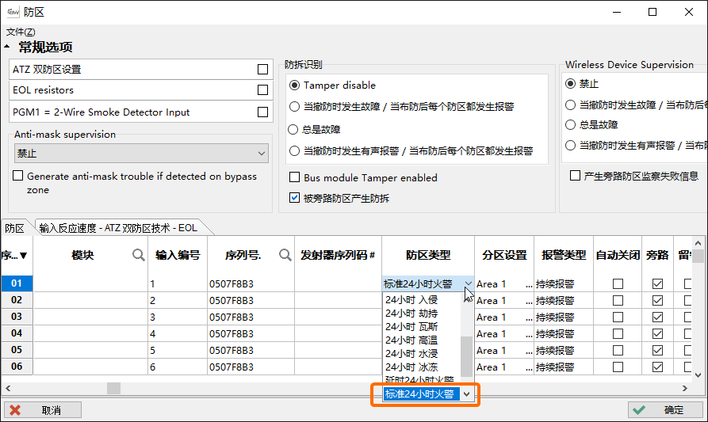
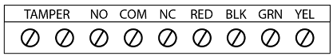
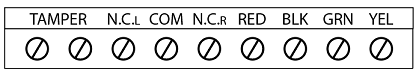
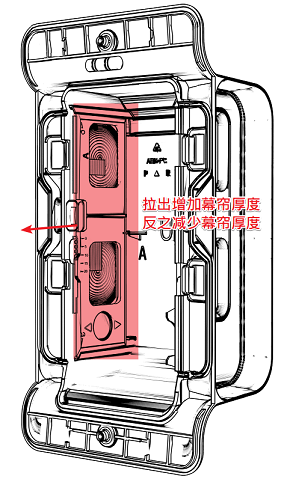
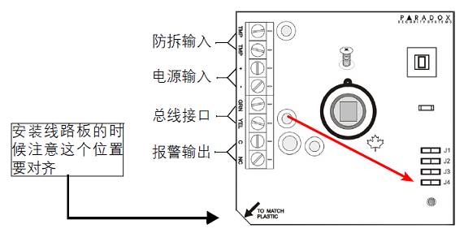
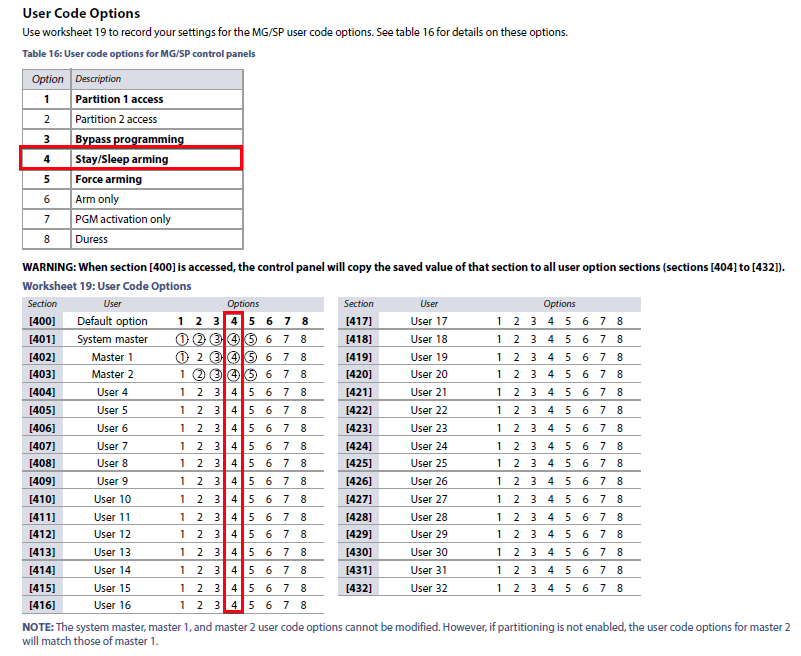
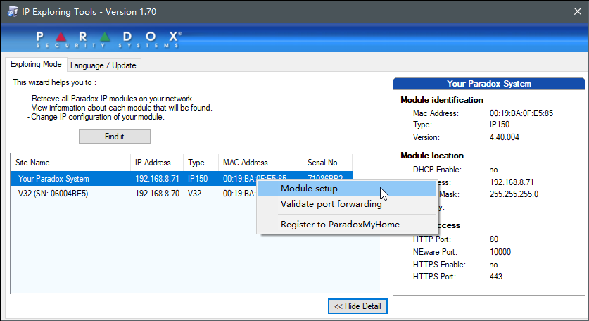

# 硬件问题

收集了枫叶硬件设备安装和使用中遇到的一些问题，对于安装调试有很大的参考价值。

## 通用方法

如果碰到了一些奇怪的问题，通过常见方法都解决不了，请使用重新上电，断电的时候，记得后备电源断电，上电的时候检查好接线以免发生意外。还可以尝试复位 → [查看复位方法](/content/node2/babyware/#%E5%A4%8D%E4%BD%8D)，或升降固件 → [查看升降级固件](/content/node2/babyware/#%E5%8D%87%E9%99%8D%E5%9B%BA%E4%BB%B6)。

## EVO总线问题

::: warning
总线探测器数量超过20个以上，建议加HUB2总线驱动器模块，这是导致总线模块通信不稳定的因素之一。
:::

### 总线不通

::: tip
总线接口的表示在不同设备上会有不同，如：（AUX+ AUX- GRN YEL），（RED BLK GRN YEL），（+ - GRN YEL）和（+ - G Y），这几种都是表示总线接口。
:::

总线模块包含总线上的所有设备，总线探测器，操作键盘，防区模块，对接模块，继电器模块，无线信号覆盖模块等这些都是总线模块，如果遇到了搜不到的情况，有以下几种原因：

1. 线路问题，有可能短路，或者断路，请检测线路；
2. 电源问题，线路距离过长或者线材质量问题导致压降太大，设备端的电压衰减太多，已经不足以提供正常工作所需电源，请保证工作所需电源；
3. 设备（主机或总线模块）总线口短路，如果接错线，会直接烧坏总线口，请彻底切断电源，断开接线柱的线，用万用表测试总线口是否有短路新情况，如有短路，请联系设备提供商。有时候线渣掉进接线柱也可导致短路，所以接线的时候务必小心，如果有线渣，务必要清理干净。

排除以上情况后，可以尝试重启主机或进入高级编程搜索模块解决。

进入高级编程搜索命令操作步骤（请在触摸屏键盘上操作）：  
菜单 → 高级设置 → 安装设置 → 系统编程 → 输入安装者密码（默认：000000） → 输入`4005`  等待即可。

### 总线模块偶尔掉线或搜不到

线路问题和电源问题是导致整个故障的主要原因，请参考上面的解决思路，如果线路没有问题，多数都是电源供应不足导致，请保证电源供应，如何专业的给系统供电，请参考 → [布线指南](/content/node2/wiring-method/)。

## 探测器

### 无线烟感，气感探测器防区总是开路

针对EVO主机，请选择**标准24小时火警**防区类型来解决，如图：

### NV35MX/NV37MX

#### 显示在线，但一直开路

通常有3种情况：
1. 电源问题，供电不足的时候会出现这个问题，请保证供电正常；
2. 防拆螺丝没有锁紧，会显示开路，请锁紧螺丝；
3. 防遮挡功能导致的，请通过Babyware软件关闭防遮挡，防宠物功能可以解决，如图：

#### 黄灯一直闪烁

黄灯闪烁表示跟主机无法通信，首先请检查线路问题。

#### 主机搜不到

首先要排除是电源问题或者线路问题，可以尝试升级固件解决。

### NV780MX

NV780MX在调试的时候需要注意的几点说明：

拨码4设为ON（输出1个防区），表示探测器两边合并为一路信号输出，此时的接线方式有变化，**特别提示：之前的NC-R变为NC输出，NC-L变为NO输出**。如图：

拨码4设为OFF（输出2个防区），表示探测器两边分别有一路信号输出。如图：

如果距离不合适，通过下图的方式调节距离解决：

如果幕帘探测区域有遮挡物，可以通过下面的方法调节解决：

### NV790

#### 灵敏度低

请打开探测器，设置拨码3和4为ON状态。其中拨码3是调节灵敏度，拨码4是防宠物模式。

#### 需要关闭蜂鸣器

请打开探测器，设置拨码5和6为OFF状态。

### 总线探测器DG467

#### 主机搜不到探测器

首先要排除是电源问题或者线路问题，然后看一下DG467的跳线j4，将j4设置为ON，即短接(j4为ON表示总线通讯模式，OFF表示继电器信号输出，默认是OFF)，如图：

## 操作键盘

### K10V/K32

#### 键盘上StayD指示灯常亮，无法撤防

出现这个现象，是由于StayD模式被打开了，请在键盘上依次按下 OFF → 输入用户密码（默认：1234）1 → OFF即可关闭StayD模式。

为了避免再次进入StayD模式，请使用键盘进入高级编程，禁用所有用户的Stay权限，步骤如下：  

- 在K10V/K32等按键键盘上操作步骤：在撤防状态下，长按0 → 输入安装者密码（默认：0000） → 输入`401`（一共是32个编号，从401-432，系统管理员是401，如果使用了更多的用户，请输入对应的编号，） → 关闭选项`4`。
- 在触摸屏键盘上操作步骤：在撤防状态下，菜单 → 高级设置 → 安装设置 → 系统编程 → 输入安装者密码（默认：0000） → 输入`401`（一共是32个编号，从401-432，系统管理员是401，如果使用了更多的用户，请输入对应的编号，） → 关闭选项`4`。

下图是用户选项的详细说明：

### 有线警号：待机状态有微弱的声音

请在警号接线端子上并接1K电阻解决。

## 防区模块

### 防区模块ZX1：Babyware软件无法编程双防区

由于ZX1停产，Babyware没有及时更新，请升级Babywrae软件版本(版本要求高于5.1)或者用键盘进入高级编程解决。

## 继电器模块

::: tip
关于继电器资源按照是否支持枫叶云分为两种，分别对应不同编程方式。
:::

请参考下面的表格：

| 设备 | 是否支持枫叶云 | 编程方法 |
|---|---|---|
| 主机 | V7.0以下不支持V7.0及以上支持 | 支持云：进入主机编程不支持云：进入模块编程 |
| PGM4 | V5.00及以下不支持V5.03及以上支持 | 支持云：进入主机编程不支持云：进入模块编程 |
| PGM82 | 所有版本支持 | 进入主机编程 |

### 继电器模块PGM4：无法进入模块编程

目前PGM4分为两种模式，不支持云和支持云。对照下面的说明使用相应的固件。请访问 → [升降级固件指南](/content/node2/babyware/#刷固件)；

::: tip
PGM4升降级操作时仅需供电，不可接入总线，否则会导致升级失败。
:::

- 不支持云固件版本：V5.00，编程方法：进入模块编程；
- 支持云固件版本：V5.03+，编程方法：进入主机编程。

## 通信模块

### IP100/IP150 网络模块

#### 无法设置IP地址

如果在局域网里并且知道模块的具体地址，请使用枫叶搜索工具（工具请联系设备提供商）搜索网络模块。

如果能搜到模块，请对照MAC地址是否是目标模块，然后右击手动来设置地址，参考下面的步骤请参考下面的步骤。

如果搜不到，有可能不在一个网段，请使用网线将网络模块和PC直连，提前给PC设置一个默认的IP地址，比如，IP：192.168.1.10，子网掩码：255.255.255.0，网关：192.168.1.1。然后使用搜索工具。搜到了模块后，请对照MAC地址是否是目标模块，然后右击手动来设置地址，请参考下面的步骤。

**修改IP地址步骤：**

第一步：使用搜索工具搜索

第二步：设置IP地址

### PCS250 GSM/GPRS模块

#### 无法拨号

以下几种情况比较常见：

1. 可能是由于固件版本不兼容，请降低到V2.13，请使用307USB连接电脑至PCS250的update接口。请访问 → [升降级固件指南](/content/node2/babyware/#刷固件)；
2. 信号质量弱，可以尝试更换其他运营商(目前只支持联通和移动)的SIM卡或者加强信号质量来解决；
3. 无2G信号，目前有些地区联通和移动运营商开始关闭2G网络，请及时联系供应商；

### VDMP3 语音模块

#### 通过有线电话无法拨号

由于光纤改造，光纤猫的品牌太多，质量层次不齐，有些品牌光猫的电话线接口输出电压不符合国际标准（标准是48V-56V），通常表现为电话线电压过低，如果用万用表(直流档)测试电压，低于48v的，可以确定是不符合标准的，遇到这种情况，可以咨询运营商(电信，联通，移动)或者光猫厂家看是否有设置电压的参数选项或者更换光猫，如果还解决不了，可以选择枫叶GSM模块通过电话卡拨号解决。

#### 拨号回控主机不稳定

通常是移动网信号的问题，有区域性，如果是联通手机，可以换移动手机尝试，或者换一个地方尝试。