# 软件问题

包括枫叶APP，调试工具软件Babyware，接警中心平台PA2000，NE2008系列软件等，如果发现新的问题请及时联系我们。

## PA2000软件

---

### 运行时错误'3159'

一般都是非正常退出软件导致数据库损坏，请用PA2000安装根目录下的数据库修复工具压缩修复数据库解决。

### 路径/文件访问错误

如图：

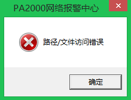

当操作系统是Windows 7 或者Windows 8，用户安装PA2000到系统盘路径下，双击启动PA2000时（普通用户权限）出现的错误，原因就是用户的权限不够，解决方法：在PA2000快捷方式右键单击**属性**，选择兼容性，将以**管理员身份运行**此程序的选项打勾即可。请参考：

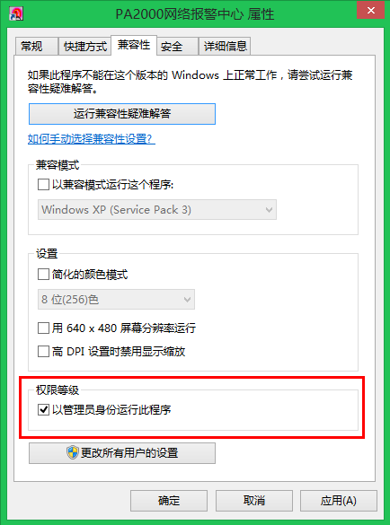

### PA2000.ini配置设置文件修改后保存不了

当操作系统是Windows 7 或者Windows 8，用户权限不够才会出现。解决方法：右键单击PA2000.ini属性，点击安全标签，将当前用户的权限分配为完全控制，权限修改后，如图：

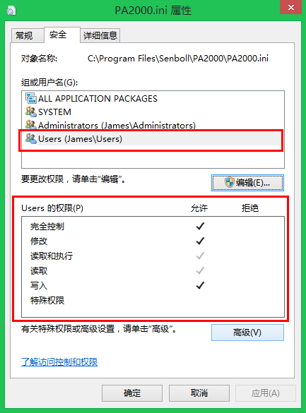

### 运行时错误'339'

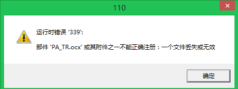

错误原因：Windows 7或者Windows 8系统当前用户权限不够，PA2000安装出错所导致。解决方法：

步骤1：打开控制面板找到管理工具，如图：

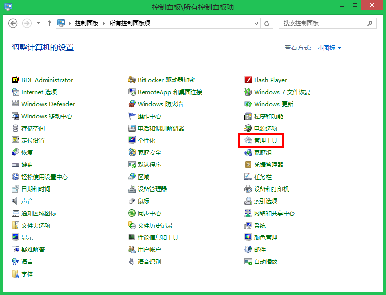

步骤2：打开管理工具，点击本地安全策略，如图：

步骤3：打开本地安全策略，点击本地策略-〉安全选项，找到用户账户控制：以管理员批准模式运行所有管理员，将其禁用。

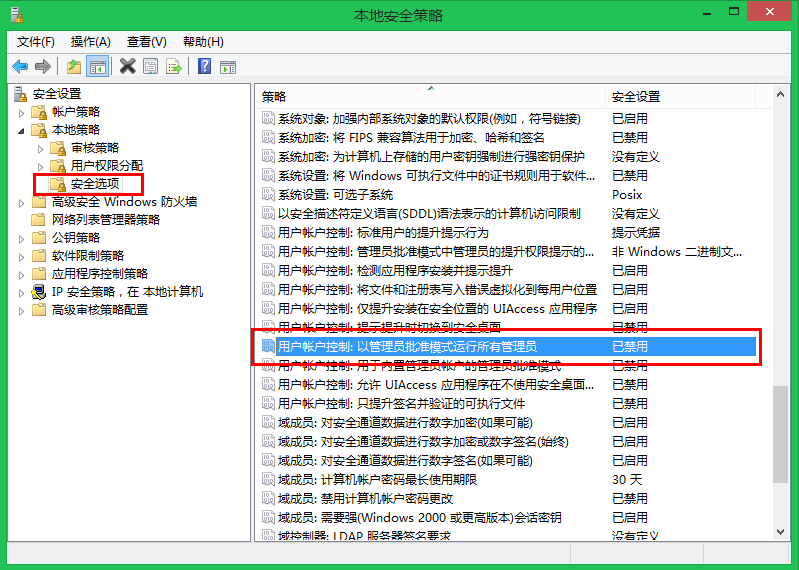

### 找不到对应的硬件狗

找不到硬件狗，是未插USB加密狗或者加密狗驱动安装失败，请重新安装，如何安装加密狗驱动，请参考说明书。

### 运行时错误'3075'

如图：

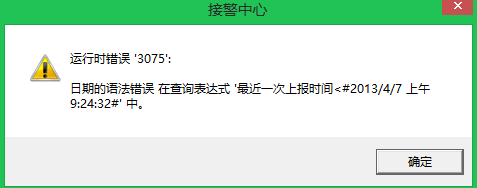

此问题的原因是系统的时间和日期格式不对导致的。如果是ghost系统或者非微软官方系统才会出现此错误,所以建议安装官方原版系统。解决方法：

步骤1：打开控制面板，点击区域或区域与语言设置选项。如图：

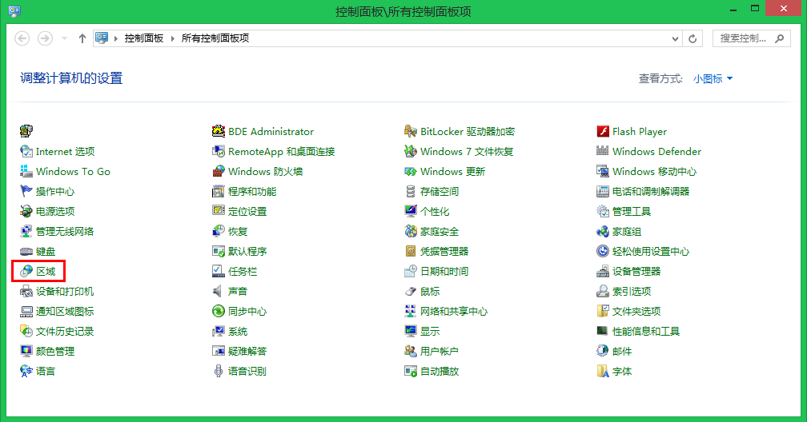

步骤2：点击[自定义]，然后把时间和日期格式改成如下图所示的格式：

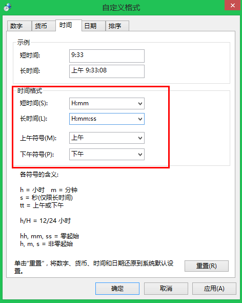

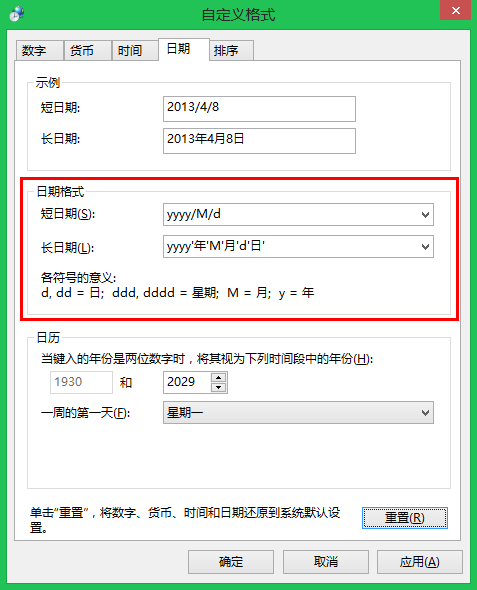

### 导出文件发生错误

资料导出为Office文件时，弹出保存文件错误，这种现象的原因是Office软件安装问题。请安装原版Microsoft Office办公软件。如果安装的是WPS，或经过二次开发的Office版本，导出用户资料或者事件的时候会出错。

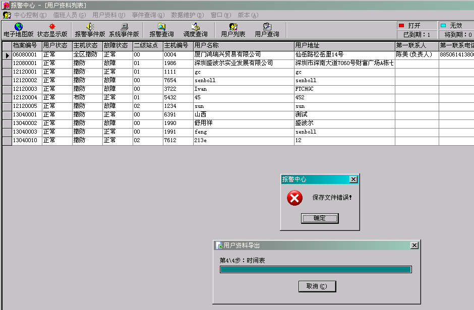

### 串口一开始收到数据软件卡死

PA2000的用户资料的主机账号不存在，收到了未知的主机账号的事件软件无法解析导致卡死，填入正确的主机账号即可。